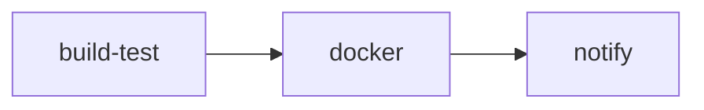

# Table of Contents

- [CI Documentation](#ci-documentation)
  - [Guides](#guides)
  - [Workflow file](#workflow-file)
  - [Pipeline stages](#pipeline-stages)
  - [Known failure resolutions](#known-failure-resolutions)

---

# CI Documentation

> A practical reference for the Java end-to-end CI workflow, its artifacts, and common recovery steps.

<!-- TOC -->
- [CI Documentation](#ci-documentation)
  - [Guides](#guides)
  - [Workflow file](#workflow-file)
  - [Pipeline stages](#pipeline-stages)
  - [Known failure resolutions](#known-failure-resolutions)
<!-- /TOC -->

This directory contains documentation for the Java End-to-End CI pipeline.

> **Preview tip:** Open the linked guides in Markdown Preview (`Ctrl+Shift+V`) to view the workflow diagrams and tables.

## Guides

| File | Description |
| ---- | ----------- |
| [java-e2e-ci-pipeline-guide.md](java-e2e-ci-pipeline-guide.md) | Full pipeline design, job details, secrets reference, Docker tagging, and troubleshooting with diagrams |
| [java-e2e-ci-quick-runbook.md](java-e2e-ci-quick-runbook.md) | Day-to-day runbook: triggering runs, pulling images, configuring secrets, quick troubleshooting |

## Workflow file

`.github/workflows/java-end-to-end_ci.yml`

## Pipeline stages

| Stage | Description |
| ----- | ----------- |
| **build-test** | Maven build and unit tests; uploads Surefire XML reports as a GitHub Actions artifact |
| **docker** | Builds with `docker/build-push-action@v6` (`provenance: false`); pushes to GHCR on `push` events only |
| **notify** | Sends email via **Resend API** (preferred) or Gmail SMTP fallback; attaches the HTML execution report |

## Known failure resolutions

Full resolution guide with diagrams: [java-e2e-ci-pipeline-guide.md — Troubleshooting and Resolution Guide](java-e2e-ci-pipeline-guide.md#troubleshooting-and-resolution-guide)

| Error | Doc section |
| ----- | ----------- |
| `535 BadCredentials` (Gmail SMTP) | [§1 Invalid App Password](java-e2e-ci-pipeline-guide.md#1-gmail-smtp-535-badcredentials-invalid-app-password) |
| `535` with valid password | [§4 Datacenter IP block → use Resend](java-e2e-ci-pipeline-guide.md#4-gmail-smtp-535-from-github-actions-ips) |
| `ENETUNREACH` (IPv6) | [§2 IPv6 fix](java-e2e-ci-pipeline-guide.md#2-gmail-smtp-enetunreach-ipv6) |
| `starttls TypeError` | [§3 Python TLS fix](java-e2e-ci-pipeline-guide.md#3-python-smtp-starttls-typeerror) |
| `unknown blob` (GHCR push) | [§6 GHCR fix](java-e2e-ci-pipeline-guide.md#6-ghcr-docker-push-unknown-blob) |
| **Recommended email setup** | [§5 Resend API](java-e2e-ci-pipeline-guide.md#5-resend-api-recommended-email-provider) |
| Quick checklists | [Quick runbook](java-e2e-ci-quick-runbook.md#failure-resolution-guide) |
