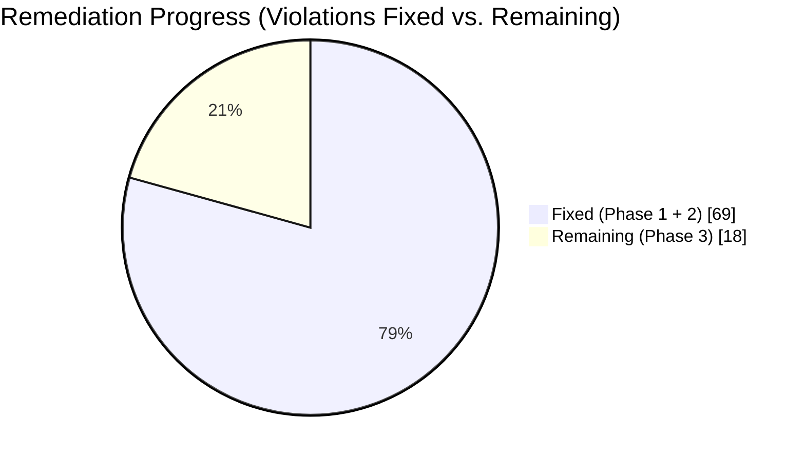
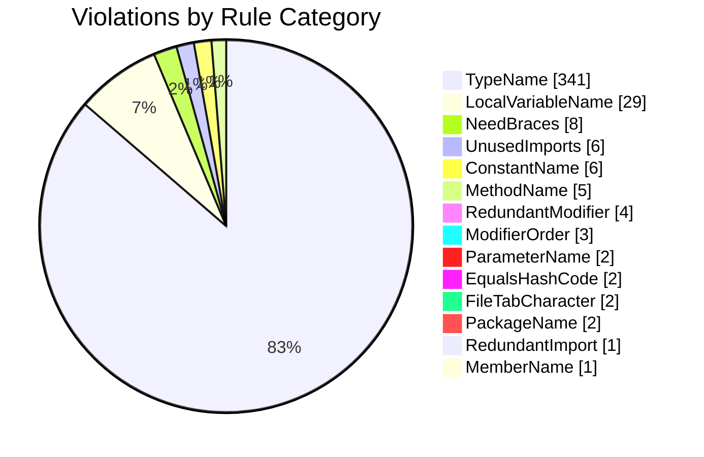

# Table of Contents

- [Overview](#overview)
- [Progress Tracker](#progress-tracker)
- [Summary of Violations by Category](#summary-of-violations-by-category)
- [Class/Interface/Enum Name Not in UpperCamelCase (`TypeName`)](#classinterfaceenum-name-not-in-uppercamelcase-typename)
- [Local Variable Not in lowerCamelCase (`LocalVariableName`)](#local-variable-not-in-lowercamelcase-localvariablename)
- [Missing Braces on Control-Flow Blocks (`NeedBraces`)](#missing-braces-on-control-flow-blocks-needbraces)
- [Unused Import Statements (`UnusedImports`)](#unused-import-statements-unusedimports)
- [Constant (`static final`) Not in UPPER_SNAKE_CASE (`ConstantName`)](#constant-static-final-not-in-uppersnakecase-constantname)
- [Method Name Not in lowerCamelCase (or Same Name as Enclosing Class) (`MethodName`)](#method-name-not-in-lowercamelcase-or-same-name-as-enclosing-class-methodname)
- [Redundant Modifier (`RedundantModifier`)](#redundant-modifier-redundantmodifier)
- [Modifiers Not in JLS-Recommended Order (`ModifierOrder`)](#modifiers-not-in-jls-recommended-order-modifierorder)
- [Method Parameter Not in lowerCamelCase (`ParameterName`)](#method-parameter-not-in-lowercamelcase-parametername)
- [Overrides `equals()` Without `hashCode()` (or vice versa) (`EqualsHashCode`)](#overrides-equals-without-hashcode-or-vice-versa-equalshashcode)
- [File Uses Tab Characters for Indentation (`FileTabCharacter`)](#file-uses-tab-characters-for-indentation-filetabcharacter)
- [Package Name Not in All-Lowercase (`PackageName`)](#package-name-not-in-all-lowercase-packagename)
- [Redundant Import (`RedundantImport`)](#redundant-import-redundantimport)
- [Instance Field Not in lowerCamelCase (`MemberName`)](#instance-field-not-in-lowercamelcase-membername)
- [Remediation Plan](#remediation-plan)

---

# Coding Standards Violations Report

## Overview

This report documents every Java coding-standards violation detected across all `.java` source files in this repository, found using a pragmatic Checkstyle ruleset (naming conventions, unused/redundant imports, missing braces, modifier order, and the `equals`/`hashCode` contract). It intentionally excludes purely stylistic/subjective rules (like mandatory Javadoc or strict line-length limits) that would force unnecessary rewrites.

**Scope:** 418 `.java` files scanned, **412 violations** found across **14 rule categories**. Every fix described here changes only *names* or *syntax sugar* — no method logic, control flow, field values, or program behavior is altered. Commented-out code is left untouched (not uncommented, not deleted).

## Progress Tracker

The "Summary of Violations by Category" and per-rule tables below are kept exactly as originally found (the as-found baseline), so this section tracks live remediation progress separately, without editing the original counts.

| Phase | Rules Covered | Violations | Status | Verified By |
|-------|----------------|:----------:|--------|--------------|
| **Phase 1 — Mechanical fixes** | `UnusedImports` (6), `RedundantImport` (1), `RedundantModifier` (4), `ModifierOrder` (3), `NeedBraces` (8), `FileTabCharacter` (2), `EqualsHashCode` (2) | 26 | ✅ **Done** | `mvn -f demo/pom.xml compile` → 0 errors; re-scan confirms 0 remaining violations in these 7 categories |
| **Phase 2 — Safe identifier renames** | `LocalVariableName` (29), `ParameterName` (2), `MemberName` (1), `ConstantName` (6), `MethodName` (5) | 43 | ✅ **Done** | `mvn -f demo/pom.xml compile` → 0 errors; re-scan confirms 0 remaining violations in these 5 categories |
| **Phase 3 — File/type renames** | `TypeName` (341), `PackageName` (2) | 343 | ✅ ~325 fixed (top-level classes + package renamed; 22 JDK-name clashes prefixed `Custom`); ~18 secondary/nested types left | — |
| | **Total** | **412** | **~394 fixed / ~18 remaining (secondary types in 18 files)** | |

## Summary of Violations by Category

| # | Rule | Category Meaning | Count |
|---|------|-------------------|-------|
| 1 | `TypeName` | Class/Interface/Enum Name Not in UpperCamelCase | 341 |
| 2 | `LocalVariableName` | Local Variable Not in lowerCamelCase | 29 |
| 3 | `NeedBraces` | Missing Braces on Control-Flow Blocks | 8 |
| 4 | `UnusedImports` | Unused Import Statements | 6 |
| 5 | `ConstantName` | Constant (`static final`) Not in UPPER_SNAKE_CASE | 6 |
| 6 | `MethodName` | Method Name Not in lowerCamelCase (or Same Name as Enclosing Class) | 5 |
| 7 | `RedundantModifier` | Redundant Modifier | 4 |
| 8 | `ModifierOrder` | Modifiers Not in JLS-Recommended Order | 3 |
| 9 | `ParameterName` | Method Parameter Not in lowerCamelCase | 2 |
| 10 | `EqualsHashCode` | Overrides `equals()` Without `hashCode()` (or vice versa) | 2 |
| 11 | `FileTabCharacter` | File Uses Tab Characters for Indentation | 2 |
| 12 | `PackageName` | Package Name Not in All-Lowercase | 2 |
| 13 | `RedundantImport` | Redundant Import | 1 |
| 14 | `MemberName` | Instance Field Not in lowerCamelCase | 1 |
| | **Total** | | **412** |

---

## Class/Interface/Enum Name Not in UpperCamelCase (`TypeName`)

**What it means:** Java naming convention requires every top-level and nested type (class, interface, enum, record) to start with an uppercase letter and use UpperCamelCase (e.g. `MyClass`, not `myClass` or `my_class`). This codebase has many types that start with a lowercase letter (e.g. `jarDemo`, `typeCastingDef`) or use underscores.

**How it will be fixed:** Rename the class/enum/interface declaration to UpperCamelCase, rename its `.java` file to match (Java requires the public type name == file name), and update every reference to that type across the codebase (imports, instantiations, static references) so nothing breaks. No method bodies, fields, or logic are changed — only the identifier name.

**Occurrences: 341**

| File | Line:Col | Detail |
|------|----------|--------|
| `demo/src/main/java/com/objectoriented/typeCasting/typeCastingDef.java` | 3:14 | Name 'typeCastingDef' must match pattern '^[A-Z][a-zA-Z0-9]*$'. |
| `demo/src/main/java/com/objectoriented/coupling/encrpytionServiceMain.java` | 3:14 | Name 'encrpytionServiceMain' must match pattern '^[A-Z][a-zA-Z0-9]*$'. |
| `demo/src/main/java/com/objectoriented/coupling/coupling_Def.java` | 9:7 | Name 'encrpytionService' must match pattern '^[A-Z][a-zA-Z0-9]*$'. |
| `demo/src/main/java/com/objectoriented/coupling/coupling_Def.java` | 22:14 | Name 'coupling_Def' must match pattern '^[A-Z][a-zA-Z0-9]*$'. |
| `demo/src/main/java/com/objectoriented/Blocks/staticBlock/executionFlowInSB.java` | 3:14 | Name 'executionFlowInSB' must match pattern '^[A-Z][a-zA-Z0-9]*$'. |
| `demo/src/main/java/com/objectoriented/Blocks/instanceBlock/instanceblockDef.java` | 3:14 | Name 'instanceblockDef' must match pattern '^[A-Z][a-zA-Z0-9]*$'. |
| `demo/src/main/java/com/objectoriented/methods/VarArg_def.java` | 3:14 | Name 'VarArg_def' must match pattern '^[A-Z][a-zA-Z0-9]*$'. |
| `demo/src/main/java/com/objectoriented/methods/VarArg_preference.java` | 3:14 | Name 'VarArg_preference' must match pattern '^[A-Z][a-zA-Z0-9]*$'. |
| `demo/src/main/java/com/objectoriented/constructors/recursiveConstructors.java` | 3:14 | Name 'recursiveConstructors' must match pattern '^[A-Z][a-zA-Z0-9]*$'. |
| `demo/src/main/java/com/objectoriented/constructors/constructorWithExceptionHandling.java` | 12:14 | Name 'constructorWithExceptionHandling' must match pattern '^[A-Z][a-zA-Z0-9]*$'. |
| `demo/src/main/java/com/objectoriented/constructors/defaultConstructor.java` | 3:14 | Name 'defaultConstructor' must match pattern '^[A-Z][a-zA-Z0-9]*$'. |
| `demo/src/main/java/com/objectoriented/constructors/constructorWithCheckedException.java` | 3:14 | Name 'constructorWithCheckedException' must match pattern '^[A-Z][a-zA-Z0-9]*$'. |
| `demo/src/main/java/com/objectoriented/constructors/super_thisVariations.java` | 3:14 | Name 'super_thisVariations' must match pattern '^[A-Z][a-zA-Z0-9]*$'. |
| `demo/src/main/java/com/objectoriented/constructors/prototypeConstructor.java` | 3:14 | Name 'prototypeConstructor' must match pattern '^[A-Z][a-zA-Z0-9]*$'. |
| `demo/src/main/java/com/objectoriented/constructors/constructorErrorInheritedClasses.java` | 3:14 | Name 'constructorErrorInheritedClasses' must match pattern '^[A-Z][a-zA-Z0-9]*$'. |
| `demo/src/main/java/com/objectoriented/constructors/constructore_voidMethod.java` | 5:14 | Name 'constructore_voidMethod' must match pattern '^[A-Z][a-zA-Z0-9]*$'. |
| `demo/src/main/java/com/objectoriented/constructors/overloadConstructors.java` | 8:14 | Name 'overloadConstructors' must match pattern '^[A-Z][a-zA-Z0-9]*$'. |
| `demo/src/main/java/com/objectoriented/cohesion/cohesionDef.java` | 31:14 | Name 'cohesionDef' must match pattern '^[A-Z][a-zA-Z0-9]*$'. |
| `demo/src/main/java/com/regularExpressions/regularExpressionTwo.java` | 3:14 | Name 'regularExpressionTwo' must match pattern '^[A-Z][a-zA-Z0-9]*$'. |
| `demo/src/main/java/com/regularExpressions/regularExpressionOne.java` | 4:14 | Name 'regularExpressionOne' must match pattern '^[A-Z][a-zA-Z0-9]*$'. |
| `demo/src/main/java/com/regularExpressions/regexBasics.java` | 6:14 | Name 'regexBasics' must match pattern '^[A-Z][a-zA-Z0-9]*$'. |
| `demo/src/main/java/com/regularExpressions/patternClass/splitMethod.java` | 3:14 | Name 'splitMethod' must match pattern '^[A-Z][a-zA-Z0-9]*$'. |
| `demo/src/main/java/com/regularExpressions/stringTokenizer/stringTokenizer.java` | 5:14 | Name 'stringTokenizer' must match pattern '^[A-Z][a-zA-Z0-9]*$'. |
| `demo/src/main/java/com/regularExpressions/checkNumber.java` | 14:14 | Name 'checkNumber' must match pattern '^[A-Z][a-zA-Z0-9]*$'. |
| `demo/src/main/java/com/enumeration/mainMethodInsideEnum.java` | 18:14 | Name 'mainMethodInsideEnum' must match pattern '^[A-Z][a-zA-Z0-9]*$'. |
| `demo/src/main/java/com/enumeration/enumParameterConstructors.java` | 3:6 | Name 'fruits' must match pattern '^[A-Z][a-zA-Z0-9]*$'. |
| `demo/src/main/java/com/enumeration/enumParameterConstructors.java` | 14:14 | Name 'enumParameterConstructors' must match pattern '^[A-Z][a-zA-Z0-9]*$'. |
| `demo/src/main/java/com/enumeration/enumConstructor.java` | 3:6 | Name 'pulses' must match pattern '^[A-Z][a-zA-Z0-9]*$'. |
| `demo/src/main/java/com/enumeration/enumConstructor.java` | 15:14 | Name 'enumConstructor' must match pattern '^[A-Z][a-zA-Z0-9]*$'. |
| `demo/src/main/java/com/enumeration/enumAllMethods.java` | 3:14 | Name 'enumAllMethods' must match pattern '^[A-Z][a-zA-Z0-9]*$'. |
| `demo/src/main/java/com/enumeration/enumAllMethods.java` | 5:10 | Name 'rice' must match pattern '^[A-Z][a-zA-Z0-9]*$'. |
| `demo/src/main/java/com/enumeration/enumWithSwitchBasic.java` | 7:14 | Name 'enumWithSwitchBasic' must match pattern '^[A-Z][a-zA-Z0-9]*$'. |
| `demo/src/main/java/com/enumeration/enumWithSwitchBasic.java` | 9:10 | Name 'pulses' must match pattern '^[A-Z][a-zA-Z0-9]*$'. |
| `demo/src/main/java/com/enumeration/enumSpecialScenarios/enumCaseTwo.java` | 3:14 | Name 'enumCaseTwo' must match pattern '^[A-Z][a-zA-Z0-9]*$'. |
| `demo/src/main/java/com/enumeration/enumSpecialScenarios/enumCaseTwo.java` | 5:10 | Name 'color' must match pattern '^[A-Z][a-zA-Z0-9]*$'. |
| `demo/src/main/java/com/enumeration/enumSpecialScenarios/enumCaseOne.java` | 3:14 | Name 'enumCaseOne' must match pattern '^[A-Z][a-zA-Z0-9]*$'. |
| `demo/src/main/java/com/enumeration/enumSpecialScenarios/enumCaseOne.java` | 5:10 | Name 'vegetables' must match pattern '^[A-Z][a-zA-Z0-9]*$'. |
| `demo/src/main/java/com/enumeration/enumSpecialScenarios/enumCaseThree.java` | 3:14 | Name 'enumCaseThree' must match pattern '^[A-Z][a-zA-Z0-9]*$'. |
| `demo/src/main/java/com/enumeration/enumSpecialScenarios/enumCaseThree.java` | 5:10 | Name 'bike' must match pattern '^[A-Z][a-zA-Z0-9]*$'. |
| `demo/src/main/java/com/enumeration/enumBasics.java` | 9:14 | Name 'enumBasics' must match pattern '^[A-Z][a-zA-Z0-9]*$'. |
| `demo/src/main/java/com/enumeration/enumBasics.java` | 11:10 | Name 'food' must match pattern '^[A-Z][a-zA-Z0-9]*$'. |
| `demo/src/main/java/com/enumeration/enumWithSwitchAdvanced.java` | 3:14 | Name 'enumWithSwitchAdvanced' must match pattern '^[A-Z][a-zA-Z0-9]*$'. |
| `demo/src/main/java/com/enumeration/enumWithSwitchAdvanced.java` | 5:10 | Name 'vegetables' must match pattern '^[A-Z][a-zA-Z0-9]*$'. |
| `demo/src/main/java/com/enumeration/enumWithSwitchAdvanced.java` | 9:10 | Name 'spicies' must match pattern '^[A-Z][a-zA-Z0-9]*$'. |
| `demo/src/main/java/com/concurrentCollection/concurrentMap/concurrentMap.java` | 3:14 | Name 'concurrentMap' must match pattern '^[A-Z][a-zA-Z0-9]*$'. |
| `demo/src/main/java/com/concurrentCollection/concurrentMap/concurrentHashMapExample.java` | 5:14 | Name 'concurrentHashMapExample' must match pattern '^[A-Z][a-zA-Z0-9]*$'. |
| `demo/src/main/java/com/concurrentCollection/concurrentMap/updationByoneThreadDuringOtherThreadExceution/concurrentHashMapwithChildThreadUpdate.java` | 8:14 | Name 'concurrentHashMapwithChildThreadUpdate' must match pattern '^[A-Z][a-zA-Z0-9]*$'. |
| `demo/src/main/java/com/concurrentCollection/concurrentMap/updationByoneThreadDuringOtherThreadExceution/childBaseThread.java` | 5:14 | Name 'childBaseThread' must match pattern '^[A-Z][a-zA-Z0-9]*$'. |
| `demo/src/main/java/com/concurrentCollection/concurrentMap/concurrentMapDemo.java` | 11:14 | Name 'concurrentMapDemo' must match pattern '^[A-Z][a-zA-Z0-9]*$'. |
| `demo/src/main/java/com/concurrentCollection/concurrentMap/concurrentHashMap.java` | 3:14 | Name 'concurrentHashMap' must match pattern '^[A-Z][a-zA-Z0-9]*$'. |
| `demo/src/main/java/com/concurrentCollection/ConcurrentModificationException/threadDemo.java` | 6:14 | Name 'threadDemo' must match pattern '^[A-Z][a-zA-Z0-9]*$'. |
| `demo/src/main/java/com/concurrentCollection/copyOnWriteArraySetClass/copyOnWriteArraySetexample.java` | 6:14 | Name 'copyOnWriteArraySetexample' must match pattern '^[A-Z][a-zA-Z0-9]*$'. |
| `demo/src/main/java/com/concurrentCollection/copyOnWriteArraySetClass/copyOnWriteArrayListDemo.java` | 9:14 | Name 'copyOnWriteArrayListDemo' must match pattern '^[A-Z][a-zA-Z0-9]*$'. |
| `demo/src/main/java/com/concurrentCollection/copyOnWriteArraySetClass/unsupportedOperationexception.java` | 6:14 | Name 'unsupportedOperationexception' must match pattern '^[A-Z][a-zA-Z0-9]*$'. |
| `demo/src/main/java/com/concurrentCollection/copyOnWriteArraySetClass/updateOperationNoImpactOniterator.java` | 7:14 | Name 'updateOperationNoImpactOniterator' must match pattern '^[A-Z][a-zA-Z0-9]*$'. |
| `demo/src/main/java/com/concurrentCollection/copyOnWriteArraySetClass/updationByoneThreadwhileOtherThreadExceution/copyOnWriteASDemo.java` | 7:14 | Name 'copyOnWriteASDemo' must match pattern '^[A-Z][a-zA-Z0-9]*$'. |
| `demo/src/main/java/com/concurrentCollection/copyOnWriteArraySetClass/updationByoneThreadwhileOtherThreadExceution/childThreadBase.java` | 5:14 | Name 'childThreadBase' must match pattern '^[A-Z][a-zA-Z0-9]*$'. |
| `demo/src/main/java/com/concurrentCollection/copyOnWriteArraySetClass/copyOnWriteArraySet.java` | 3:14 | Name 'copyOnWriteArraySet' must match pattern '^[A-Z][a-zA-Z0-9]*$'. |
| `demo/src/main/java/com/concurrentCollection/concurrentCollectionTypeInspector.java` | 9:14 | Name 'concurrentCollectionTypeInspector' must match pattern '^[A-Z][a-zA-Z0-9]*$'. |
| `demo/src/main/java/com/concurrentCollection/copyOnWriteArrayListClass/copyOnWriteArrayListDemo.java` | 9:14 | Name 'copyOnWriteArrayListDemo' must match pattern '^[A-Z][a-zA-Z0-9]*$'. |
| `demo/src/main/java/com/concurrentCollection/copyOnWriteArrayListClass/unsupportedOperationexception.java` | 6:14 | Name 'unsupportedOperationexception' must match pattern '^[A-Z][a-zA-Z0-9]*$'. |
| `demo/src/main/java/com/concurrentCollection/copyOnWriteArrayListClass/copyOnWriteArrayListexample.java` | 5:14 | Name 'copyOnWriteArrayListexample' must match pattern '^[A-Z][a-zA-Z0-9]*$'. |
| `demo/src/main/java/com/concurrentCollection/copyOnWriteArrayListClass/copyOnWriteArrayList.java` | 3:14 | Name 'copyOnWriteArrayList' must match pattern '^[A-Z][a-zA-Z0-9]*$'. |
| `demo/src/main/java/com/concurrentCollection/copyOnWriteArrayListClass/updateOperationNoImpactOniterator.java` | 7:14 | Name 'updateOperationNoImpactOniterator' must match pattern '^[A-Z][a-zA-Z0-9]*$'. |
| `demo/src/main/java/com/concurrentCollection/copyOnWriteArrayListClass/updationByoneThreadwhileOtherThreadExceution/childThreadBase.java` | 5:14 | Name 'childThreadBase' must match pattern '^[A-Z][a-zA-Z0-9]*$'. |
| `demo/src/main/java/com/concurrentCollection/copyOnWriteArrayListClass/updationByoneThreadwhileOtherThreadExceution/copyOnWriteAlDemo.java` | 7:14 | Name 'copyOnWriteAlDemo' must match pattern '^[A-Z][a-zA-Z0-9]*$'. |
| `demo/src/main/java/com/generics/genericMethods/sendingGenericToNonGenericArea.java` | 5:14 | Name 'sendingGenericToNonGenericArea' must match pattern '^[A-Z][a-zA-Z0-9]*$'. |
| `demo/src/main/java/com/generics/ourOwnGenericClasses/genericDemo.java` | 3:14 | Name 'genericDemo' must match pattern '^[A-Z][a-zA-Z0-9]*$'. |
| `demo/src/main/java/com/generics/ourOwnGenericClasses/genericBaseWithMulitpleParams.java` | 3:14 | Name 'genericBaseWithMulitpleParams' must match pattern '^[A-Z][a-zA-Z0-9]*$'. |
| `demo/src/main/java/com/generics/ourOwnGenericClasses/genericBase.java` | 3:14 | Name 'genericBase' must match pattern '^[A-Z][a-zA-Z0-9]*$'. |
| `demo/src/main/java/com/generics/wildCardCharacter/exampleOne.java` | 6:14 | Name 'exampleOne' must match pattern '^[A-Z][a-zA-Z0-9]*$'. |
| `demo/src/main/java/com/generics/genericWithitsExtendedClasses/genericWithStringClasses.java` | 3:14 | Name 'genericWithStringClasses' must match pattern '^[A-Z][a-zA-Z0-9]*$'. |
| `demo/src/main/java/com/generics/genericWithitsExtendedClasses/genericWithNumberClasses.java` | 3:14 | Name 'genericWithNumberClasses' must match pattern '^[A-Z][a-zA-Z0-9]*$'. |
| `demo/src/main/java/com/generics/genericWithitsExtendedClasses/genericWithMultipleConditions.java` | 3:14 | Name 'genericWithMultipleConditions' must match pattern '^[A-Z][a-zA-Z0-9]*$'. |
| `demo/src/main/java/com/generics/genericWithitsExtendedClasses/genericWithThreadClasses.java` | 3:14 | Name 'genericWithThreadClasses' must match pattern '^[A-Z][a-zA-Z0-9]*$'. |
| `demo/src/main/java/com/generics/validationForGenericsonlyAtCompiletime/validationDemo.java` | 6:14 | Name 'validationDemo' must match pattern '^[A-Z][a-zA-Z0-9]*$'. |
| `demo/src/main/java/com/javalangPackage/autoboxingAndAutoUnBoxing/overloadingWithAutoboxing.java` | 3:14 | Name 'overloadingWithAutoboxing' must match pattern '^[A-Z][a-zA-Z0-9]*$'. |
| `demo/src/main/java/com/javalangPackage/autoboxingAndAutoUnBoxing/autoBoxingBasics.java` | 3:14 | Name 'autoBoxingBasics' must match pattern '^[A-Z][a-zA-Z0-9]*$'. |
| `demo/src/main/java/com/javalangPackage/autoboxingAndAutoUnBoxing/overloadingWithAutoBoxingOne.java` | 3:14 | Name 'overloadingWithAutoBoxingOne' must match pattern '^[A-Z][a-zA-Z0-9]*$'. |
| `demo/src/main/java/com/javalangPackage/autoboxingAndAutoUnBoxing/autoBoxingExample2.java` | 3:14 | Name 'autoBoxingExample2' must match pattern '^[A-Z][a-zA-Z0-9]*$'. |
| `demo/src/main/java/com/javalangPackage/autoboxingAndAutoUnBoxing/autoBoxingexample1.java` | 3:14 | Name 'autoBoxingexample1' must match pattern '^[A-Z][a-zA-Z0-9]*$'. |
| `demo/src/main/java/com/javalangPackage/autoboxingAndAutoUnBoxing/overloadingWithVarArgMethods.java` | 3:14 | Name 'overloadingWithVarArgMethods' must match pattern '^[A-Z][a-zA-Z0-9]*$'. |
| `demo/src/main/java/com/javalangPackage/strings/stringBufferConstructors/stringBuffer.java` | 7:14 | Name 'stringBuffer' must match pattern '^[A-Z][a-zA-Z0-9]*$'. |
| `demo/src/main/java/com/javalangPackage/strings/stringBufferConstructors/stringBuilder.java` | 3:14 | Name 'stringBuilder' must match pattern '^[A-Z][a-zA-Z0-9]*$'. |
| `demo/src/main/java/com/javalangPackage/strings/stringBufferConstructors/methodChainingInStringBuffer.java` | 3:14 | Name 'methodChainingInStringBuffer' must match pattern '^[A-Z][a-zA-Z0-9]*$'. |
| `demo/src/main/java/com/javalangPackage/strings/stringObjectCreationPart1.java` | 3:14 | Name 'stringObjectCreationPart1' must match pattern '^[A-Z][a-zA-Z0-9]*$'. |
| `demo/src/main/java/com/javalangPackage/strings/stringObjectsCreation/stringObjects.java` | 3:14 | Name 'stringObjects' must match pattern '^[A-Z][a-zA-Z0-9]*$'. |
| `demo/src/main/java/com/javalangPackage/strings/immutabilityMutability.java` | 3:14 | Name 'immutabilityMutability' must match pattern '^[A-Z][a-zA-Z0-9]*$'. |
| `demo/src/main/java/com/javalangPackage/strings/stringConstuctors/customizedImmutabilityMethod.java` | 3:14 | Name 'customizedImmutabilityMethod' must match pattern '^[A-Z][a-zA-Z0-9]*$'. |
| `demo/src/main/java/com/javalangPackage/strings/stringConstuctors/finalVsImmutability.java` | 3:14 | Name 'finalVsImmutability' must match pattern '^[A-Z][a-zA-Z0-9]*$'. |
| `demo/src/main/java/com/javalangPackage/strings/stringConstuctors/stringconstructor.java` | 3:14 | Name 'stringconstructor' must match pattern '^[A-Z][a-zA-Z0-9]*$'. |
| `demo/src/main/java/com/javalangPackage/strings/stringConstuctors/stringMethods.java` | 3:14 | Name 'stringMethods' must match pattern '^[A-Z][a-zA-Z0-9]*$'. |
| `demo/src/main/java/com/javalangPackage/strings/ImportantConcept/ourOwnImmutableClass.java` | 5:13 | Name 'ourOwnImmutableClass' must match pattern '^[A-Z][a-zA-Z0-9]*$'. |
| `demo/src/main/java/com/javalangPackage/strings/interningofStrings/interningStrings.java` | 3:14 | Name 'interningStrings' must match pattern '^[A-Z][a-zA-Z0-9]*$'. |
| `demo/src/main/java/com/javalangPackage/variousMethods/equalsMethodInObjectClass.java` | 3:14 | Name 'equalsMethodInObjectClass' must match pattern '^[A-Z][a-zA-Z0-9]*$'. |
| `demo/src/main/java/com/javalangPackage/variousMethods/customizedEqualsMethod.java` | 3:14 | Name 'customizedEqualsMethod' must match pattern '^[A-Z][a-zA-Z0-9]*$'. |
| `demo/src/main/java/com/javalangPackage/variousMethods/toStringMethod.java` | 5:14 | Name 'toStringMethod' must match pattern '^[A-Z][a-zA-Z0-9]*$'. |
| `demo/src/main/java/com/javalangPackage/variousMethods/hashCode.java` | 3:14 | Name 'hashCode' must match pattern '^[A-Z][a-zA-Z0-9]*$'. |
| `demo/src/main/java/com/javalangPackage/variousMethods/getClassMethods.java` | 4:14 | Name 'getClassMethods' must match pattern '^[A-Z][a-zA-Z0-9]*$'. |
| `demo/src/main/java/com/javalangPackage/wrapperClasses/wrapperBasics.java` | 3:14 | Name 'wrapperBasics' must match pattern '^[A-Z][a-zA-Z0-9]*$'. |
| `demo/src/main/java/com/javalangPackage/wrapperClasses/stringToPrimitive.java` | 3:14 | Name 'stringToPrimitive' must match pattern '^[A-Z][a-zA-Z0-9]*$'. |
| `demo/src/main/java/com/javalangPackage/wrapperClasses/valueOfMethod.java` | 3:14 | Name 'valueOfMethod' must match pattern '^[A-Z][a-zA-Z0-9]*$'. |
| `demo/src/main/java/com/javalangPackage/wrapperClasses/voidClass.java` | 5:14 | Name 'voidClass' must match pattern '^[A-Z][a-zA-Z0-9]*$'. |
| `demo/src/main/java/com/javalangPackage/cloning/cloneBasics.java` | 3:14 | Name 'cloneBasics' must match pattern '^[A-Z][a-zA-Z0-9]*$'. |
| `demo/src/main/java/com/javalangPackage/cloning/shallowCloning/teacher.java` | 3:14 | Name 'teacher' must match pattern '^[A-Z][a-zA-Z0-9]*$'. |
| `demo/src/main/java/com/javalangPackage/cloning/shallowCloning/shallowCloningDemo.java` | 3:14 | Name 'shallowCloningDemo' must match pattern '^[A-Z][a-zA-Z0-9]*$'. |
| `demo/src/main/java/com/javalangPackage/cloning/shallowCloning/student.java` | 3:14 | Name 'student' must match pattern '^[A-Z][a-zA-Z0-9]*$'. |
| `demo/src/main/java/com/javalangPackage/cloning/deepCloning/teacher.java` | 3:14 | Name 'teacher' must match pattern '^[A-Z][a-zA-Z0-9]*$'. |
| `demo/src/main/java/com/javalangPackage/cloning/deepCloning/deepCloning.java` | 3:14 | Name 'deepCloning' must match pattern '^[A-Z][a-zA-Z0-9]*$'. |
| `demo/src/main/java/com/javalangPackage/cloning/deepCloning/student.java` | 3:14 | Name 'student' must match pattern '^[A-Z][a-zA-Z0-9]*$'. |
| `demo/src/main/java/com/exceptionHandling/defineOurOwenException.java` | 3:14 | Name 'defineOurOwenException' must match pattern '^[A-Z][a-zA-Z0-9]*$'. |
| `demo/src/main/java/com/exceptionHandling/finallyBlock.java` | 7:7 | Name 'finallyBlock' must match pattern '^[A-Z][a-zA-Z0-9]*$'. |
| `demo/src/main/java/com/exceptionHandling/nullPointerException.java` | 3:14 | Name 'nullPointerException' must match pattern '^[A-Z][a-zA-Z0-9]*$'. |
| `demo/src/main/java/com/exceptionHandling/tryCatchBasics.java` | 3:14 | Name 'tryCatchBasics' must match pattern '^[A-Z][a-zA-Z0-9]*$'. |
| `demo/src/main/java/com/exceptionHandling/specialCases/specialCaseFour.java` | 8:14 | Name 'specialCaseFour' must match pattern '^[A-Z][a-zA-Z0-9]*$'. |
| `demo/src/main/java/com/exceptionHandling/specialCases/specialCaseTwo.java` | 3:14 | Name 'specialCaseTwo' must match pattern '^[A-Z][a-zA-Z0-9]*$'. |
| `demo/src/main/java/com/exceptionHandling/specialCases/specialCaseThree.java` | 3:14 | Name 'specialCaseThree' must match pattern '^[A-Z][a-zA-Z0-9]*$'. |
| `demo/src/main/java/com/exceptionHandling/specialCases/specialCaseOne.java` | 3:14 | Name 'specialCaseOne' must match pattern '^[A-Z][a-zA-Z0-9]*$'. |
| `demo/src/main/java/com/exceptionHandling/throwsKeyword.java` | 3:14 | Name 'throwsKeyword' must match pattern '^[A-Z][a-zA-Z0-9]*$'. |
| `demo/src/main/java/com/exceptionHandling/typeOfExceptions.java` | 3:14 | Name 'typeOfExceptions' must match pattern '^[A-Z][a-zA-Z0-9]*$'. |
| `demo/src/main/java/com/exceptionHandling/rethrowingExceptions.java` | 3:14 | Name 'rethrowingExceptions' must match pattern '^[A-Z][a-zA-Z0-9]*$'. |
| `demo/src/main/java/com/exceptionHandling/exceptionTypes.java` | 5:14 | Name 'exceptionTypes' must match pattern '^[A-Z][a-zA-Z0-9]*$'. |
| `demo/src/main/java/com/exceptionHandling/unreachableStatement.java` | 3:14 | Name 'unreachableStatement' must match pattern '^[A-Z][a-zA-Z0-9]*$'. |
| `demo/src/main/java/com/exceptionHandling/tryCatchUseCases.java` | 3:14 | Name 'tryCatchUseCases' must match pattern '^[A-Z][a-zA-Z0-9]*$'. |
| `demo/src/main/java/com/exceptionHandling/abnormalFlowNoExceptionHandling.java` | 3:14 | Name 'abnormalFlowNoExceptionHandling' must match pattern '^[A-Z][a-zA-Z0-9]*$'. |
| `demo/src/main/java/com/exceptionHandling/throwKeyword.java` | 3:14 | Name 'throwKeyword' must match pattern '^[A-Z][a-zA-Z0-9]*$'. |
| `demo/src/main/java/com/exceptionHandling/trywithresources.java` | 3:14 | Name 'trywithresources' must match pattern '^[A-Z][a-zA-Z0-9]*$'. |
| `demo/src/main/java/com/exceptionHandling/rulesInExceptionHandling.java` | 3:14 | Name 'rulesInExceptionHandling' must match pattern '^[A-Z][a-zA-Z0-9]*$'. |
| `demo/src/main/java/com/exceptionHandling/waysOfPrintingException.java` | 3:14 | Name 'waysOfPrintingException' must match pattern '^[A-Z][a-zA-Z0-9]*$'. |
| `demo/src/main/java/com/lambda/lambdaFunctions.java` | 12:14 | Name 'lambdaFunctions' must match pattern '^[A-Z][a-zA-Z0-9]*$'. |
| `demo/src/main/java/com/advanced/serialization/externalization/externalizationbasics.java` | 7:14 | Name 'externalizationbasics' must match pattern '^[A-Z][a-zA-Z0-9]*$'. |
| `demo/src/main/java/com/advanced/serialization/customizedSerialization/securePassword.java` | 11:14 | Name 'securePassword' must match pattern '^[A-Z][a-zA-Z0-9]*$'. |
| `demo/src/main/java/com/advanced/serialization/customizedSerialization/customizedSer.java` | 10:7 | Name 'account' must match pattern '^[A-Z][a-zA-Z0-9]*$'. |
| `demo/src/main/java/com/advanced/serialization/customizedSerialization/customizedSer.java` | 50:14 | Name 'customizedSer' must match pattern '^[A-Z][a-zA-Z0-9]*$'. |
| `demo/src/main/java/com/advanced/serialization/customizedSerialization/normalSer.java` | 11:7 | Name 'normalAccount' must match pattern '^[A-Z][a-zA-Z0-9]*$'. |
| `demo/src/main/java/com/advanced/serialization/customizedSerialization/normalSer.java` | 18:14 | Name 'normalSer' must match pattern '^[A-Z][a-zA-Z0-9]*$'. |
| `demo/src/main/java/com/advanced/serialization/inheritanceSerialization/inheritanceSerTwo.java` | 11:7 | Name 'protein' must match pattern '^[A-Z][a-zA-Z0-9]*$'. |
| `demo/src/main/java/com/advanced/serialization/inheritanceSerialization/inheritanceSerTwo.java` | 21:7 | Name 'concentrate' must match pattern '^[A-Z][a-zA-Z0-9]*$'. |
| `demo/src/main/java/com/advanced/serialization/inheritanceSerialization/inheritanceSerTwo.java` | 32:14 | Name 'inheritanceSerTwo' must match pattern '^[A-Z][a-zA-Z0-9]*$'. |
| `demo/src/main/java/com/advanced/serialization/inheritanceSerialization/inheritanceSerOne.java` | 11:7 | Name 'engine' must match pattern '^[A-Z][a-zA-Z0-9]*$'. |
| `demo/src/main/java/com/advanced/serialization/inheritanceSerialization/inheritanceSerOne.java` | 16:7 | Name 'tata' must match pattern '^[A-Z][a-zA-Z0-9]*$'. |
| `demo/src/main/java/com/advanced/serialization/inheritanceSerialization/inheritanceSerOne.java` | 20:14 | Name 'inheritanceSerOne' must match pattern '^[A-Z][a-zA-Z0-9]*$'. |
| `demo/src/main/java/com/advanced/serialization/transientKeyword.java` | 3:14 | Name 'transientKeyword' must match pattern '^[A-Z][a-zA-Z0-9]*$'. |
| `demo/src/main/java/com/advanced/serialization/instanceOfMultipleObjects.java` | 12:14 | Name 'instanceOfMultipleObjects' must match pattern '^[A-Z][a-zA-Z0-9]*$'. |
| `demo/src/main/java/com/advanced/serialization/reflectionVsDirectAccess.java` | 12:14 | Name 'reflectionVsDirectAccess' must match pattern '^[A-Z][a-zA-Z0-9]*$'. |
| `demo/src/main/java/com/advanced/serialization/objectGraphs/objectGraphBasics.java` | 11:7 | Name 'dog' must match pattern '^[A-Z][a-zA-Z0-9]*$'. |
| `demo/src/main/java/com/advanced/serialization/objectGraphs/objectGraphBasics.java` | 18:7 | Name 'cat' must match pattern '^[A-Z][a-zA-Z0-9]*$'. |
| `demo/src/main/java/com/advanced/serialization/objectGraphs/objectGraphBasics.java` | 24:7 | Name 'rat' must match pattern '^[A-Z][a-zA-Z0-9]*$'. |
| `demo/src/main/java/com/advanced/serialization/objectGraphs/objectGraphBasics.java` | 30:14 | Name 'objectGraphBasics' must match pattern '^[A-Z][a-zA-Z0-9]*$'. |
| `demo/src/main/java/com/advanced/serialization/serialVersionUID/dog1.java` | 5:14 | Name 'dog1' must match pattern '^[A-Z][a-zA-Z0-9]*$'. |
| `demo/src/main/java/com/advanced/serialization/serialVersionUID/receiver.java` | 9:14 | Name 'receiver' must match pattern '^[A-Z][a-zA-Z0-9]*$'. |
| `demo/src/main/java/com/advanced/serialization/serialVersionUID/sender.java` | 7:14 | Name 'sender' must match pattern '^[A-Z][a-zA-Z0-9]*$'. |
| `demo/src/main/java/com/advanced/serialization/sequenceOfMultpleObjects.java` | 12:14 | Name 'sequenceOfMultpleObjects' must match pattern '^[A-Z][a-zA-Z0-9]*$'. |
| `demo/src/main/java/com/advanced/serialization/serializationBasics.java` | 6:14 | Name 'serializationBasics' must match pattern '^[A-Z][a-zA-Z0-9]*$'. |
| `demo/src/main/java/com/advanced/serialization/serializeBase.java` | 17:14 | Name 'serializeBase' must match pattern '^[A-Z][a-zA-Z0-9]*$'. |
| `demo/src/main/java/com/advanced/innerClass/example3/toAccessvariablesInclasses.java` | 3:14 | Name 'toAccessvariablesInclasses' must match pattern '^[A-Z][a-zA-Z0-9]*$'. |
| `demo/src/main/java/com/advanced/innerClass/nestingOfInnerClasses/staticNestedInnerClass.java` | 3:14 | Name 'staticNestedInnerClass' must match pattern '^[A-Z][a-zA-Z0-9]*$'. |
| `demo/src/main/java/com/advanced/innerClass/nestingOfInnerClasses/nestingInnerClass.java` | 5:14 | Name 'nestingInnerClass' must match pattern '^[A-Z][a-zA-Z0-9]*$'. |
| `demo/src/main/java/com/advanced/innerClass/nestedClassesAndInterfaces/interfaceInsideClass.java` | 3:14 | Name 'interfaceInsideClass' must match pattern '^[A-Z][a-zA-Z0-9]*$'. |
| `demo/src/main/java/com/advanced/innerClass/nestedClassesAndInterfaces/interfaceInsideClass.java` | 12:15 | Name 'protein' must match pattern '^[A-Z][a-zA-Z0-9]*$'. |
| `demo/src/main/java/com/advanced/innerClass/nestedClassesAndInterfaces/interfaceInsideClass.java` | 17:11 | Name 'wheyProtein' must match pattern '^[A-Z][a-zA-Z0-9]*$'. |
| `demo/src/main/java/com/advanced/innerClass/nestedClassesAndInterfaces/interfaceInsideClass.java` | 25:11 | Name 'casein' must match pattern '^[A-Z][a-zA-Z0-9]*$'. |
| `demo/src/main/java/com/advanced/innerClass/nestedClassesAndInterfaces/interfaceInsideInterface.java` | 23:14 | Name 'interfaceInsideInterface' must match pattern '^[A-Z][a-zA-Z0-9]*$'. |
| `demo/src/main/java/com/advanced/innerClass/nestedClassesAndInterfaces/classInsideAClass.java` | 3:14 | Name 'classInsideAClass' must match pattern '^[A-Z][a-zA-Z0-9]*$'. |
| `demo/src/main/java/com/advanced/innerClass/example2/outerClassDemo.java` | 3:14 | Name 'outerClassDemo' must match pattern '^[A-Z][a-zA-Z0-9]*$'. |
| `demo/src/main/java/com/advanced/innerClass/example2/supplementClass.java` | 3:14 | Name 'supplementClass' must match pattern '^[A-Z][a-zA-Z0-9]*$'. |
| `demo/src/main/java/com/advanced/innerClass/example2/supplementClass.java` | 5:11 | Name 'protein' must match pattern '^[A-Z][a-zA-Z0-9]*$'. |
| `demo/src/main/java/com/advanced/innerClass/example2/sampleClass.java` | 3:14 | Name 'sampleClass' must match pattern '^[A-Z][a-zA-Z0-9]*$'. |
| `demo/src/main/java/com/advanced/innerClass/anonymousInnerclasses/example1/protein.java` | 3:14 | Name 'protein' must match pattern '^[A-Z][a-zA-Z0-9]*$'. |
| `demo/src/main/java/com/advanced/innerClass/anonymousInnerclasses/example1/runnableInterface.java` | 3:14 | Name 'runnableInterface' must match pattern '^[A-Z][a-zA-Z0-9]*$'. |
| `demo/src/main/java/com/advanced/innerClass/anonymousInnerclasses/example1/anonymousInnerclass.java` | 3:14 | Name 'anonymousInnerclass' must match pattern '^[A-Z][a-zA-Z0-9]*$'. |
| `demo/src/main/java/com/advanced/innerClass/example1/basicMain.java` | 3:14 | Name 'basicMain' must match pattern '^[A-Z][a-zA-Z0-9]*$'. |
| `demo/src/main/java/com/advanced/innerClass/methodLocal/methodLocalInnerClass.java` | 3:14 | Name 'methodLocalInnerClass' must match pattern '^[A-Z][a-zA-Z0-9]*$'. |
| `demo/src/main/java/com/advanced/innerClass/methodLocal/methodLocalInnerOne.java` | 3:14 | Name 'methodLocalInnerOne' must match pattern '^[A-Z][a-zA-Z0-9]*$'. |
| `demo/src/main/java/com/advanced/innerClass/methodLocal/methodLocalWithLocalVariable.java` | 3:14 | Name 'methodLocalWithLocalVariable' must match pattern '^[A-Z][a-zA-Z0-9]*$'. |
| `demo/src/main/java/com/advanced/multiThreading/interruptMethodInThread.java` | 3:14 | Name 'interruptMethodInThread' must match pattern '^[A-Z][a-zA-Z0-9]*$'. |
| `demo/src/main/java/com/advanced/multiThreading/threadConstructors.java` | 3:14 | Name 'threadConstructors' must match pattern '^[A-Z][a-zA-Z0-9]*$'. |
| `demo/src/main/java/com/advanced/multiThreading/modelsAndOtherConcepts/models.java` | 3:14 | Name 'models' must match pattern '^[A-Z][a-zA-Z0-9]*$'. |
| `demo/src/main/java/com/advanced/multiThreading/modelsAndOtherConcepts/suspendAndresume.java` | 8:14 | Name 'suspendAndresume' must match pattern '^[A-Z][a-zA-Z0-9]*$'. |
| `demo/src/main/java/com/advanced/multiThreading/daemonThreads/daemonThread.java` | 3:14 | Name 'daemonThread' must match pattern '^[A-Z][a-zA-Z0-9]*$'. |
| `demo/src/main/java/com/advanced/multiThreading/daemonThreads/daemonMyThread.java` | 4:14 | Name 'daemonMyThread' must match pattern '^[A-Z][a-zA-Z0-9]*$'. |
| `demo/src/main/java/com/advanced/multiThreading/daemonThreads/daeomonThreadexample.java` | 3:14 | Name 'daeomonThreadexample' must match pattern '^[A-Z][a-zA-Z0-9]*$'. |
| `demo/src/main/java/com/advanced/multiThreading/joinMethodInThread.java` | 6:14 | Name 'joinMethodInThread' must match pattern '^[A-Z][a-zA-Z0-9]*$'. |
| `demo/src/main/java/com/advanced/multiThreading/threadlocal/threadLocalOne.java` | 3:14 | Name 'threadLocalOne' must match pattern '^[A-Z][a-zA-Z0-9]*$'. |
| `demo/src/main/java/com/advanced/multiThreading/threadlocal/threadLocalTwo.java` | 3:14 | Name 'threadLocalTwo' must match pattern '^[A-Z][a-zA-Z0-9]*$'. |
| `demo/src/main/java/com/advanced/multiThreading/threadlocal/threadlocalexample1/parentThread.java` | 3:14 | Name 'parentThread' must match pattern '^[A-Z][a-zA-Z0-9]*$'. |
| `demo/src/main/java/com/advanced/multiThreading/threadlocal/threadlocalexample1/childThread.java` | 3:14 | Name 'childThread' must match pattern '^[A-Z][a-zA-Z0-9]*$'. |
| `demo/src/main/java/com/advanced/multiThreading/threadlocal/threadlocalexample1/threadlocalDemo.java` | 3:14 | Name 'threadlocalDemo' must match pattern '^[A-Z][a-zA-Z0-9]*$'. |
| `demo/src/main/java/com/advanced/multiThreading/threadlocal/threadlocalexample2/customerThread.java` | 3:14 | Name 'customerThread' must match pattern '^[A-Z][a-zA-Z0-9]*$'. |
| `demo/src/main/java/com/advanced/multiThreading/threadlocal/threadlocalexample2/threadLocoalThree.java` | 3:14 | Name 'threadLocoalThree' must match pattern '^[A-Z][a-zA-Z0-9]*$'. |
| `demo/src/main/java/com/advanced/multiThreading/synchroinizedExample.java` | 3:14 | Name 'synchroinizedExample' must match pattern '^[A-Z][a-zA-Z0-9]*$'. |
| `demo/src/main/java/com/advanced/multiThreading/threadCreationByRunnable.java` | 3:14 | Name 'threadCreationByRunnable' must match pattern '^[A-Z][a-zA-Z0-9]*$'. |
| `demo/src/main/java/com/advanced/multiThreading/executeSync.java` | 3:14 | Name 'executeSync' must match pattern '^[A-Z][a-zA-Z0-9]*$'. |
| `demo/src/main/java/com/advanced/multiThreading/synchronizationInThread.java` | 3:14 | Name 'synchronizationInThread' must match pattern '^[A-Z][a-zA-Z0-9]*$'. |
| `demo/src/main/java/com/advanced/multiThreading/deadLock/threadTwo.java` | 3:14 | Name 'threadTwo' must match pattern '^[A-Z][a-zA-Z0-9]*$'. |
| `demo/src/main/java/com/advanced/multiThreading/deadLock/deadlockOne.java` | 3:14 | Name 'deadlockOne' must match pattern '^[A-Z][a-zA-Z0-9]*$'. |
| `demo/src/main/java/com/advanced/multiThreading/deadLock/deadlock.java` | 6:14 | Name 'deadlock' must match pattern '^[A-Z][a-zA-Z0-9]*$'. |
| `demo/src/main/java/com/advanced/multiThreading/deadLock/threadOne.java` | 3:14 | Name 'threadOne' must match pattern '^[A-Z][a-zA-Z0-9]*$'. |
| `demo/src/main/java/com/advanced/multiThreading/similarLikeDeadlock.java` | 3:14 | Name 'similarLikeDeadlock' must match pattern '^[A-Z][a-zA-Z0-9]*$'. |
| `demo/src/main/java/com/advanced/multiThreading/setAndGetPriorityInTheread.java` | 3:14 | Name 'setAndGetPriorityInTheread' must match pattern '^[A-Z][a-zA-Z0-9]*$'. |
| `demo/src/main/java/com/advanced/multiThreading/threadPriority.java` | 3:14 | Name 'threadPriority' must match pattern '^[A-Z][a-zA-Z0-9]*$'. |
| `demo/src/main/java/com/advanced/multiThreading/concurrentPackage/exampleThree/myThreadTwo.java` | 6:14 | Name 'myThreadTwo' must match pattern '^[A-Z][a-zA-Z0-9]*$'. |
| `demo/src/main/java/com/advanced/multiThreading/concurrentPackage/exampleThree/reentrantLockThreadTwo.java` | 3:14 | Name 'reentrantLockThreadTwo' must match pattern '^[A-Z][a-zA-Z0-9]*$'. |
| `demo/src/main/java/com/advanced/multiThreading/concurrentPackage/utilPackageMethods.java` | 6:14 | Name 'utilPackageMethods' must match pattern '^[A-Z][a-zA-Z0-9]*$'. |
| `demo/src/main/java/com/advanced/multiThreading/concurrentPackage/reentrantLockOne.java` | 5:14 | Name 'reentrantLockOne' must match pattern '^[A-Z][a-zA-Z0-9]*$'. |
| `demo/src/main/java/com/advanced/multiThreading/concurrentPackage/exampleTwo/reentrantLockThreadOne.java` | 3:14 | Name 'reentrantLockThreadOne' must match pattern '^[A-Z][a-zA-Z0-9]*$'. |
| `demo/src/main/java/com/advanced/multiThreading/concurrentPackage/exampleTwo/myThreadOne.java` | 5:14 | Name 'myThreadOne' must match pattern '^[A-Z][a-zA-Z0-9]*$'. |
| `demo/src/main/java/com/advanced/multiThreading/concurrentPackage/reentrantLock.java` | 5:14 | Name 'reentrantLock' must match pattern '^[A-Z][a-zA-Z0-9]*$'. |
| `demo/src/main/java/com/advanced/multiThreading/concurrentPackage/exampleOne/display.java` | 5:14 | Name 'display' must match pattern '^[A-Z][a-zA-Z0-9]*$'. |
| `demo/src/main/java/com/advanced/multiThreading/concurrentPackage/exampleOne/reentrantLockThread.java` | 3:14 | Name 'reentrantLockThread' must match pattern '^[A-Z][a-zA-Z0-9]*$'. |
| `demo/src/main/java/com/advanced/multiThreading/concurrentPackage/exampleOne/myThread.java` | 3:14 | Name 'myThread' must match pattern '^[A-Z][a-zA-Z0-9]*$'. |
| `demo/src/main/java/com/advanced/multiThreading/myThreadInterrupt.java` | 3:14 | Name 'myThreadInterrupt' must match pattern '^[A-Z][a-zA-Z0-9]*$'. |
| `demo/src/main/java/com/advanced/multiThreading/classlevelLock/democlass.java` | 3:14 | Name 'democlass' must match pattern '^[A-Z][a-zA-Z0-9]*$'. |
| `demo/src/main/java/com/advanced/multiThreading/classlevelLock/syncDemoClass.java` | 3:14 | Name 'syncDemoClass' must match pattern '^[A-Z][a-zA-Z0-9]*$'. |
| `demo/src/main/java/com/advanced/multiThreading/superKeywordWithMultithreading.java` | 4:14 | Name 'superKeywordWithMultithreading' must match pattern '^[A-Z][a-zA-Z0-9]*$'. |
| `demo/src/main/java/com/advanced/multiThreading/sleepMethodInThread.java` | 3:14 | Name 'sleepMethodInThread' must match pattern '^[A-Z][a-zA-Z0-9]*$'. |
| `demo/src/main/java/com/advanced/multiThreading/executeMainFirstusingJoin.java` | 3:14 | Name 'executeMainFirstusingJoin' must match pattern '^[A-Z][a-zA-Z0-9]*$'. |
| `demo/src/main/java/com/advanced/multiThreading/threadpools/threadpoolWithRunnable/printJob.java` | 3:14 | Name 'printJob' must match pattern '^[A-Z][a-zA-Z0-9]*$'. |
| `demo/src/main/java/com/advanced/multiThreading/threadpools/threadpoolWithRunnable/threadpool.java` | 6:14 | Name 'threadpool' must match pattern '^[A-Z][a-zA-Z0-9]*$'. |
| `demo/src/main/java/com/advanced/multiThreading/threadpools/threadpoolWithCallable/threadpoolCallable.java` | 7:14 | Name 'threadpoolCallable' must match pattern '^[A-Z][a-zA-Z0-9]*$'. |
| `demo/src/main/java/com/advanced/multiThreading/threadpools/threadpoolWithCallable/myCallable.java` | 5:14 | Name 'myCallable' must match pattern '^[A-Z][a-zA-Z0-9]*$'. |
| `demo/src/main/java/com/advanced/multiThreading/myThreadWithJoin.java` | 3:14 | Name 'myThreadWithJoin' must match pattern '^[A-Z][a-zA-Z0-9]*$'. |
| `demo/src/main/java/com/advanced/multiThreading/executionWithoutThreadCreation.java` | 3:14 | Name 'executionWithoutThreadCreation' must match pattern '^[A-Z][a-zA-Z0-9]*$'. |
| `demo/src/main/java/com/advanced/multiThreading/threadCreationPartTwo.java` | 3:14 | Name 'threadCreationPartTwo' must match pattern '^[A-Z][a-zA-Z0-9]*$'. |
| `demo/src/main/java/com/advanced/multiThreading/overridingInMultithreading.java` | 3:14 | Name 'overridingInMultithreading' must match pattern '^[A-Z][a-zA-Z0-9]*$'. |
| `demo/src/main/java/com/advanced/multiThreading/yieldMethodInThread.java` | 3:14 | Name 'yieldMethodInThread' must match pattern '^[A-Z][a-zA-Z0-9]*$'. |
| `demo/src/main/java/com/advanced/multiThreading/threadGroup/threadgroup.java` | 3:14 | Name 'threadgroup' must match pattern '^[A-Z][a-zA-Z0-9]*$'. |
| `demo/src/main/java/com/advanced/multiThreading/threadGroup/threadgroupCreation.java` | 3:14 | Name 'threadgroupCreation' must match pattern '^[A-Z][a-zA-Z0-9]*$'. |
| `demo/src/main/java/com/advanced/multiThreading/threadGroup/threadEnumerate.java` | 3:14 | Name 'threadEnumerate' must match pattern '^[A-Z][a-zA-Z0-9]*$'. |
| `demo/src/main/java/com/advanced/multiThreading/threadGroup/myThread.java` | 3:14 | Name 'myThread' must match pattern '^[A-Z][a-zA-Z0-9]*$'. |
| `demo/src/main/java/com/advanced/multiThreading/threadGroup/threadListCount.java` | 3:14 | Name 'threadListCount' must match pattern '^[A-Z][a-zA-Z0-9]*$'. |
| `demo/src/main/java/com/advanced/multiThreading/threadGroup/threadGroupPriority.java` | 3:14 | Name 'threadGroupPriority' must match pattern '^[A-Z][a-zA-Z0-9]*$'. |
| `demo/src/main/java/com/advanced/multiThreading/display.java` | 3:14 | Name 'display' must match pattern '^[A-Z][a-zA-Z0-9]*$'. |
| `demo/src/main/java/com/advanced/multiThreading/interThreadCommunication/waitNotifyNotifyAll.java` | 3:14 | Name 'waitNotifyNotifyAll' must match pattern '^[A-Z][a-zA-Z0-9]*$'. |
| `demo/src/main/java/com/advanced/multiThreading/interThreadCommunication/myThreadCom.java` | 3:14 | Name 'myThreadCom' must match pattern '^[A-Z][a-zA-Z0-9]*$'. |
| `demo/src/main/java/com/advanced/multiThreading/interThreadCommunication/myThread.java` | 3:14 | Name 'myThread' must match pattern '^[A-Z][a-zA-Z0-9]*$'. |
| `demo/src/main/java/com/advanced/multiThreading/typesOfMultiThreading.java` | 3:14 | Name 'typesOfMultiThreading' must match pattern '^[A-Z][a-zA-Z0-9]*$'. |
| `demo/src/main/java/com/advanced/multiThreading/threadCreationPartOne.java` | 3:14 | Name 'threadCreationPartOne' must match pattern '^[A-Z][a-zA-Z0-9]*$'. |
| `demo/src/main/java/com/advanced/multiThreading/synchronizationBlock/syncBlockClasslevel.java` | 7:14 | Name 'syncBlockClasslevel' must match pattern '^[A-Z][a-zA-Z0-9]*$'. |
| `demo/src/main/java/com/advanced/multiThreading/synchronizationBlock/displaySync.java` | 3:14 | Name 'displaySync' must match pattern '^[A-Z][a-zA-Z0-9]*$'. |
| `demo/src/main/java/com/advanced/multiThreading/synchronizationBlock/syncBlockCurrentObject.java` | 7:14 | Name 'syncBlockCurrentObject' must match pattern '^[A-Z][a-zA-Z0-9]*$'. |
| `demo/src/main/java/com/advanced/multiThreading/starvation/starvation.java` | 6:14 | Name 'starvation' must match pattern '^[A-Z][a-zA-Z0-9]*$'. |
| `demo/src/main/java/com/advanced/multiThreading/executionWithoutThread.java` | 3:14 | Name 'executionWithoutThread' must match pattern '^[A-Z][a-zA-Z0-9]*$'. |
| `demo/src/main/java/com/advanced/multiThreading/myThread.java` | 3:14 | Name 'myThread' must match pattern '^[A-Z][a-zA-Z0-9]*$'. |
| `demo/src/main/java/com/advanced/multiThreading/multipleLock/classA.java` | 3:14 | Name 'classA' must match pattern '^[A-Z][a-zA-Z0-9]*$'. |
| `demo/src/main/java/com/advanced/multiThreading/multipleLock/multiLock.java` | 3:14 | Name 'multiLock' must match pattern '^[A-Z][a-zA-Z0-9]*$'. |
| `demo/src/main/java/com/advanced/multiThreading/multipleLock/classB.java` | 3:14 | Name 'classB' must match pattern '^[A-Z][a-zA-Z0-9]*$'. |
| `demo/src/main/java/com/advanced/multiThreading/multipleLock/classC.java` | 3:14 | Name 'classC' must match pattern '^[A-Z][a-zA-Z0-9]*$'. |
| `demo/src/main/java/com/advanced/multiThreading/wishMethodInThread.java` | 3:14 | Name 'wishMethodInThread' must match pattern '^[A-Z][a-zA-Z0-9]*$'. |
| `demo/src/main/java/com/advanced/multiThreading/overloadingInMultithreading.java` | 3:14 | Name 'overloadingInMultithreading' must match pattern '^[A-Z][a-zA-Z0-9]*$'. |
| `demo/src/main/java/com/advanced/garbageCollection/Garbage_Collector.java` | 3:14 | Name 'Garbage_Collector' must match pattern '^[A-Z][a-zA-Z0-9]*$'. |
| `demo/src/main/java/com/advanced/garbageCollection/islandOfIsolation.java` | 3:14 | Name 'islandOfIsolation' must match pattern '^[A-Z][a-zA-Z0-9]*$'. |
| `demo/src/main/java/com/advanced/garbageCollection/runtimeDemo.java` | 4:14 | Name 'runtimeDemo' must match pattern '^[A-Z][a-zA-Z0-9]*$'. |
| `demo/src/main/java/com/advanced/garbageCollection/runtimeMemoryAndGc.java` | 9:14 | Name 'runtimeMemoryAndGc' must match pattern '^[A-Z][a-zA-Z0-9]*$'. |
| `demo/src/main/java/com/advanced/garbageCollection/finalization/scenarioOne.java` | 3:14 | Name 'scenarioOne' must match pattern '^[A-Z][a-zA-Z0-9]*$'. |
| `demo/src/main/java/com/advanced/garbageCollection/finalization/scenarioFour.java` | 3:14 | Name 'scenarioFour' must match pattern '^[A-Z][a-zA-Z0-9]*$'. |
| `demo/src/main/java/com/advanced/garbageCollection/finalization/scenarioThree.java` | 3:14 | Name 'scenarioThree' must match pattern '^[A-Z][a-zA-Z0-9]*$'. |
| `demo/src/main/java/com/advanced/garbageCollection/finalization/scenarioTwo.java` | 3:14 | Name 'scenarioTwo' must match pattern '^[A-Z][a-zA-Z0-9]*$'. |
| `demo/src/main/java/com/advanced/internationalization/classes/localeClass.java` | 14:14 | Name 'localeClass' must match pattern '^[A-Z][a-zA-Z0-9]*$'. |
| `demo/src/main/java/com/advanced/internationalization/numberFormatClassDemo.java` | 5:14 | Name 'numberFormatClassDemo' must match pattern '^[A-Z][a-zA-Z0-9]*$'. |
| `demo/src/main/java/com/advanced/internationalization/dateFormatClassDemo.java` | 20:14 | Name 'dateFormatClassDemo' must match pattern '^[A-Z][a-zA-Z0-9]*$'. |
| `demo/src/main/java/com/advanced/internationalization/localeClassDemo.java` | 5:14 | Name 'localeClassDemo' must match pattern '^[A-Z][a-zA-Z0-9]*$'. |
| `demo/src/main/java/com/fundamentals/Interface/InterfaceCaseThree.java` | 3:11 | Name 'primary' must match pattern '^[A-Z][a-zA-Z0-9]*$'. |
| `demo/src/main/java/com/fundamentals/Interface/InterfaceCaseThree.java` | 8:11 | Name 'secondary' must match pattern '^[A-Z][a-zA-Z0-9]*$'. |
| `demo/src/main/java/com/fundamentals/operators/Increment_DecrementOperators.java` | 3:14 | Name 'Increment_DecrementOperators' must match pattern '^[A-Z][a-zA-Z0-9]*$'. |
| `demo/src/main/java/com/fundamentals/variables/Instance_Variables.java` | 3:14 | Name 'Instance_Variables' must match pattern '^[A-Z][a-zA-Z0-9]*$'. |
| `demo/src/main/java/com/fundamentals/variables/Local_Variables.java` | 3:14 | Name 'Local_Variables' must match pattern '^[A-Z][a-zA-Z0-9]*$'. |
| `demo/src/main/java/com/fundamentals/variables/Static_Variables.java` | 3:14 | Name 'Static_Variables' must match pattern '^[A-Z][a-zA-Z0-9]*$'. |
| `demo/src/main/java/com/fundamentals/commandlineargs/dataTypesData.java` | 5:14 | Name 'dataTypesData' must match pattern '^[A-Z][a-zA-Z0-9]*$'. |
| `demo/src/main/java/com/collection/cursors.java` | 4:14 | Name 'cursors' must match pattern '^[A-Z][a-zA-Z0-9]*$'. |
| `demo/src/main/java/com/collection/collectionBaseClasses/queueDemo.java` | 12:14 | Name 'queueDemo' must match pattern '^[A-Z][a-zA-Z0-9]*$'. |
| `demo/src/main/java/com/collection/collectionBaseClasses/synchornizedCollections.java` | 5:14 | Name 'synchornizedCollections' must match pattern '^[A-Z][a-zA-Z0-9]*$'. |
| `demo/src/main/java/com/collection/hashTable/basicflow/hashTableBase.java` | 3:14 | Name 'hashTableBase' must match pattern '^[A-Z][a-zA-Z0-9]*$'. |
| `demo/src/main/java/com/collection/hashTable/basicflow/hashTableDemo.java` | 3:14 | Name 'hashTableDemo' must match pattern '^[A-Z][a-zA-Z0-9]*$'. |
| `demo/src/main/java/com/collection/collectionsClass/CollectionsSortMethod/customizedCollectionBase.java` | 5:14 | Name 'customizedCollectionBase' must match pattern '^[A-Z][a-zA-Z0-9]*$'. |
| `demo/src/main/java/com/collection/collectionsClass/CollectionsSortMethod/collectionsDemo.java` | 7:14 | Name 'collectionsDemo' must match pattern '^[A-Z][a-zA-Z0-9]*$'. |
| `demo/src/main/java/com/collection/collectionsClass/binarySearchMethod/binarySearchBase.java` | 3:14 | Name 'binarySearchBase' must match pattern '^[A-Z][a-zA-Z0-9]*$'. |
| `demo/src/main/java/com/collection/collectionsClass/binarySearchMethod/binarySearchDemo.java` | 4:14 | Name 'binarySearchDemo' must match pattern '^[A-Z][a-zA-Z0-9]*$'. |
| `demo/src/main/java/com/collection/list/internalProcessOfLinkedList.java` | 9:14 | Name 'internalProcessOfLinkedList' must match pattern '^[A-Z][a-zA-Z0-9]*$'. |
| `demo/src/main/java/com/collection/list/linkedList.java` | 5:14 | Name 'linkedList' must match pattern '^[A-Z][a-zA-Z0-9]*$'. |
| `demo/src/main/java/com/collection/list/listDemo.java` | 14:14 | Name 'listDemo' must match pattern '^[A-Z][a-zA-Z0-9]*$'. |
| `demo/src/main/java/com/collection/list/arrayList.java` | 5:14 | Name 'arrayList' must match pattern '^[A-Z][a-zA-Z0-9]*$'. |
| `demo/src/main/java/com/collection/list/internalProcessInCollections.java` | 5:14 | Name 'internalProcessInCollections' must match pattern '^[A-Z][a-zA-Z0-9]*$'. |
| `demo/src/main/java/com/collection/list/stackClass.java` | 5:14 | Name 'stackClass' must match pattern '^[A-Z][a-zA-Z0-9]*$'. |
| `demo/src/main/java/com/collection/list/vectorClass.java` | 5:14 | Name 'vectorClass' must match pattern '^[A-Z][a-zA-Z0-9]*$'. |
| `demo/src/main/java/com/collection/arraysClass/arraysClassBase.java` | 5:14 | Name 'arraysClassBase' must match pattern '^[A-Z][a-zA-Z0-9]*$'. |
| `demo/src/main/java/com/collection/arraysClass/arraysClassComparator.java` | 3:14 | Name 'arraysClassComparator' must match pattern '^[A-Z][a-zA-Z0-9]*$'. |
| `demo/src/main/java/com/collection/set/hashSet.java` | 5:14 | Name 'hashSet' must match pattern '^[A-Z][a-zA-Z0-9]*$'. |
| `demo/src/main/java/com/collection/set/treeSet.java` | 5:14 | Name 'treeSet' must match pattern '^[A-Z][a-zA-Z0-9]*$'. |
| `demo/src/main/java/com/collection/set/navigableSet.java` | 6:14 | Name 'navigableSet' must match pattern '^[A-Z][a-zA-Z0-9]*$'. |
| `demo/src/main/java/com/collection/set/linkedHashSet.java` | 5:14 | Name 'linkedHashSet' must match pattern '^[A-Z][a-zA-Z0-9]*$'. |
| `demo/src/main/java/com/collection/set/sortedSet.java` | 5:14 | Name 'sortedSet' must match pattern '^[A-Z][a-zA-Z0-9]*$'. |
| `demo/src/main/java/com/collection/set/treeSetexample1.java` | 3:14 | Name 'treeSetexample1' must match pattern '^[A-Z][a-zA-Z0-9]*$'. |
| `demo/src/main/java/com/collection/set/comparatorConcepts/stringAndSBObjects/stringAndSBObjectsComparator.java` | 8:14 | Name 'stringAndSBObjectsComparator' must match pattern '^[A-Z][a-zA-Z0-9]*$'. |
| `demo/src/main/java/com/collection/set/comparatorConcepts/stringAndSBObjects/stringAndSBBase.java` | 3:14 | Name 'stringAndSBBase' must match pattern '^[A-Z][a-zA-Z0-9]*$'. |
| `demo/src/main/java/com/collection/set/comparatorConcepts/employeeObjects/employeeBaseComparator.java` | 3:14 | Name 'employeeBaseComparator' must match pattern '^[A-Z][a-zA-Z0-9]*$'. |
| `demo/src/main/java/com/collection/set/comparatorConcepts/employeeObjects/employeeDemo.java` | 5:14 | Name 'employeeDemo' must match pattern '^[A-Z][a-zA-Z0-9]*$'. |
| `demo/src/main/java/com/collection/set/comparatorConcepts/employeeObjects/employeeBase.java` | 3:14 | Name 'employeeBase' must match pattern '^[A-Z][a-zA-Z0-9]*$'. |
| `demo/src/main/java/com/collection/set/comparatorConcepts/basicCustomization/treeSetCutomized.java` | 3:14 | Name 'treeSetCutomized' must match pattern '^[A-Z][a-zA-Z0-9]*$'. |
| `demo/src/main/java/com/collection/set/comparatorConcepts/basicCustomization/comparatorBase.java` | 9:14 | Name 'comparatorBase' must match pattern '^[A-Z][a-zA-Z0-9]*$'. |
| `demo/src/main/java/com/collection/set/comparatorConcepts/stringObject/stringObjectTreeSet.java` | 11:14 | Name 'stringObjectTreeSet' must match pattern '^[A-Z][a-zA-Z0-9]*$'. |
| `demo/src/main/java/com/collection/set/comparatorConcepts/stringObject/stringObjectComparator.java` | 5:14 | Name 'stringObjectComparator' must match pattern '^[A-Z][a-zA-Z0-9]*$'. |
| `demo/src/main/java/com/collection/set/comparatorConcepts/comparableInterface.java` | 3:14 | Name 'comparableInterface' must match pattern '^[A-Z][a-zA-Z0-9]*$'. |
| `demo/src/main/java/com/collection/set/comparatorConcepts/stringbufferComparator/treeSetStringBuffer.java` | 5:14 | Name 'treeSetStringBuffer' must match pattern '^[A-Z][a-zA-Z0-9]*$'. |
| `demo/src/main/java/com/collection/set/comparatorConcepts/stringbufferComparator/stringBufferComparator.java` | 5:14 | Name 'stringBufferComparator' must match pattern '^[A-Z][a-zA-Z0-9]*$'. |
| `demo/src/main/java/com/collection/set/setDemo.java` | 14:14 | Name 'setDemo' must match pattern '^[A-Z][a-zA-Z0-9]*$'. |
| `demo/src/main/java/com/collection/map/sortedMap.java` | 5:14 | Name 'sortedMap' must match pattern '^[A-Z][a-zA-Z0-9]*$'. |
| `demo/src/main/java/com/collection/map/treeMapSorting/customizedBase.java` | 5:14 | Name 'customizedBase' must match pattern '^[A-Z][a-zA-Z0-9]*$'. |
| `demo/src/main/java/com/collection/map/treeMapSorting/defaultNaturalSortingTreeMap.java` | 5:14 | Name 'defaultNaturalSortingTreeMap' must match pattern '^[A-Z][a-zA-Z0-9]*$'. |
| `demo/src/main/java/com/collection/map/treeMapSorting/customizedSortingTreeMap.java` | 5:14 | Name 'customizedSortingTreeMap' must match pattern '^[A-Z][a-zA-Z0-9]*$'. |
| `demo/src/main/java/com/collection/map/mapDemo.java` | 11:14 | Name 'mapDemo' must match pattern '^[A-Z][a-zA-Z0-9]*$'. |
| `demo/src/main/java/com/collection/map/hashMap.java` | 5:14 | Name 'hashMap' must match pattern '^[A-Z][a-zA-Z0-9]*$'. |
| `demo/src/main/java/com/collection/map/navigableMap.java` | 5:14 | Name 'navigableMap' must match pattern '^[A-Z][a-zA-Z0-9]*$'. |
| `demo/src/main/java/com/collection/map/treeMap.java` | 5:14 | Name 'treeMap' must match pattern '^[A-Z][a-zA-Z0-9]*$'. |
| `demo/src/main/java/com/collection/map/garbageCollectorAndMap/garbageCollectorWithMap.java` | 3:14 | Name 'garbageCollectorWithMap' must match pattern '^[A-Z][a-zA-Z0-9]*$'. |
| `demo/src/main/java/com/collection/map/garbageCollectorAndMap/gcWithHashMap.java` | 5:14 | Name 'gcWithHashMap' must match pattern '^[A-Z][a-zA-Z0-9]*$'. |
| `demo/src/main/java/com/collection/map/linkedHashMap.java` | 5:14 | Name 'linkedHashMap' must match pattern '^[A-Z][a-zA-Z0-9]*$'. |
| `demo/src/main/java/com/collection/map/hashTable.java` | 5:14 | Name 'hashTable' must match pattern '^[A-Z][a-zA-Z0-9]*$'. |
| `demo/src/main/java/com/collection/properties/propertiesBase.java` | 3:14 | Name 'propertiesBase' must match pattern '^[A-Z][a-zA-Z0-9]*$'. |
| `demo/src/main/java/com/collection/properties/createProperties.java` | 7:14 | Name 'createProperties' must match pattern '^[A-Z][a-zA-Z0-9]*$'. |
| `demo/src/main/java/com/collection/properties/propertiesDemo.java` | 7:14 | Name 'propertiesDemo' must match pattern '^[A-Z][a-zA-Z0-9]*$'. |
| `demo/src/main/java/com/collection/queue/priorotyQueueBasics/priorityQueueDemo.java` | 3:14 | Name 'priorityQueueDemo' must match pattern '^[A-Z][a-zA-Z0-9]*$'. |
| `demo/src/main/java/com/collection/queue/priorotyQueueBasics/priorityBase.java` | 5:14 | Name 'priorityBase' must match pattern '^[A-Z][a-zA-Z0-9]*$'. |
| `demo/src/main/java/com/collection/queue/priroityQueue.java` | 6:14 | Name 'priroityQueue' must match pattern '^[A-Z][a-zA-Z0-9]*$'. |
| `demo/src/main/java/com/collection/queue/arrayDeque.java` | 6:14 | Name 'arrayDeque' must match pattern '^[A-Z][a-zA-Z0-9]*$'. |
| `demo/src/main/java/com/javaIOPackage/FileWriter/fileWriterBasics.java` | 6:14 | Name 'fileWriterBasics' must match pattern '^[A-Z][a-zA-Z0-9]*$'. |
| `demo/src/main/java/com/javaIOPackage/baseMethodsInFileOperations/fileBasicMethods.java` | 16:14 | Name 'fileBasicMethods' must match pattern '^[A-Z][a-zA-Z0-9]*$'. |
| `demo/src/main/java/com/javaIOPackage/FileExtraction/fileExtractionOperation.java` | 9:14 | Name 'fileExtractionOperation' must match pattern '^[A-Z][a-zA-Z0-9]*$'. |
| `demo/src/main/java/com/javaIOPackage/FileExtraction/removeDuplicates.java` | 8:14 | Name 'removeDuplicates' must match pattern '^[A-Z][a-zA-Z0-9]*$'. |
| `demo/src/main/java/com/javaIOPackage/mergeFiles/fileMergerwithLineByLine.java` | 9:14 | Name 'fileMergerwithLineByLine' must match pattern '^[A-Z][a-zA-Z0-9]*$'. |
| `demo/src/main/java/com/javaIOPackage/mergeFiles/fileMerger.java` | 6:14 | Name 'fileMerger' must match pattern '^[A-Z][a-zA-Z0-9]*$'. |
| `demo/src/main/java/com/javaIOPackage/FileReader/fileReaderBasics.java` | 6:14 | Name 'fileReaderBasics' must match pattern '^[A-Z][a-zA-Z0-9]*$'. |
| `demo/src/main/java/com/javaIOPackage/dynamicDirectoryCreation/createFileInExistingFolder.java` | 8:14 | Name 'createFileInExistingFolder' must match pattern '^[A-Z][a-zA-Z0-9]*$'. |
| `demo/src/main/java/com/javaIOPackage/dynamicDirectoryCreation/createDynamicDirectory.java` | 5:14 | Name 'createDynamicDirectory' must match pattern '^[A-Z][a-zA-Z0-9]*$'. |
| `demo/src/main/java/com/javaIOPackage/PrintWriter/printWriterBasics.java` | 6:14 | Name 'printWriterBasics' must match pattern '^[A-Z][a-zA-Z0-9]*$'. |
| `demo/src/main/java/com/javaIOPackage/FileBasics/displayOnlyFilename.java` | 7:14 | Name 'displayOnlyFilename' must match pattern '^[A-Z][a-zA-Z0-9]*$'. |
| `demo/src/main/java/com/javaIOPackage/FileBasics/fileInIOpackage.java` | 7:14 | Name 'fileInIOpackage' must match pattern '^[A-Z][a-zA-Z0-9]*$'. |
| `demo/src/main/java/com/javaIOPackage/FileBasics/displayFilesAndDirectories.java` | 7:14 | Name 'displayFilesAndDirectories' must match pattern '^[A-Z][a-zA-Z0-9]*$'. |
| `demo/src/main/java/com/javaIOPackage/FileBasics/displayOnlyDirectory.java` | 7:14 | Name 'displayOnlyDirectory' must match pattern '^[A-Z][a-zA-Z0-9]*$'. |
| `demo/src/main/java/Interview/ArrayBased/findLongestWordInString.java` | 3:14 | Name 'findLongestWordInString' must match pattern '^[A-Z][a-zA-Z0-9]*$'. |
| `demo/src/main/java/Interview/ArrayBased/findLongestWordsInString.java` | 5:14 | Name 'findLongestWordsInString' must match pattern '^[A-Z][a-zA-Z0-9]*$'. |

---

## Local Variable Not in lowerCamelCase (`LocalVariableName`)

**What it means:** Local variables (inside methods/blocks) should start with a lowercase letter and use lowerCamelCase (e.g. `count`, not `Count` or `I`).

**How it will be fixed:** Rename the local variable at its declaration and every usage within its scope.

**Occurrences: 29**

| File | Line:Col | Detail |
|------|----------|--------|
| `demo/src/main/java/com/objectoriented/typeCasting/typeCastingDef.java` | 16:17 | Name 'I' must match pattern '^[a-z][a-zA-Z0-9]*$'. |
| `demo/src/main/java/com/concurrentCollection/concurrentMap/updationByoneThreadDuringOtherThreadExceution/concurrentHashMapwithChildThreadUpdate.java` | 20:21 | Name 'I1' must match pattern '^[a-z][a-zA-Z0-9]*$'. |
| `demo/src/main/java/com/javalangPackage/autoboxingAndAutoUnBoxing/autoBoxingBasics.java` | 9:16 | Name 'I' must match pattern '^[a-z][a-zA-Z0-9]*$'. |
| `demo/src/main/java/com/javalangPackage/autoboxingAndAutoUnBoxing/autoBoxingBasics.java` | 18:17 | Name 'I' must match pattern '^[a-z][a-zA-Z0-9]*$'. |
| `demo/src/main/java/com/javalangPackage/autoboxingAndAutoUnBoxing/overloadingWithAutoBoxingOne.java` | 27:19 | Name 'I' must match pattern '^[a-z][a-zA-Z0-9]*$'. |
| `demo/src/main/java/com/javalangPackage/autoboxingAndAutoUnBoxing/autoBoxingExample2.java` | 7:17 | Name 'X' must match pattern '^[a-z][a-zA-Z0-9]*$'. |
| `demo/src/main/java/com/javalangPackage/autoboxingAndAutoUnBoxing/autoBoxingExample2.java` | 8:17 | Name 'Y' must match pattern '^[a-z][a-zA-Z0-9]*$'. |
| `demo/src/main/java/com/javalangPackage/autoboxingAndAutoUnBoxing/autoBoxingExample2.java` | 15:17 | Name 'X' must match pattern '^[a-z][a-zA-Z0-9]*$'. |
| `demo/src/main/java/com/javalangPackage/autoboxingAndAutoUnBoxing/autoBoxingExample2.java` | 16:17 | Name 'Y' must match pattern '^[a-z][a-zA-Z0-9]*$'. |
| `demo/src/main/java/com/javalangPackage/autoboxingAndAutoUnBoxing/autoBoxingExample2.java` | 23:17 | Name 'X' must match pattern '^[a-z][a-zA-Z0-9]*$'. |
| `demo/src/main/java/com/javalangPackage/autoboxingAndAutoUnBoxing/autoBoxingExample2.java` | 24:17 | Name 'Y' must match pattern '^[a-z][a-zA-Z0-9]*$'. |
| `demo/src/main/java/com/javalangPackage/autoboxingAndAutoUnBoxing/autoBoxingExample2.java` | 32:17 | Name 'X' must match pattern '^[a-z][a-zA-Z0-9]*$'. |
| `demo/src/main/java/com/javalangPackage/autoboxingAndAutoUnBoxing/autoBoxingExample2.java` | 33:17 | Name 'Y' must match pattern '^[a-z][a-zA-Z0-9]*$'. |
| `demo/src/main/java/com/javalangPackage/autoboxingAndAutoUnBoxing/autoBoxingExample2.java` | 41:17 | Name 'X' must match pattern '^[a-z][a-zA-Z0-9]*$'. |
| `demo/src/main/java/com/javalangPackage/autoboxingAndAutoUnBoxing/autoBoxingExample2.java` | 42:17 | Name 'Y' must match pattern '^[a-z][a-zA-Z0-9]*$'. |
| `demo/src/main/java/com/javalangPackage/autoboxingAndAutoUnBoxing/autoBoxingExample2.java` | 50:16 | Name 'X' must match pattern '^[a-z][a-zA-Z0-9]*$'. |
| `demo/src/main/java/com/javalangPackage/autoboxingAndAutoUnBoxing/autoBoxingExample2.java` | 52:16 | Name 'Y' must match pattern '^[a-z][a-zA-Z0-9]*$'. |
| `demo/src/main/java/com/javalangPackage/autoboxingAndAutoUnBoxing/autoBoxingExample2.java` | 58:17 | Name 'X' must match pattern '^[a-z][a-zA-Z0-9]*$'. |
| `demo/src/main/java/com/javalangPackage/autoboxingAndAutoUnBoxing/autoBoxingExample2.java` | 60:17 | Name 'Y' must match pattern '^[a-z][a-zA-Z0-9]*$'. |
| `demo/src/main/java/com/javalangPackage/variousMethods/toStringMethod.java` | 45:16 | Name 'I' must match pattern '^[a-z][a-zA-Z0-9]*$'. |
| `demo/src/main/java/com/javalangPackage/wrapperClasses/wrapperBasics.java` | 25:17 | Name 'I' must match pattern '^[a-z][a-zA-Z0-9]*$'. |
| `demo/src/main/java/com/javalangPackage/wrapperClasses/wrapperBasics.java` | 55:17 | Name 'I1' must match pattern '^[a-z][a-zA-Z0-9]*$'. |
| `demo/src/main/java/com/javalangPackage/wrapperClasses/wrapperBasics.java` | 56:17 | Name 'I2' must match pattern '^[a-z][a-zA-Z0-9]*$'. |
| `demo/src/main/java/com/javalangPackage/wrapperClasses/valueOfMethod.java` | 18:16 | Name 'I' must match pattern '^[a-z][a-zA-Z0-9]*$'. |
| `demo/src/main/java/com/javalangPackage/wrapperClasses/valueOfMethod.java` | 30:16 | Name 'I' must match pattern '^[a-z][a-zA-Z0-9]*$'. |
| `demo/src/main/java/com/javalangPackage/wrapperClasses/valueOfMethod.java` | 37:16 | Name 'I' must match pattern '^[a-z][a-zA-Z0-9]*$'. |
| `demo/src/main/java/com/advanced/multiThreading/concurrentPackage/reentrantLockOne.java` | 9:23 | Name 'I' must match pattern '^[a-z][a-zA-Z0-9]*$'. |
| `demo/src/main/java/com/advanced/multiThreading/threadGroup/threadListCount.java` | 30:20 | Name 'T' must match pattern '^[a-z][a-zA-Z0-9]*$'. |
| `demo/src/main/java/com/javaIOPackage/FileBasics/displayFilesAndDirectories.java` | 29:16 | Name 'Directory' must match pattern '^[a-z][a-zA-Z0-9]*$'. |

---

## Missing Braces on Control-Flow Blocks (`NeedBraces`)

**What it means:** `if`, `else`, `for`, `while`, and `do` statements should always use `{ }` braces, even for single-line bodies. Brace-less blocks are a common source of bugs when code is later edited.

**How it will be fixed:** Wrap the existing single-statement body in `{ }` without altering what it does.

**Occurrences: 8**

| File | Line:Col | Detail |
|------|----------|--------|
| `demo/src/main/java/com/concurrentCollection/copyOnWriteArraySetClass/unsupportedOperationexception.java` | 22:13 | 'if' construct must use '{}'s. |
| `demo/src/main/java/com/concurrentCollection/copyOnWriteArraySetClass/updateOperationNoImpactOniterator.java` | 26:13 | 'if' construct must use '{}'s. |
| `demo/src/main/java/com/concurrentCollection/copyOnWriteArrayListClass/unsupportedOperationexception.java` | 21:13 | 'if' construct must use '{}'s. |
| `demo/src/main/java/com/concurrentCollection/copyOnWriteArrayListClass/updateOperationNoImpactOniterator.java` | 26:13 | 'if' construct must use '{}'s. |
| `demo/src/main/java/com/collection/set/comparatorConcepts/stringAndSBObjects/stringAndSBBase.java` | 15:9 | 'if' construct must use '{}'s. |
| `demo/src/main/java/com/collection/set/comparatorConcepts/stringAndSBObjects/stringAndSBBase.java` | 17:14 | 'if' construct must use '{}'s. |
| `demo/src/main/java/com/collection/set/comparatorConcepts/stringAndSBObjects/stringAndSBBase.java` | 19:9 | 'else' construct must use '{}'s. |
| `demo/src/main/java/Interview/ArrayBased/findLongestWordsInString.java` | 22:13 | 'if' construct must use '{}'s. |

---

## Unused Import Statements (`UnusedImports`)

**What it means:** An `import` statement is present but the imported type is never referenced in the file.

**How it will be fixed:** Remove the dead `import` line. This has no effect on runtime behavior.

**Occurrences: 6**

| File | Line:Col | Detail |
|------|----------|--------|
| `demo/src/main/java/com/objectoriented/Overriding/CovariantEngine.java` | 3:8 | Unused import - java.lang.Number. |
| `demo/src/main/java/com/concurrentCollection/copyOnWriteArraySetClass/copyOnWriteArraySetexample.java` | 3:8 | Unused import - java.util.concurrent.CopyOnWriteArrayList. |
| `demo/src/main/java/com/generics/wildCardCharacter/exampleOne.java` | 3:8 | Unused import - java.lang.reflect.Array. |
| `demo/src/main/java/com/javalangPackage/strings/stringBufferConstructors/stringBuffer.java` | 4:8 | Unused import - java.io.ObjectStreamClass. |
| `demo/src/main/java/com/javalangPackage/strings/ImportantConcept/ourOwnImmutableClass.java` | 3:8 | Unused import - java.nio.channels.UnsupportedAddressTypeException. |
| `demo/src/main/java/com/exceptionHandling/specialCases/specialCaseFour.java` | 3:8 | Unused import - java.io.IOException. |

---

## Constant (`static final`) Not in UPPER_SNAKE_CASE (`ConstantName`)

**What it means:** Fields declared `static final` are constants by convention and should be named in UPPER_SNAKE_CASE (e.g. `MAX_SIZE`, not `maxSize` or `data`).

**How it will be fixed:** Rename the constant field and all its usages to UPPER_SNAKE_CASE.

**Occurrences: 6**

| File | Line:Col | Detail |
|------|----------|--------|
| `demo/src/main/java/com/objectoriented/accessmodifiers/FinalModifier.java` | 7:25 | Name 'data' must match pattern '^[A-Z][A-Z0-9]*(_[A-Z0-9]+)*$'. |
| `demo/src/main/java/com/advanced/multiThreading/concurrentPackage/reentrantLock.java` | 14:40 | Name 'lock' must match pattern '^[A-Z][A-Z0-9]*(_[A-Z0-9]+)*$'. |
| `demo/src/main/java/com/advanced/multiThreading/interThreadCommunication/waitNotifyNotifyAll.java` | 7:33 | Name 'lock' must match pattern '^[A-Z][A-Z0-9]*(_[A-Z0-9]+)*$'. |
| `demo/src/main/java/com/fundamentals/Interface/InterfaceCaseThree.java` | 5:9 | Name 'x' must match pattern '^[A-Z][A-Z0-9]*(_[A-Z0-9]+)*$'. |
| `demo/src/main/java/com/fundamentals/Interface/InterfaceCaseThree.java` | 10:9 | Name 'x' must match pattern '^[A-Z][A-Z0-9]*(_[A-Z0-9]+)*$'. |
| `demo/src/main/java/com/fundamentals/Interface/InterfaceDef.java` | 8:12 | Name 'roi' must match pattern '^[A-Z][A-Z0-9]*(_[A-Z0-9]+)*$'. |

---

## Method Name Not in lowerCamelCase (or Same Name as Enclosing Class) (`MethodName`)

**What it means:** Methods must start with a lowercase letter and use lowerCamelCase. A method must also never share the exact name of its enclosing class (that syntax is reserved for constructors).

**How it will be fixed:** Rename the method and update all call sites to match.

**Occurrences: 5**

| File | Line:Col | Detail |
|------|----------|--------|
| `demo/src/main/java/com/objectoriented/constructors/constructore_voidMethod.java` | 14:10 | Method Name 'constructore_voidMethod' must not equal the enclosing class name. |
| `demo/src/main/java/com/objectoriented/constructors/constructore_voidMethod.java` | 14:10 | Name 'constructore_voidMethod' must match pattern '^[a-z][a-zA-Z0-9]*$'. |
| `demo/src/main/java/com/javalangPackage/strings/stringConstuctors/stringMethods.java` | 5:24 | Name 'CaseMethods' must match pattern '^[a-z][a-zA-Z0-9]*$'. |
| `demo/src/main/java/com/javalangPackage/wrapperClasses/wrapperBasics.java` | 53:24 | Name 'IntegerwrapperClassConstructors' must match pattern '^[a-z][a-zA-Z0-9]*$'. |
| `demo/src/main/java/com/fundamentals/commandlineargs/CMDBasics.java` | 25:24 | Name 'AddData' must match pattern '^[a-z][a-zA-Z0-9]*$'. |

---

## Redundant Modifier (`RedundantModifier`)

**What it means:** A modifier is present but has no effect because it's already implied by context — e.g. `public` on an interface method (interface methods are implicitly `public`), or `final` on a method in a `final` class.

**How it will be fixed:** Remove the redundant modifier keyword. Behavior is identical with or without it.

**Occurrences: 4**

| File | Line:Col | Detail |
|------|----------|--------|
| `demo/src/main/java/com/objectoriented/Aggregation_Composition/Association.java` | 18:5 | Redundant 'public' modifier. |
| `demo/src/main/java/com/objectoriented/Aggregation_Composition/Association.java` | 53:5 | Redundant 'public' modifier. |
| `demo/src/main/java/com/objectoriented/coupling/coupling_Def.java` | 12:5 | Redundant 'public' modifier. |
| `demo/src/main/java/com/advanced/innerClass/nestedClassesAndInterfaces/interfaceInsideClass.java` | 14:9 | Redundant 'public' modifier. |

---

## Modifiers Not in JLS-Recommended Order (`ModifierOrder`)

**What it means:** The Java Language Specification recommends a conventional modifier order: `public/protected/private`, `static`, `final`, ... Out-of-order modifiers still compile, but hurt readability/consistency.

**How it will be fixed:** Reorder the modifier keywords on the declaration. No semantic change.

**Occurrences: 3**

| File | Line:Col | Detail |
|------|----------|--------|
| `demo/src/main/java/com/objectoriented/accessmodifiers/FinalModifier.java` | 12:11 | 'static' modifier out of order with the JLS suggestions. |
| `demo/src/main/java/com/advanced/serialization/serializeBase.java` | 25:15 | 'static' modifier out of order with the JLS suggestions. |
| `demo/src/main/java/com/advanced/serialization/serializeBase.java` | 28:15 | 'final' modifier out of order with the JLS suggestions. |

---

## Method Parameter Not in lowerCamelCase (`ParameterName`)

**What it means:** Method parameters should start with a lowercase letter and use lowerCamelCase.

**How it will be fixed:** Rename the parameter at the method signature and every usage inside the method body.

**Occurrences: 2**

| File | Line:Col | Detail |
|------|----------|--------|
| `demo/src/main/java/com/javalangPackage/autoboxingAndAutoUnBoxing/overloadingWithAutoboxing.java` | 11:40 | Name 'I' must match pattern '^[a-z][a-zA-Z0-9]*$'. |
| `demo/src/main/java/com/javaIOPackage/FileBasics/displayFilesAndDirectories.java` | 10:56 | Name 'Directory' must match pattern '^[a-z][a-zA-Z0-9]*$'. |

---

## Overrides `equals()` Without `hashCode()` (or vice versa) (`EqualsHashCode`)

**What it means:** Per the `Object` contract, classes that override `equals()` must also override `hashCode()`, and vice versa, otherwise the class behaves inconsistently in hash-based collections (`HashMap`, `HashSet`, etc.).

**How it will be fixed:** Add the missing paired method with a standard, consistent implementation (same fields used for equality are used in the hash calculation). This is an additive fix — existing methods are not altered.

**Occurrences: 2**

| File | Line:Col | Detail |
|------|----------|--------|
| `demo/src/main/java/com/javalangPackage/variousMethods/customizedEqualsMethod.java` | 22:5 | Definition of 'equals()' without corresponding definition of 'hashCode()'. |
| `demo/src/main/java/com/collection/hashTable/basicflow/hashTableBase.java` | 13:5 | Definition of 'hashCode()' without corresponding definition of 'equals()'. |

---

## File Uses Tab Characters for Indentation (`FileTabCharacter`)

**What it means:** The file contains literal tab (`\t`) characters instead of spaces, which can render inconsistently across editors.

**How it will be fixed:** Replace tab characters with the equivalent spaces, preserving the visual indentation.

**Occurrences: 2**

| File | Line:Col | Detail |
|------|----------|--------|
| `demo/src/main/java/com/advanced/serialization/sequenceOfMultpleObjects.java` | 14:1 | File contains tab characters (this is the first instance). |
| `demo/src/main/java/com/collection/cursors.java` | 6:1 | File contains tab characters (this is the first instance). |

---

## Package Name Not in All-Lowercase (`PackageName`)

**What it means:** Java package names should be all-lowercase (e.g. `com.example.util`, not `com.example.Util`).

**How it will be fixed:** Rename the package declaration/folder and update all import statements referencing it.

**Occurrences: 2**

| File | Line:Col | Detail |
|------|----------|--------|
| `demo/src/main/java/Interview/ArrayBased/findLongestWordInString.java` | 1:9 | Name 'Interview.ArrayBased' must match pattern '^[a-z]+(\.[a-zA-Z_][a-zA-Z0-9_]*)*$'. |
| `demo/src/main/java/Interview/ArrayBased/findLongestWordsInString.java` | 1:9 | Name 'Interview.ArrayBased' must match pattern '^[a-z]+(\.[a-zA-Z_][a-zA-Z0-9_]*)*$'. |

---

## Redundant Import (`RedundantImport`)

**What it means:** An explicit import duplicates something already available automatically (e.g. importing a class from `java.lang`, which is auto-imported).

**How it will be fixed:** Remove the redundant import line. No behavior change.

**Occurrences: 1**

| File | Line:Col | Detail |
|------|----------|--------|
| `demo/src/main/java/com/objectoriented/Overriding/CovariantEngine.java` | 3:1 | Redundant import from the java.lang package - java.lang.Number. |

---

## Instance Field Not in lowerCamelCase (`MemberName`)

**What it means:** Non-constant instance/static fields should start with a lowercase letter and use lowerCamelCase.

**How it will be fixed:** Rename the field and update all usages within the class (and outside, if accessed via an instance).

**Occurrences: 1**

| File | Line:Col | Detail |
|------|----------|--------|
| `demo/src/main/java/com/advanced/multiThreading/concurrentPackage/exampleOne/display.java` | 7:19 | Name 'I' must match pattern '^[a-z][a-zA-Z0-9]*$'. |

---

## Remediation Plan

Fixes will be applied **file-by-file, category-by-category**, smallest/safest categories first, verifying a full `mvn compile` after each batch:

1. Mechanical/no-rename fixes first (`UnusedImports`, `RedundantImport`, `RedundantModifier`, `ModifierOrder`, `NeedBraces`, `FileTabCharacter`, `EqualsHashCode`).
2. Simple identifier renames with narrow scope (`LocalVariableName`, `ParameterName`, `MemberName`, `ConstantName`, `MethodName`).
3. Type renames last (`TypeName`, `PackageName`) since these require renaming the `.java` file itself and updating every file that references the type — the highest-risk category, done carefully with a full project build after each file to guarantee zero compile errors and unchanged behavior.

No existing functionality, commented-out code, or business logic will be removed or altered at any step.
