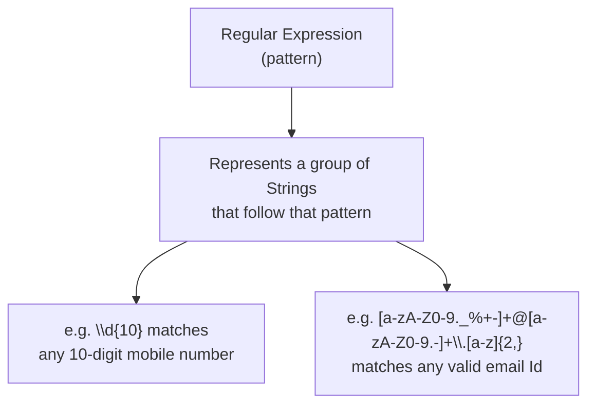
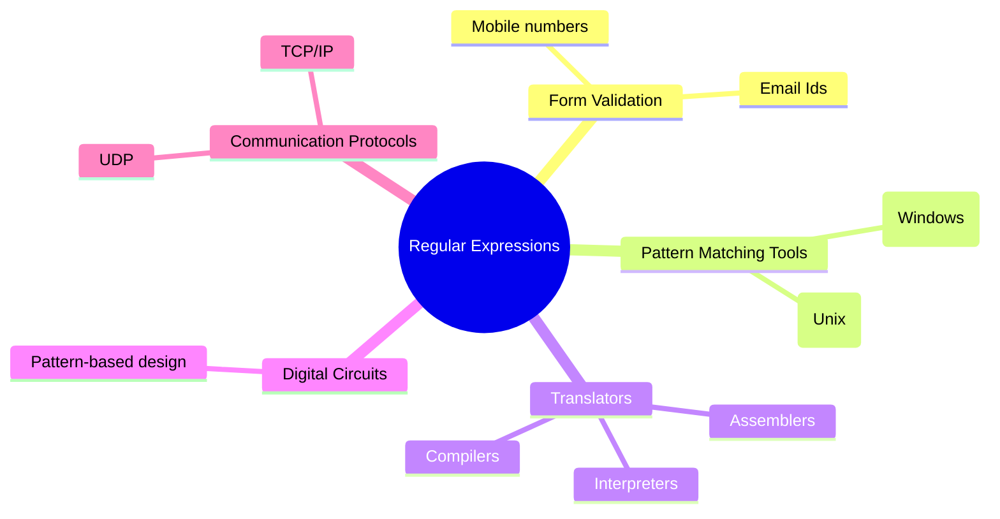
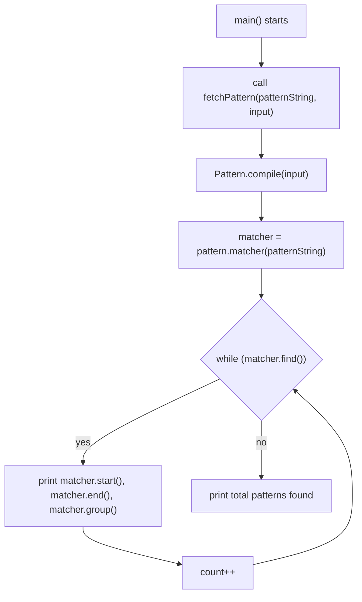
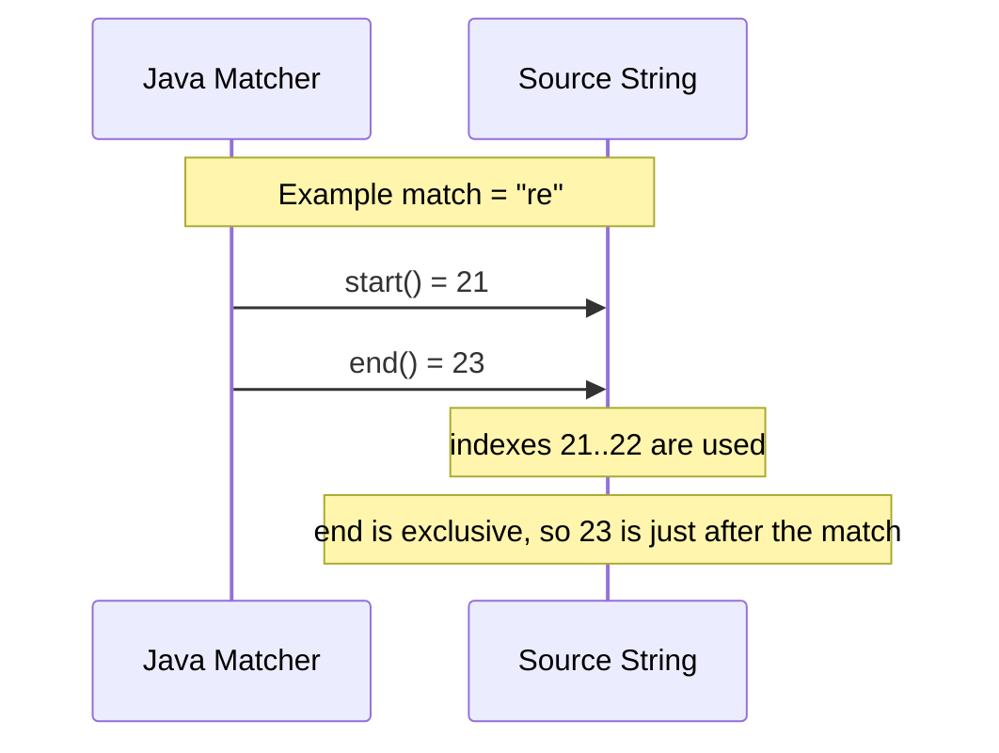
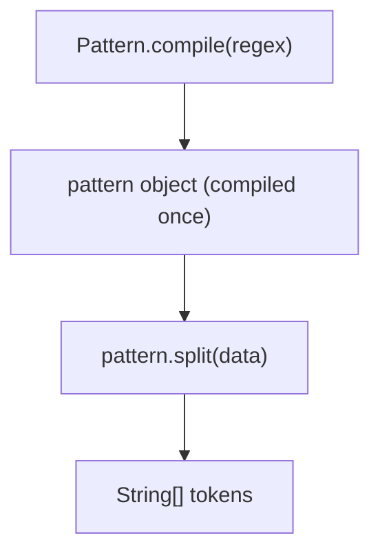
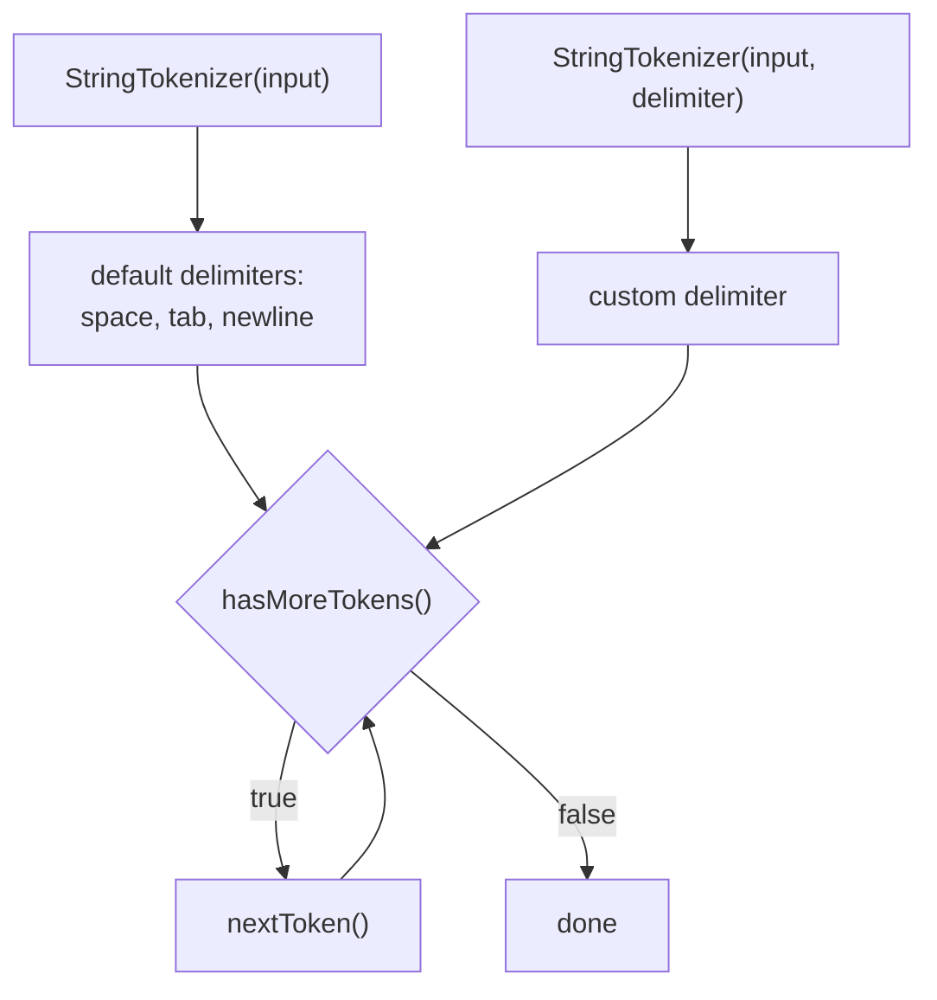
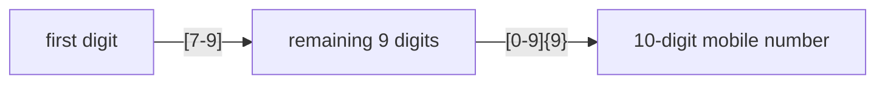
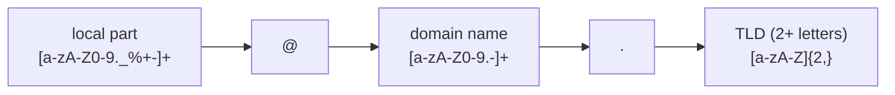
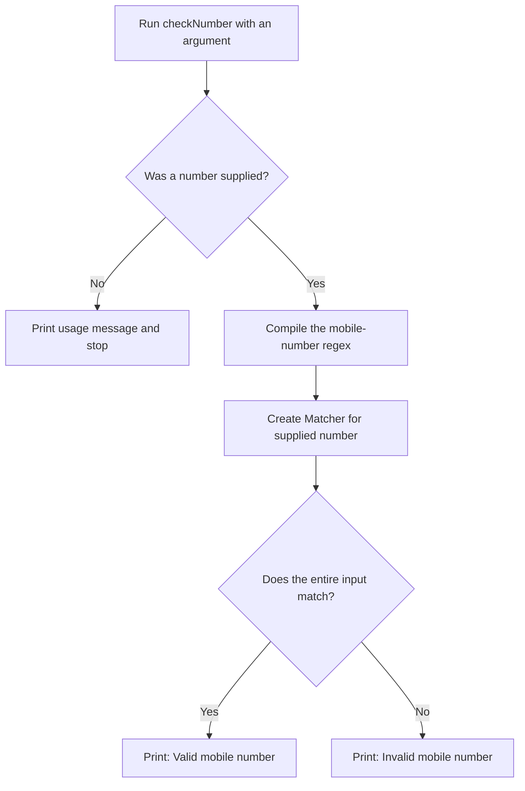
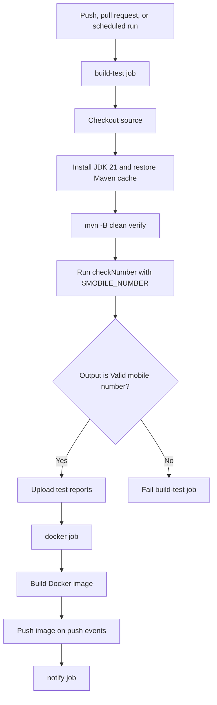

# Table of Contents

- [Regular Expressions — Basics](#regular-expressions-—-basics)
  - [📌 Concept](#📌-concept)
    - [Main application areas](#main-application-areas)
  - [Execution Summary of the Program](#execution-summary-of-the-program)
    - [Program flow](#program-flow)
    - [What the program does](#what-the-program-does)
    - [Why `start()` and `end()` behave like this](#why-start-and-end-behave-like-this)
    - [Example interpretation](#example-interpretation)
    - [`Pattern` and `Matcher` API summary](#pattern-and-matcher-api-summary)
  - [Important Methods of `Matcher`](#important-methods-of-matcher)
  - [🔗 Related Files](#🔗-related-files)
  - [Character classes](#character-classes)
  - [Predefined character classes](#predefined-character-classes)
  - [Quantifiers](#quantifiers)
  - [Boundary matchers](#boundary-matchers)
  - [Logical operators](#logical-operators)
  - [Back references](#back-references)
  - [Regular Expressions — `Pattern` Class](#regular-expressions-—-pattern-class)
  - [split()](#split)
    - [Two ways to split a String](#two-ways-to-split-a-string)
    - [Example](#example)
  - [`StringTokenizer`](#stringtokenizer)
  - [📌 Concept](#📌-concept-1)
  - [Key methods](#key-methods)
    - [Example — default delimiter](#example-—-default-delimiter)
    - [Example — custom delimiter](#example-—-custom-delimiter)
  - [🔥 Real-world regex — validating a mobile number](#🔥-real-world-regex-—-validating-a-mobile-number)
  - [🔥 Real-world regex — validating an email Id](#🔥-real-world-regex-—-validating-an-email-id)
  - [🔗 Related Files](#🔗-related-files-1)
  - [Regular Expression to Represent Java Language Identifiers](#regular-expression-to-represent-java-language-identifiers)
    - [Rules](#rules)
  - [Executing the Mobile Number Validator Locally](#executing-the-mobile-number-validator-locally)
  - [Program execution flow](#program-execution-flow)
  - [1. Build the program](#1-build-the-program)
  - [2. Run with a valid number](#2-run-with-a-valid-number)
  - [3. Try other cases](#3-try-other-cases)
  - [Executing the Validator in the CI Pipeline](#executing-the-validator-in-the-ci-pipeline)
  - [Workflow configuration](#workflow-configuration)
  - [CI stages explained](#ci-stages-explained)
  - [Changing the pipeline input](#changing-the-pipeline-input)

---

# Regular Expressions — Basics

> A hands-on reference for Java regular expressions, `Pattern`, `Matcher`, tokenization, validation, and CI execution.

> **Preview tip:** Open this page in **Markdown Preview** (`Ctrl+Shift+V`) for the diagrams, tables, and clickable contents.

<!-- TOC -->
- [Regular Expressions — Basics](#regular-expressions--basics)
  - [Concept](#concept)
  - [Execution Summary of the Program](#execution-summary-of-the-program)
  - [Important Methods of Matcher class](#important-methods-of-matcher-class)
  - [Related Files](#related-files)
  - [Character classes](#character-classes)
  - [Predefined character classes](#predefined-character-classes)
  - [Quantifiers](#quantifiers)
  - [Boundary matchers](#boundary-matchers)
  - [Logical operators](#logical-operators)
  - [Back references](#back-references)
- [Regular Expressions — Pattern Class](#regular-expressions--pattern-class)
  - [split()](#split)
- [StringTokenizer](#stringtokenizer)
  - [Concept](#concept-1)
  - [Key methods](#key-methods)
  - [Real-world regex — validating a mobile number](#real-world-regex--validating-a-mobile-number)
  - [Real-world regex — validating an email Id](#real-world-regex--validating-an-email-id)
  - [Related Files](#related-files-1)
- [Regular expression to represent Java language identifiers](#regular-expression-to-represent-java-language-identifiers)
- [Executing the Mobile Number Validator Locally](#executing-the-mobile-number-validator-locally)
  - [Program execution flow](#program-execution-flow)
- [Executing the Validator in the CI Pipeline](#executing-the-validator-in-the-ci-pipeline)
  - [Workflow configuration](#workflow-configuration)
  - [CI stages explained](#ci-stages-explained)
  - [Changing the pipeline input](#changing-the-pipeline-input)
<!-- /TOC -->

**File:** [regularExpressionBasics.java](../../../demo/src/main/java/com/regularExpressions/regularExpressionBasics.java)

---

## 📌 Concept

> A regular expression represents a **group of Strings that follow a particular pattern**, instead of a single fixed String. It lets you validate or match many possible inputs (e.g. "any valid mobile number") with one compact rule.



### Main application areas

1. **Form/input validation** — e.g. mobile numbers, email addresses.
2. **Pattern-matching applications** — e.g. `Ctrl+F` (Windows), `grep` (Unix).
3. **Building translators** — e.g. assemblers, compilers, interpreters (tokenizing source text against lexical patterns).
4. **Designing digital circuits** — pattern-based state/transition specifications used in digital circuit design.
5. **Communication protocols** — specifying valid message/packet formats, e.g. TCP/IP, UDP.



## Execution Summary of the Program

This file demonstrates the core idea of regex matching using `Pattern` and `Matcher`.

### Program flow



### What the program does

- `Pattern.compile(input)` creates a regex pattern from the `input` text.
- `pattern.matcher(patternString)` tries to find matches inside the larger string.
- `matcher.find()` keeps scanning until no more matches remain.
- For every match, Java prints:
  - `matcher.start()` → index where the match starts
  - `matcher.end()` → index just after the match ends
  - `matcher.group()` → the actual matched text
- `count` stores how many matches were found.

### Why `start()` and `end()` behave like this

Java uses a half-open range for match boundaries:

- `start()` is inclusive
- `end()` is exclusive

So if a match is found at index `21` and ends at `23`, the matched text is from index `21` and `22`.



### Example interpretation

```text
match found: re
start = 21
end = 23
actual characters used = indexes 21 to 22
```

So the formula is:

```text
match length = end - start
```

For example:

```text
23 - 21 = 2
```

This explains why the output can look like:

```text
21===23===re
```

Even though the actual match is only two characters long.

### `Pattern` and `Matcher` API summary

`Pattern.compile(String regex)` compiles the given regular expression into a `Pattern` object.

```java
public static Pattern compile(String regex)
public Matcher matcher(CharSequence target)
```

Use a `Matcher` object to check a compiled pattern against a target string. Create it with the `matcher()` method of `Pattern`.

## Important Methods of `Matcher`

| Method | Description |
| ------ | ----------- |
| `boolean find()` | Attempts to find the next match and returns `true` when one is available. |
| `int start()` | Returns the inclusive start index of the match. |
| `int end()` | Returns the exclusive end index of the match. |
| `String group()` | Returns the matched text. |

> **Note:** `Pattern` and `Matcher` are in the `java.util.regex` package and were introduced in Java 1.4.

## 🔗 Related Files
- [regularExpressionBasics.java](../../../demo/src/main/java/com/regularExpressions/regularExpressionBasics.java) — source file implementing the regex scanning logic.

## Character classes

| Pattern | Meaning |
| ------- | ------- |
| `[abc]` | Either `a`, `b`, or `c`. |
| `[^abc]` | Any character except `a`, `b`, or `c` (negation). |
| `[a-z]` | Any character from `a` to `z` (lowercase range). |
| `[A-Z]` | Any character from `A` to `Z` (uppercase range). |
| `[a-zA-Z]` | Any character from `a` to `z` or `A` to `Z` (a letter, either case). |
| `[0-9]` | Any digit from `0` to `9`. |
| `[a-d[m-p]]` | Union: either `a` to `d` or `m` to `p`. |
| `[a-z&&[def]]` | Intersection: only `d`, `e`, or `f` (letters common to both classes). |
| `[a-z&&[^bc]]` | Subtraction: `a` to `z` except `b` and `c`. |
| `[a-z&&[^m-p]]` | Subtraction: `a` to `z` except `m` to `p`. |

## Predefined character classes

| Pattern | Meaning |
| ------- | ------- |
| `.` | Any character (except line terminator). |
| `\d` | Any digit, same as `[0-9]`. |
| `\D` | Any non-digit, same as `[^0-9]`. |
| `\s` | Any whitespace character (space, tab, newline), same as `[ \t\n\x0B\f\r]`. |
| `\S` | Any non-whitespace character, same as `[^\s]`. |
| `\w` | Any word character, same as `[a-zA-Z_0-9]`. |
| `\W` | Any non-word character, same as `[^\w]`. |

## Quantifiers

| Pattern | Meaning |
| ------- | ------- |
| `X?` | `X` occurs zero or one time (optional). |
| `X*` | `X` occurs zero or more times. |
| `X+` | `X` occurs one or more times. |
| `X{n}` | `X` occurs exactly `n` times. |
| `X{n,}` | `X` occurs at least `n` times. |
| `X{n,m}` | `X` occurs at least `n` but not more than `m` times. |

## Boundary matchers

| Pattern | Meaning |
| ------- | ------- |
| `^` | Matches at the beginning of a line. |
| `$` | Matches at the end of a line. |
| `\b` | Matches a word boundary. |
| `\B` | Matches a non-word boundary. |
| `\A` | Matches at the beginning of the input. |
| `\Z` | Matches at the end of the input, before the final line terminator (if any). |
| `\z` | Matches at the very end of the input. |

## Logical operators

| Pattern | Meaning |
| ------- | ------- |
| `XY` | `X` followed by `Y` (concatenation). |
| `X\|Y` | Either `X` or `Y` (alternation). |
| `(X)` | `X` as a capturing group. |

## Back references

| Pattern | Meaning |
| ------- | ------- |
| `\n` | Matches whatever was matched by the n-th capturing group (for example, `\1` refers to group 1). |

---

## Regular Expressions — `Pattern` Class

**File:** [splitMethod.java](../../../demo/src/main/java/com/regularExpressions/patternClass/splitMethod.java)

## split()

We can use `Pattern` class' `split()` method to split the target String according to a particular regex pattern.

```java
public String[] split(CharSequence input)
```

This is more powerful than `String.split()` because the pattern is compiled once (via `Pattern.compile()`) and can be reused across multiple `split()` calls efficiently.



### Two ways to split a String

| Approach        | Method                                | Notes                                                                          |
| --------------- | ------------------------------------- | ------------------------------------------------------------------------------ |
| `String` class  | `input.split(regex)`                  | Compiles the regex internally on every call                                    |
| `Pattern` class | `Pattern.compile(regex).split(input)` | Compile once, reuse the pattern multiple times — better for repeated splitting |

### Example

```java
Pattern pattern = Pattern.compile("\\s+");   // split by one-or-more whitespace
String[] result = pattern.split("This is an example string");
// => ["This", "is", "an", "example", "string"]

Pattern dotPattern = Pattern.compile("[.]"); // split by literal dot
String[] parts = dotPattern.split("www.durgajobs.com");
// => ["www", "durgajobs", "com"]
```

> ⚠️ Note the dot is wrapped in a character class `[.]` (or escaped as `\\.`) — an unescaped `.` in regex means "any character", not a literal dot.

---

## `StringTokenizer`

**Files:**
- [stringTokenizer.java](../../../demo/src/main/java/com/regularExpressions/stringTokenizer/stringTokenizer.java)
- [mobileNumber.java](../../../demo/src/main/java/com/regularExpressions/stringTokenizer/mobileNumber.java)

## 📌 Concept

> `StringTokenizer` is a class **specially designed for tokenization** — breaking a String into smaller pieces ("tokens") based on delimiter characters.

- Present in the `java.util` package.
- Considered a **legacy class** — for new code, `String.split()` or `Pattern`/`Matcher` are generally preferred, but `StringTokenizer` is still simple and fast for basic delimiter-based splitting.



## Key methods

| Method | Description |
| ------ | ----------- |
| `StringTokenizer(String input)` | Creates a tokenizer using the **default delimiters** — space, tab, newline, carriage return, form feed. |
| `StringTokenizer(String input, String delimiter)` | Creates a tokenizer using a **custom delimiter** string. |
| `boolean hasMoreTokens()` | Returns `true` if there are still tokens left to read. |
| `String nextToken()` | Returns the next token and advances the tokenizer. |

### Example — default delimiter

```java
StringTokenizer tokenizer = new StringTokenizer("This is an example string");
while (tokenizer.hasMoreTokens()) {
    System.out.println(tokenizer.nextToken());
}
// This
// is
// an
// example
// string
```

### Example — custom delimiter

```java
StringTokenizer tokenizer = new StringTokenizer("19-09-2015", "-");
while (tokenizer.hasMoreTokens()) {
    System.out.println(tokenizer.nextToken());
}
// 19
// 09
// 2015
```

---

## 🔥 Real-world regex — validating a mobile number

**Requirement:** design a regex representing all valid 10-digit mobile numbers.

**Rules:**
1. Every number must contain **exactly 10 digits**.
2. The **first digit** must be `7`, `8`, or `9`.



| Pattern                 | Meaning                                                                   |
| ----------------------- | ------------------------------------------------------------------------- |
| `[7-9][0-9]{9}`         | Plain 10-digit number starting with 7, 8, or 9                            |
| `0?[7-9][0-9]{9}`       | Allows an optional leading `0` → 11 digits total (e.g. trunk prefix)      |
| `(0\|91)?[7-9][0-9]{9}` | Allows an optional `0` **or** `91` STD/ISD prefix → up to 12 digits total |

## 🔥 Real-world regex — validating an email Id

**Rules:**
1. Should contain exactly **one `@`** symbol.
2. Should have a **domain name** after `@`.
3. Can contain alphanumeric characters, dots, and underscores **before** `@`.

```text
[a-zA-Z0-9._%+-]+@[a-zA-Z0-9.-]+\.[a-zA-Z]{2,}
```



| Part       | Regex               | Meaning                                                       |
| ---------- | ------------------- | ------------------------------------------------------------- |
| Local part | `[a-zA-Z0-9._%+-]+` | Letters, digits, dot, underscore, `%`, `+`, `-` (one or more) |
| Separator  | `@`                 | Literal `@` symbol                                            |
| Domain     | `[a-zA-Z0-9.-]+`    | Letters, digits, dot, hyphen (one or more)                    |
| Dot        | `\.`                | Literal dot before the TLD                                    |
| TLD        | `[a-zA-Z]{2,}`      | At least 2 letters, e.g. `com`, `in`, `org`                   |

## 🔗 Related Files
- [splitMethod.java](../../../demo/src/main/java/com/regularExpressions/patternClass/splitMethod.java) — `Pattern.split()` vs `String.split()`.
- [stringTokenizer.java](../../../demo/src/main/java/com/regularExpressions/stringTokenizer/stringTokenizer.java) — default and custom delimiter tokenization.
- [mobileNumber.java](../../../demo/src/main/java/com/regularExpressions/stringTokenizer/mobileNumber.java) — mobile 
number and email regex design notes.

## Regular Expression to Represent Java Language Identifiers

### Rules

Allowed characters are:

1. `a-z`, `A-Z`, `0-9`, `#`, `$`
2. Length of the identifier should be at least 2.
3. The first character should be a lowercase alphabet symbol from `a` to `k`.
4. The second character should be a digit divisible by 3 (`0`, `3`, `6`, `9`).

```text
[a-k][0369][a-zA-Z0-9#$]*
```

---

## Executing the Mobile Number Validator Locally

**File:** [checkNumber.java](../../../demo/src/main/java/com/regularExpressions/checkNumber.java)

The program accepts a mobile number as a command-line argument and validates it against this regex:

```text
(0|91)?[7-9][0-9]{9}
```

| Regex part | Purpose                                                        |
| ---------- | -------------------------------------------------------------- |
| `(0        | 91)?`                                                          | Optionally allows the prefix `0` or `91`. The `?` makes the whole prefix optional. |
| `[7-9]`    | Requires the first mobile-number digit to be `7`, `8`, or `9`. |
| `[0-9]{9}` | Requires exactly nine more digits.                             |

## Program execution flow



## 1. Build the program

Run this from the project root:

```bash
cd demo
mvn clean verify
```

What each part does:

| Command     | Explanation                                                              |
| ----------- | ------------------------------------------------------------------------ |
| `cd demo`   | Moves into the Maven project directory containing `pom.xml`.             |
| `mvn clean` | Deletes previous build output from `target/`.                            |
| `verify`    | Compiles the Java source, runs configured tests, and verifies the build. |

After a successful build, the compiled class is located at:

```text
demo/target/classes/com/regularExpressions/checkNumber.class
```

## 2. Run with a valid number

From the project root, run:

```bash
java -cp demo/target/classes com.regularExpressions.checkNumber 9876543210
```

Expected output:

```text
Valid mobile number
```

`-cp demo/target/classes` tells Java where to find compiled classes. `com.regularExpressions.checkNumber` is the fully qualified class name, and `9876543210` becomes `args[0]` in `main`.

## 3. Try other cases

```bash
# Valid: optional 91 prefix
java -cp demo/target/classes com.regularExpressions.checkNumber 919876543210

# Invalid: starts with 6
java -cp demo/target/classes com.regularExpressions.checkNumber 6876543210

# Invalid: fewer than 10 mobile-number digits
java -cp demo/target/classes com.regularExpressions.checkNumber 987654321

# No argument: prints usage instead of throwing an exception
java -cp demo/target/classes com.regularExpressions.checkNumber
```

> The no-argument check is important: the program checks `args.length` before reading `args[0]`, preventing `ArrayIndexOutOfBoundsException`.

---

## Executing the Validator in the CI Pipeline

**Workflow:** [java-end-to-end_ci.yml](../../../.github/workflows/java-end-to-end_ci.yml)

GitHub Actions runs this workflow automatically on pushes and pull requests to `main`, and every day at `18:30` UTC.



## Workflow configuration

The number is stored once as a workflow environment variable:

```yaml
env:
  MOBILE_NUMBER: 9876543210
```

The execution step references that variable instead of embedding the number in the Java command:

```yaml
output=$(java -cp target/classes com.regularExpressions.checkNumber "$MOBILE_NUMBER")
echo "$output"
test "$output" = "Valid mobile number"
```

| Line               | Explanation                                                                                                |
| ------------------ | ---------------------------------------------------------------------------------------------------------- |
| `output=$(...)`    | Runs the validator and stores its printed result in `output`.                                              |
| `"$MOBILE_NUMBER"` | Supplies the configurable workflow variable as the program argument.                                       |
| `echo "$output"`   | Writes the program result to the GitHub Actions log.                                                       |
| `test ... = ...`   | Compares the result with the expected text. A mismatch returns a non-zero exit code, failing the pipeline. |

## CI stages explained

| Stage            | What happens                                                                                             | Why it matters                                                      |
| ---------------- | -------------------------------------------------------------------------------------------------------- | ------------------------------------------------------------------- |
| Trigger          | GitHub starts the workflow for `main` pushes, pull requests, or the scheduled cron job.                  | Ensures changes are checked before and after integration.           |
| Checkout         | `actions/checkout@v4` downloads the repository onto the GitHub runner.                                   | The runner needs the source and workflow files.                     |
| Java setup       | `actions/setup-java@v4` installs Temurin JDK 21 and restores the Maven cache.                            | Uses a consistent Java version and makes builds faster.             |
| Maven build      | `mvn -B clean verify` runs inside `demo`.                                                                | Compiles Java code and verifies the Maven project before execution. |
| Regex validation | The pipeline runs `checkNumber` with `$MOBILE_NUMBER`.                                                   | Proves the compiled class accepts the expected valid number.        |
| Assertion        | Shell `test` checks for `Valid mobile number`.                                                           | Turns the example into an automated pass/fail check.                |
| Test reports     | Surefire XML reports are uploaded even if the job fails.                                                 | Preserves test evidence for debugging.                              |
| Docker           | Runs only after `build-test` succeeds; builds the application image and pushes it on push events.        | Prevents publishing an image from a failed validation.              |
| Notification     | The final job evaluates the workflow result and uses SMTP only when all required secrets are configured. | Communicates the outcome without exposing credentials.              |

## Changing the pipeline input

To validate another known-good example, edit only `MOBILE_NUMBER` in the `env` section of the workflow. The Java command stays unchanged:

```yaml
env:
  MOBILE_NUMBER: 919876543210
```

For this pipeline check, keep the value valid. An invalid value makes the assertion fail intentionally, which stops the `build-test` job and prevents the dependent Docker job from running.
