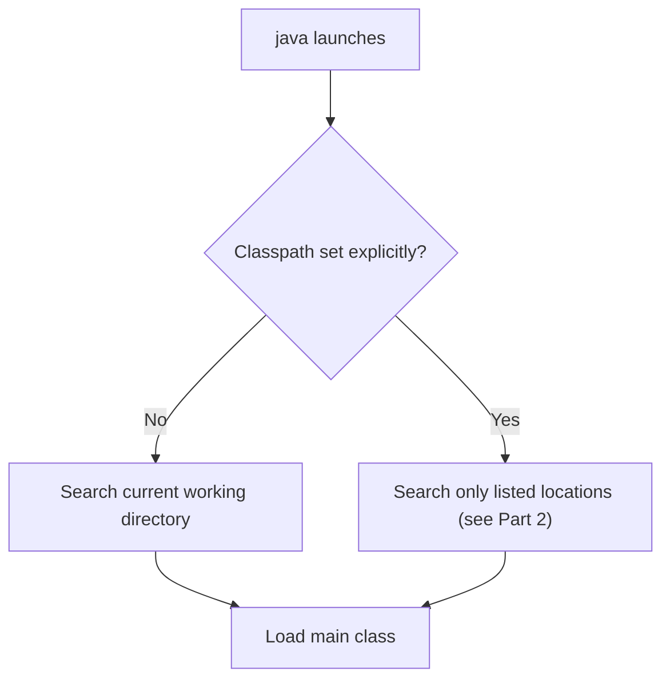
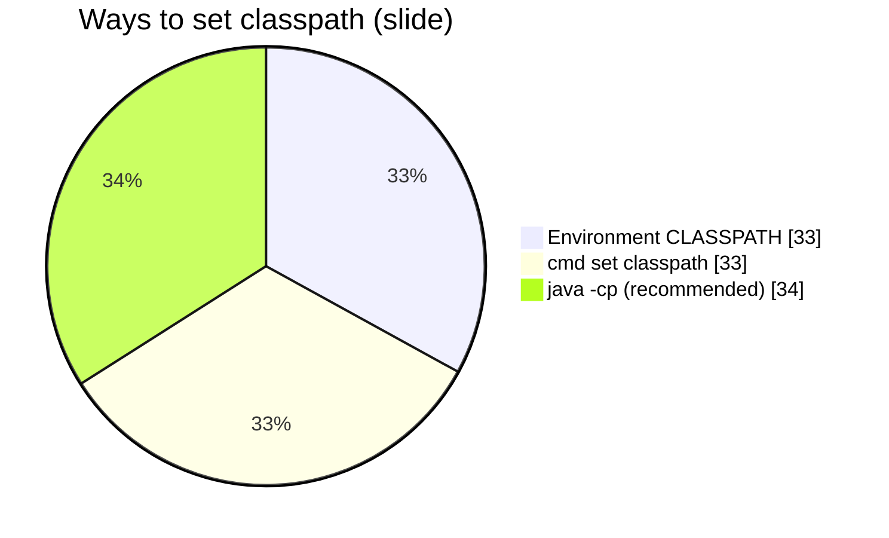
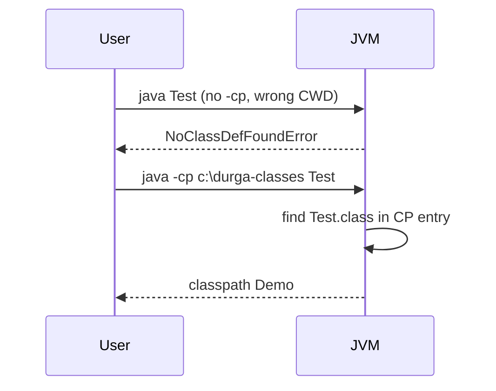
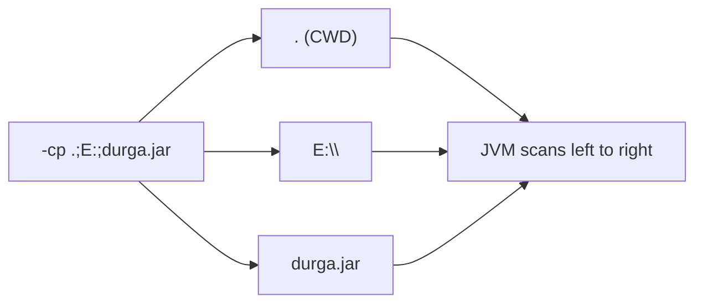
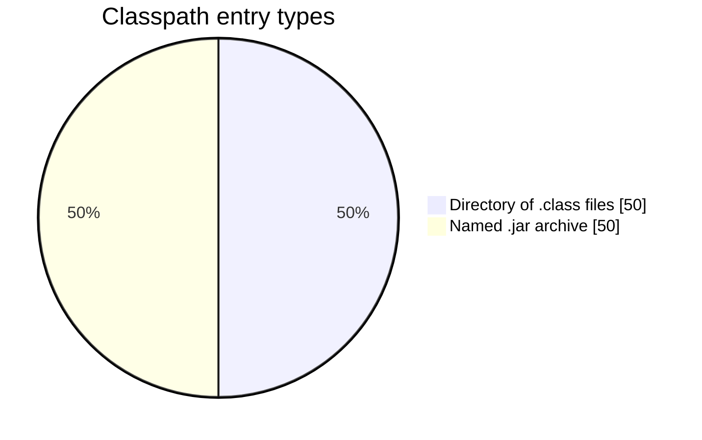
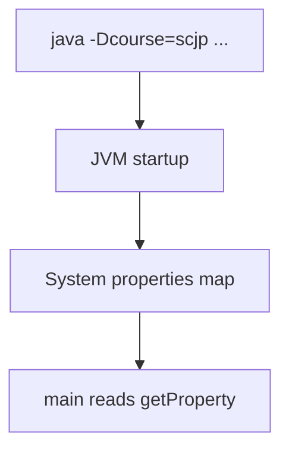
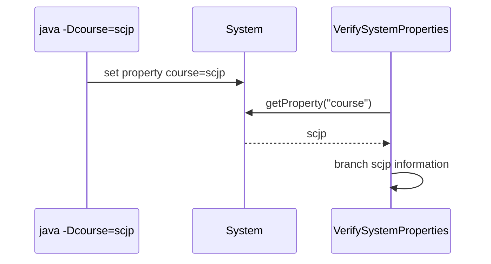
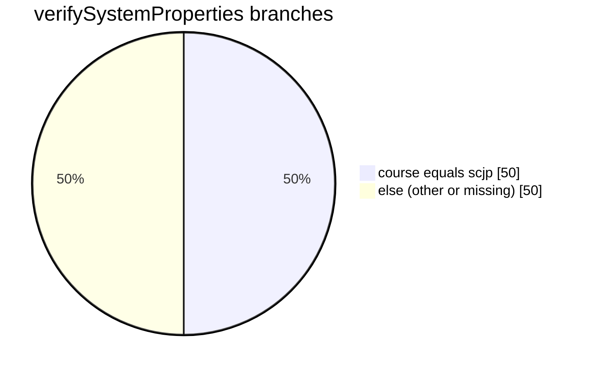
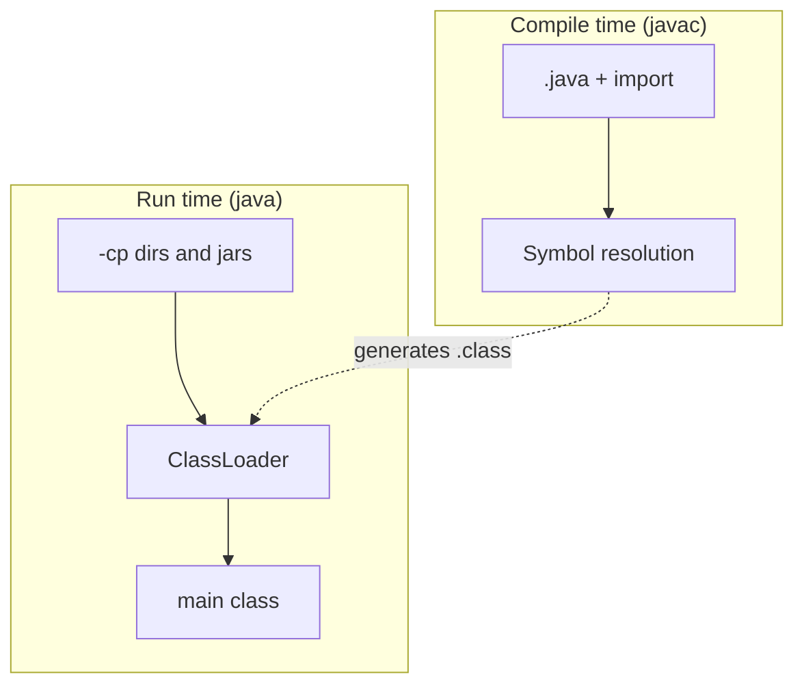
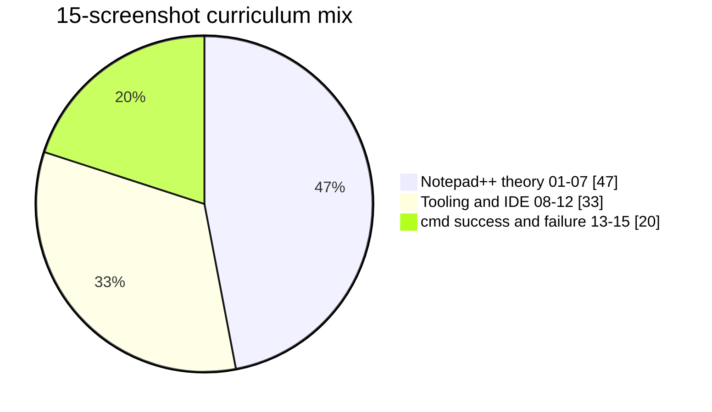

# Table of Contents

- [Classpath, JAR files, and system properties](#classpath-jar-files-and-system-properties)
  - [Guide map](#guide-map)
  - [Part 1 — Classpath overview (seq-01)](#part-1-—-classpath-overview-seq-01)
    - [Notes (from slide)](#notes-from-slide)
    - [Demo program](#demo-program)
  - [Part 2 — `Test` execution rules (seq-02)](#part-2-—-test-execution-rules-seq-02)
    - [Execution history (from notes)](#execution-history-from-notes)
    - [Rules](#rules)
  - [Part 3 — JAR creation (seq-03)](#part-3-—-jar-creation-seq-03)
    - [Why JAR files](#why-jar-files)
    - [`jar -cvf` — create](#jar--cvf-—-create)
  - [Part 4 — JAR extract & classpath (seq-04)](#part-4-—-jar-extract-classpath-seq-04)
    - [`jar -xvf` — extract](#jar--xvf-—-extract)
    - [`jar -tvf` — table of contents](#jar--tvf-—-table-of-contents)
    - [Classpath rules (slide)](#classpath-rules-slide)
  - [Part 5 — System properties (seq-05)](#part-5-—-system-properties-seq-05)
    - [Demo — list all properties](#demo-—-list-all-properties)
    - [Set property at launch: `-D`](#set-property-at-launch--d)
  - [Part 6 — `VerifySystemProperties` (seq-06)](#part-6-—-verifysystemproperties-seq-06)
  - [Part 7 — Compiler vs JVM (seq-07)](#part-7-—-compiler-vs-jvm-seq-07)
    - [Points from slide](#points-from-slide)
  - [Execution gallery (screenshots 08–15)](#execution-gallery-screenshots-08–15)
  - [Run the demos](#run-the-demos)
  - [Screenshot index (original upload → teaching order)](#screenshot-index-original-upload-→-teaching-order)

---

# Classpath, JAR files, and system properties

> Sequential guide from the **Notepad++ “new 10”** classroom notes (15 screenshots), arranged in teaching order.  
> Demos: [`Test.java`](../../../demo/src/main/java/com/classpathdemo/Test.java) · [`PrintSystemProperties.java`](../../../demo/src/main/java/com/classpathdemo/PrintSystemProperties.java) · [`VerifySystemProperties.java`](../../../demo/src/main/java/com/classpathdemo/VerifySystemProperties.java)

> **Navigation:** Ctrl+click TOC / Guide map links in preview.

## Guide map

| # | Jump to | Topic |
| - | ------- | ----- |
| 1 | [Part 1 — Classpath overview](#part-1--classpath-overview-seq-01) | Default search + 3 ways to set CP |
| 2 | [Part 2 — `Test` execution rules](#part-2--test-execution-rules-seq-02) | `NOClassDefFoundError`, `-cp` |
| 3 | [Part 3 — JAR creation](#part-3--jar-creation-seq-03) | `jar -cvf` |
| 4 | [Part 4 — JAR extract & classpath](#part-4--jar-extract--classpath-seq-04) | `jar -xvf`, `-tvf`, JAR on CP |
| 5 | [Part 5 — System properties](#part-5--system-properties-seq-05) | `getProperties`, `-D` |
| 6 | [Part 6 — `VerifySystemProperties`](#part-6--verifysystemproperties-seq-06) | `-Dcourse=scjp` |
| 7 | [Part 7 — Compiler vs JVM](#part-7--compiler-vs-jvm-seq-07) | import vs classpath order |
| 8 | [Execution gallery](#execution-gallery-screenshots-08-15) | IDE, `jar` help, cmd, errors |
| 9 | [Run the demos](#run-the-demos) | Commands |

---

<!-- TOC -->
- [Classpath, JAR files, and system properties](#classpath-jar-files-and-system-properties)
  - [Guide map](#guide-map)
  - [Part 1 — Classpath overview (seq-01)](#part-1--classpath-overview-seq-01)
  - [Part 2 — `Test` execution rules (seq-02)](#part-2--test-execution-rules-seq-02)
  - [Part 3 — JAR creation (seq-03)](#part-3--jar-creation-seq-03)
  - [Part 4 — JAR extract & classpath (seq-04)](#part-4--jar-extract--classpath-seq-04)
  - [Part 5 — System properties (seq-05)](#part-5--system-properties-seq-05)
  - [Part 6 — `VerifySystemProperties` (seq-06)](#part-6--verifysystemproperties-seq-06)
  - [Part 7 — Compiler vs JVM (seq-07)](#part-7--compiler-vs-jvm-seq-07)
  - [Execution gallery (screenshots 08–15)](#execution-gallery-screenshots-08-15)
  - [Run the demos](#run-the-demos)
<!-- /TOC -->

---

## Part 1 — Classpath overview (seq-01)


### Notes (from slide)

**How many ways to set the classpath**

1. By default the JVM searches the **current working directory** for required `.class` files.
2. If classpath is set **explicitly**, the JVM searches the locations you specify (and behavior vs “current directory” changes — see Part 2).

**Three ways to set classpath**

| # | Mechanism | Persistence | When to use |
| - | --------- | ----------- | ----------- |
| 1 | **Environment variable** `CLASSPATH` | Permanent for the OS user/session | Shared machine default |
| 2 | **`set classpath=...`** (Windows cmd) | Only that command window | Temporary local testing |
| 3 | **`java -cp ...`** (or `-classpath`) | Only that one `java` launch | **Recommended** in notes — least surprise |

**NOTE (slide):** Among the three, **command-line `-cp`** is recommended because it scopes classpath to a single run.

### Demo program

```java
package com.classpathdemo;

public class Test {
    public static void main(String[] args) {
        System.out.println("classpath Demo");
    }
}
```





---

## Part 2 — `Test` execution rules (seq-02)


### Execution history (from notes)

| Step | Command | Result |
| ---- | ------- | ------ |
| 1 | `c:\durga-classes> javac Test.java` | Compile |
| 2 | `c:\durga-classes> java Test` | Runs (CWD = class location) |
| 3 | `c:\> java Test` | **`NoClassDefFoundError: Test`** — wrong directory |
| 4 | `c:\> java -cp c:\durga-classes Test` | Runs from **any** folder |
| 5 | Repeat `-cp` | Same — location-independent |

### Rules

1. After setting `-cp`, you can run from **any drive/folder** — but the path must **include** where `Test.class` lives.
2. **`c:\durga-classes> java -cp E: Test`** → **`NoClassDefFoundError`** — `E:` alone does not contain `Test`.
3. **`java -cp .;E: Test`** — `.` means **current working directory**; `;` separates entries (Windows). JVM scans **left → right** until the class is found.

**Multi-drive example (slide):** Programs may be authored on **C:** and **D:**; classpath must list every location (and JAR names — Part 4) that holds required types.





---

## Part 3 — JAR creation (seq-03)


### Why JAR files

Third-party libraries ship as **`.jar`** archives (ZIP format): servlet-api, ojdbc, log4j, etc. You place the JAR on the **classpath** so the JVM loads classes **from inside** the archive.

### `jar -cvf` — create

| Command | Meaning |
| ------- | ------- |
| `jar -cvf durgacalc.jar Test.class` | One class file |
| `jar -cvf durgacalc.jar A.class B.class C.class` | Several classes |
| `jar -cvf durgacalc.jar *` | All files in folder |
| `jar -cvf durgacalc.jar .` | Current directory tree |

| Flag | Role |
| ---- | ---- |
| **c** | **Create** new archive |
| **v** | **Verbose** |
| **f** | **File** name follows (`durgacalc.jar`) |


---

## Part 4 — JAR extract & classpath (seq-04)


### `jar -xvf` — extract

```
jar -xvf durgacalc.jar
```

| Flag | Role |
| ---- | ---- |
| **x** | **Extract** |
| **v**, **f** | Same as create |

### `jar -tvf` — table of contents

```
jar -tvf durgaclass.jar
```

| Flag | Role |
| ---- | ---- |
| **t** | **List** entries |

### Classpath rules (slide)

| Artifact | On classpath |
| -------- | ------------ |
| **`.class` file** | Directory path is enough |
| **`.jar` file** | Directory is **not** enough — you must include the **JAR file name** in `-cp` |



**System properties (bridge to Part 5):** The OS/JVM keeps persistent configuration as **system properties** (user name, paths, separators, custom `-D` values).

---

## Part 5 — System properties (seq-05)


### Demo — list all properties

```java
import java.util.Properties;

public class PrintSystemProperties {
    public static void main(String[] args) {
        Properties p = System.getProperties();
        p.list(System.out);
    }
}
```

Runnable: [`PrintSystemProperties.java`](../../../demo/src/main/java/com/classpathdemo/PrintSystemProperties.java).

### Set property at launch: `-D`

```
java -Ddurga=ocjp com.classpathdemo.Test
```

| Rule | Detail |
| ---- | ------ |
| **`-D`** | Defines a system property for this JVM process |
| **No space** | Between `-D`, name, `=`, and value |
| **Benefit** | Customize program behavior **without recompiling** |



---

## Part 6 — `VerifySystemProperties` (seq-06)


```java
public class VerifySystemProperties {
    public static void main(String[] args) {
        String course = System.getProperty("course");
        if (course != null && course.equals("scjp")) {
            System.out.println("scjp information");
        } else {
            System.out.println("non-scjp information");
        }
    }
}
```

| Command | Output |
| ------- | ------ |
| `java -Dcourse=scjp com.classpathdemo.VerifySystemProperties` | `scjp information` |
| `java -Dcourse=scj8 com.classpathdemo.VerifySystemProperties` | `non-scjp information` |
| No `-Dcourse` | `non-scjp information` (repo demo null-safe; raw notes used `course.equals` only) |





---

## Part 7 — Compiler vs JVM (seq-07)


### Points from slide

1. **Package / import:** If a type lives in a package, source uses **`import`** so the **compiler** resolves names. That is separate from where `.class` / JAR files sit at **runtime**.
2. **Compiler vs JVM:** The **compiler** checks **compile-time** dependencies (symbols). The **JVM** loads **all runtime** dependencies from the **classpath** (every directory and JAR needed on the path).
3. **Order matters:** Classpath entries are scanned **left to right**; first match wins. Put the most specific / correct JAR first when duplicates exist.



---

## Execution gallery (screenshots 08–15)

Hands-on and IDE evidence in note order after theory.

| Seq | Image | What it shows |
| --- | ----- | ------------- |
| 08 |  | `jar` tool usage / help (`-c`, `-t`, `-x`, `-u`, `-v`, `-f`, …) |
| 09 |  | IDE — typing classroom Java |
| 10 |  | IDE — continued program |
| 11 |  | IDE — short snippet / paths |
| 12 |  | IDE + run configuration (`java -cp` style) |
| 13 |  | Command prompt — `javac` / `java -cp` across drives |
| 14 |  | **Error** — class/JAR not on classpath (`ClassLoader`, missing main) |
| 15 |  | Command prompt coda — classpath placement recap |




---

## Run the demos

From repository root (Linux/macOS — use `:` as classpath separator):

```bash
cd demo/src/main/java
javac com/classpathdemo/Test.java com/classpathdemo/PrintSystemProperties.java com/classpathdemo/VerifySystemProperties.java

# Run from another directory — needs -cp pointing at parent of package folder
cd /tmp
java -cp /workspace/demo/src/main/java com.classpathdemo.Test

java -cp /workspace/demo/src/main/java com.classpathdemo.VerifySystemProperties
java -cp /workspace/demo/src/main/java -Dcourse=scjp com.classpathdemo.VerifySystemProperties

java -cp /workspace/demo/src/main/java com.classpathdemo.PrintSystemProperties | head -20
```

**Create and run from a JAR (illustrates Part 3–4):**

```bash
cd demo/src/main/java
jar cvf durgacalc.jar -C . com/classpathdemo/Test.class
java -cp durgacalc.jar com.classpathdemo.Test
jar tvf durgacalc.jar
```

---

## Screenshot index (original upload → teaching order)

| Teaching # | File in `images/` |
| ---------- | ----------------- |
| 1–15 | `seq-01-notepad-screenshot.png` … `seq-15-notepad-screenshot.png` |

Original photos were reordered from upload order into the sequence above (classpath → JAR → system properties → lab screenshots).
