# Table of Contents

- [HashMap vs ConcurrentHashMap](#hashmap-vs-concurrenthashmap)
  - [Guide map](#guide-map)
  - [Classroom comparison table](#classroom-comparison-table)
  - [Thread safety and performance](#thread-safety-and-performance)
    - [Single-threaded vs multi-threaded](#single-threaded-vs-multi-threaded)
  - [Iteration while another thread modifies](#iteration-while-another-thread-modifies)
    - [Mini example — `HashMap` (fail-fast) vs `ConcurrentHashMap` (fail-safe)](#mini-example-—-hashmap-fail-fast-vs-concurrenthashmap-fail-safe)
    - [`HashMap` — fail-fast](#hashmap-—-fail-fast)
    - [`ConcurrentHashMap` — weakly consistent (fail-safe)](#concurrenthashmap-—-weakly-consistent-fail-safe)
  - [Null keys and values](#null-keys-and-values)
  - [Which map should you use?](#which-map-should-you-use)
  - [ConcurrentHashMap vs `synchronizedMap()` vs `Hashtable`](#concurrenthashmap-vs-synchronizedmap-vs-hashtable)
    - [Summary table (all seven slide rows)](#summary-table-all-seven-slide-rows)
    - [Locking model (flow)](#locking-model-flow)
    - [Multi-thread access (sequence)](#multi-thread-access-sequence)
    - [Iteration while another thread modifies](#iteration-while-another-thread-modifies-1)
    - [`null` keys and values](#null-keys-and-values-1)
    - [Which thread-safe map? (extended)](#which-thread-safe-map-extended)
  - [Run the repo demo](#run-the-repo-demo)
  - [See also](#see-also)

---

# HashMap vs ConcurrentHashMap

> Runnable `ConcurrentHashMap` demo: [`concurrentHashMap.java`](../../../demo/src/main/java/com/concurrentCollection/concurrentMap/concurrentHashMap.java) · Deeper internals: [concurrentMap.md](concurrentMap.md) · Hub: [concurrentCollections.md](concurrentCollections.md)

---

## Guide map

| Section | Content |
| ------- | ------- |
| [Classroom comparison](#classroom-comparison-table) | Reference slide (image + table) |
| [Thread safety & performance](#thread-safety-and-performance) | When each map wins |
| [Iteration & CME](#iteration-while-another-thread-modifies) | Fail-fast vs fail-safe flows + hub examples |
| [Hub: iterator deep dive](concurrentCollections.md#fail-fast-vs-fail-safe-iterators-with-examples) | Runnable `ArrayList` / `HashMap` / CHM / COW examples |
| [Null rules](#null-keys-and-values) | `HashMap` allows; `ConcurrentHashMap` rejects |
| [Choose the right map](#which-map-should-you-use) | Decision flow + pie chart |
| [CHM vs synchronizedMap vs Hashtable](#concurrenthashmap-vs-synchronizedmap-vs-hashtable) | Thread-safe maps compared (classroom slide) |

---

## Classroom comparison table

<p align="center">
  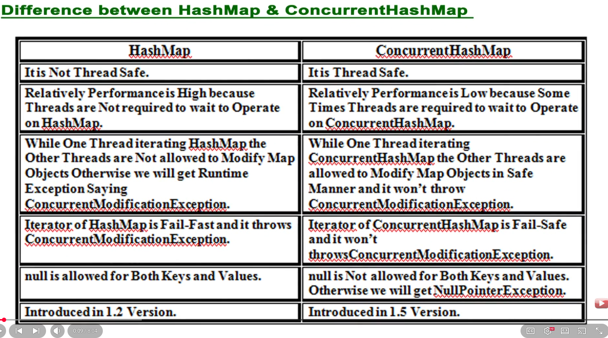
</p>

*Figure: interview-style comparison (expanded and clarified below).*

| Topic | `HashMap` | `ConcurrentHashMap` |
| ----- | --------- | ------------------- |
| **Thread safety** | **Not** thread-safe | **Thread-safe** for concurrent access |
| **Performance (slide)** | **Higher** in the **single-threaded** sense — no internal coordination | **Lower** per operation — threads may **wait** on bin/segment locks or CAS retries |
| **Performance (reality check)** | Fast alone; **unsafe** if multiple threads mutate without external sync | **Higher throughput** than `Collections.synchronizedMap(new HashMap<>())` when **many threads** update **different** keys — see [bucket vs whole-map lock](concurrentMap.md#bucket-level-lock-vs-whole-collection-lock) |
| **Modify while iterating** | Other threads must **not** structurally modify the map → **`ConcurrentModificationException`** (fail-fast iterator) | Other threads **may** update safely; iterator is **weakly consistent** (fail-safe in classroom terms) — **no CME** |
| **Iterator** | **Fail-fast** | **Fail-safe / weakly consistent** |
| **`null`** | **Allowed** for key and value (one `null` key max) | **`null` not allowed** — `NullPointerException` |
| **Since** | Java **1.2** | Java **1.5** (`java.util.concurrent`) |

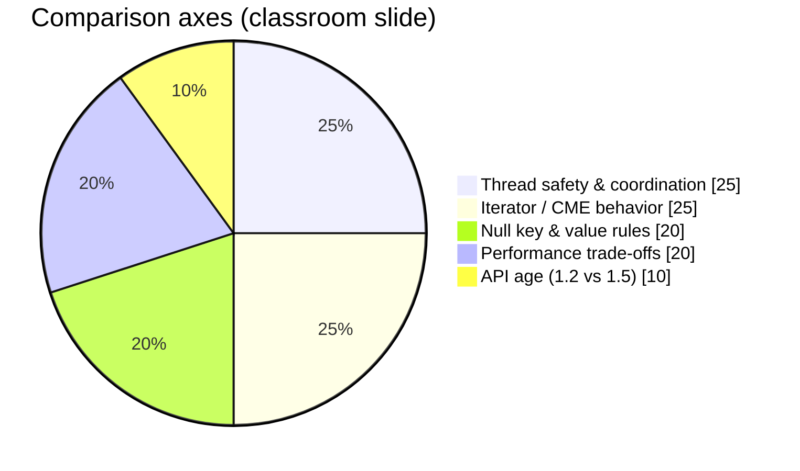
```mermaid
pie showData
    title Comparison axes (classroom slide)
    "Thread safety & coordination" : 25
    "Iterator / CME behavior" : 25
    "Null key & value rules" : 20
    "Performance trade-offs" : 20
    "API age (1.2 vs 1.5)" : 10
```

---

## Thread safety and performance

### Single-threaded vs multi-threaded

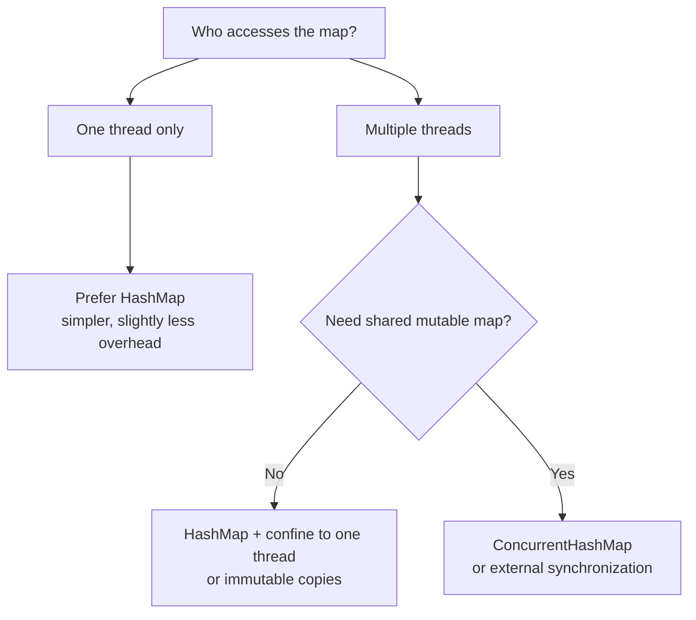
```mermaid
flowchart TD
  Q["Who accesses the map?"]
  Q --> One["One thread only"]
  Q --> Many["Multiple threads"]

  One --> HM["Prefer HashMap<br/>simpler, slightly less overhead"]
  Many --> Safe{"Need shared mutable map?"}
  Safe -- No --> HM2["HashMap + confine to one thread<br/>or immutable copies"]
  Safe -- Yes --> CHM["ConcurrentHashMap<br/>or external synchronization"]
```

| Scenario | Better choice | Why |
| -------- | ------------- | ----- |
| Local variable, one thread | **`HashMap`** | No locking/CAS cost |
| Shared cache, many readers/writers | **`ConcurrentHashMap`** | Bin-level coordination vs locking entire `HashMap` |
| Shared map, rare writes | **`HashMap`** + `ReadWriteLock` or immutable snapshots | Sometimes simpler than CHM |
| Legacy “make HashMap thread-safe” | **`ConcurrentHashMap`** (new code) | `synchronizedMap` still **fail-fast** iterator + **whole-map** lock |

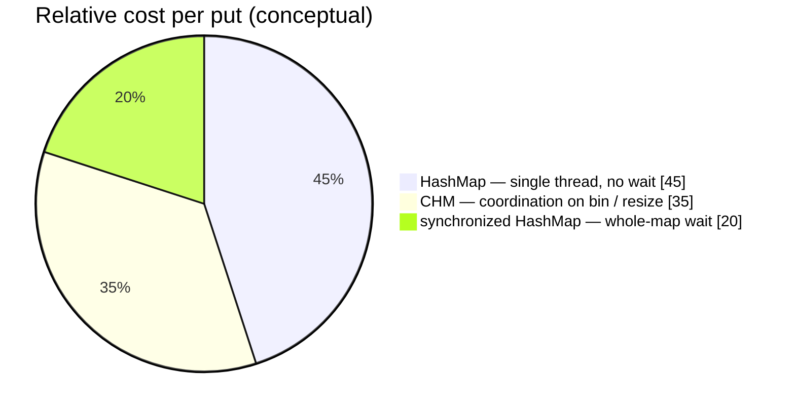
```mermaid
pie showData
    title Relative cost per put (conceptual)
    "HashMap — single thread, no wait" : 45
    "CHM — coordination on bin / resize" : 35
    "synchronized HashMap — whole-map wait" : 20
```

The slide’s “CHM performance is low” means **each operation may do more work** (atomic checks, bin locks). In **parallel**, CHM still wins over a globally locked `HashMap` because threads do not queue on **one** monitor for every key.

---

## Iteration while another thread modifies

Full lesson with **five runnable examples** (list, map, threads, `CopyOnWriteArrayList`): [Fail-fast vs fail-safe iterators](concurrentCollections.md#fail-fast-vs-fail-safe-iterators-with-examples) in the hub.

This section applies the same idea as [`threadDemo.java`](../../../demo/src/main/java/com/concurrentCollection/ConcurrentModificationException/threadDemo.java) on `ArrayList`, but for **maps**.

### Mini example — `HashMap` (fail-fast) vs `ConcurrentHashMap` (fail-safe)

```java
// Fail-fast: HashMap
Map<Integer, String> hm = new HashMap<>();
hm.put(1, "one");
var it = hm.entrySet().iterator();
it.next();
hm.put(2, "two");
it.next(); // ConcurrentModificationException

// Fail-safe: ConcurrentHashMap
Map<Integer, String> chm = new ConcurrentHashMap<>();
chm.put(1, "one");
var it2 = chm.entrySet().iterator();
it2.next();
chm.put(2, "two");
it2.next(); // OK — no CME
```

### `HashMap` — fail-fast

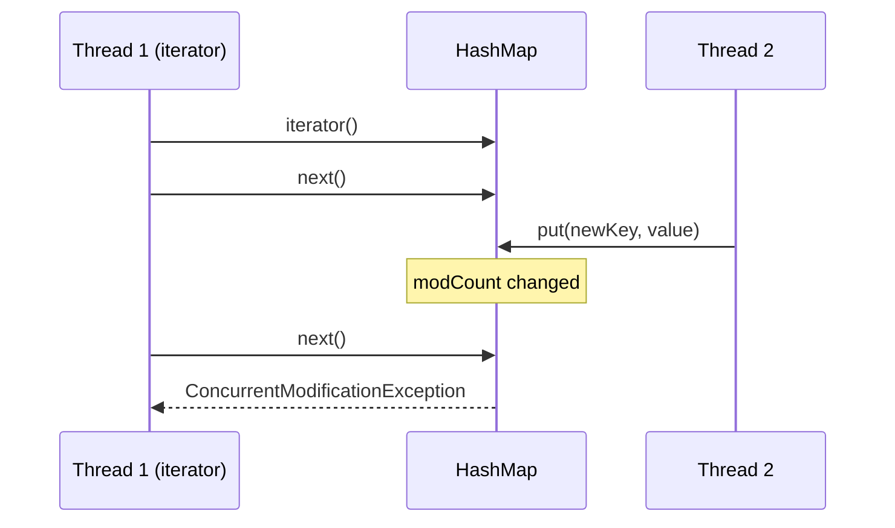
```mermaid
sequenceDiagram
  participant T1 as Thread 1 (iterator)
  participant HM as HashMap
  participant T2 as Thread 2

  T1->>HM: iterator()
  T1->>HM: next()
  T2->>HM: put(newKey, value)
  Note over HM: modCount changed
  T1->>HM: next()
  HM-->>T1: ConcurrentModificationException
```

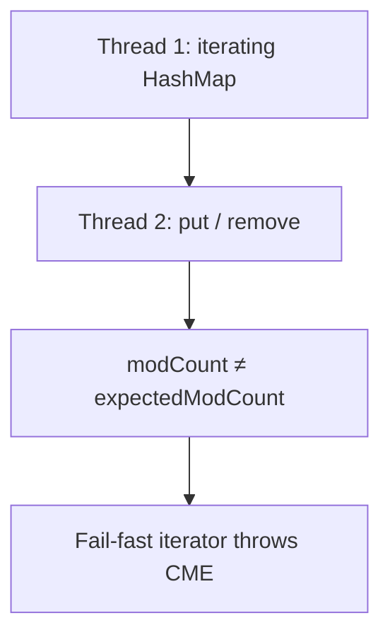
```mermaid
flowchart TD
  A["Thread 1: iterating HashMap"] --> B["Thread 2: put / remove"]
  B --> C["modCount ≠ expectedModCount"]
  C --> D["Fail-fast iterator throws CME"]
```

### `ConcurrentHashMap` — weakly consistent (fail-safe)

```mermaid
sequenceDiagram
  participant T1 as Thread 1 (iterator)
  participant CHM as ConcurrentHashMap
  participant T2 as Thread 2

  T1->>CHM: entrySet().iterator()
  T1->>CHM: next()
  T2->>CHM: put(newKey, value)
  T1->>CHM: next()
  Note over T1,CHM: may or may not see new entry; no CME
```

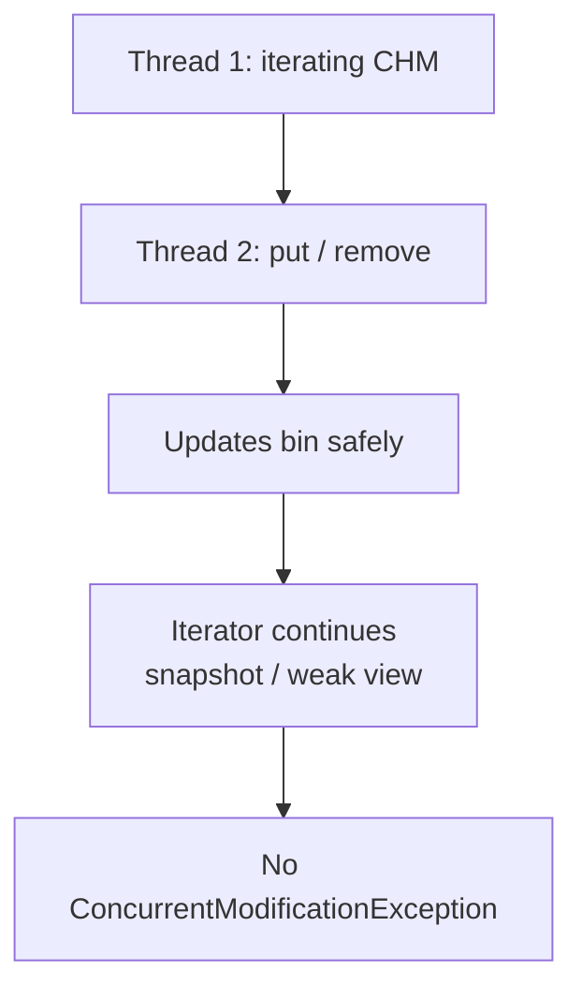
```mermaid
flowchart TD
  A["Thread 1: iterating CHM"] --> B["Thread 2: put / remove"]
  B --> C["Updates bin safely"]
  C --> D["Iterator continues<br/>snapshot / weak view"]
  D --> E["No ConcurrentModificationException"]
```

| | `HashMap` iterator | `ConcurrentHashMap` iterator |
| --- | ------------------ | --------------------------- |
| Sees concurrent adds? | N/A — **CME** first | **May** see some later entries |
| Guarantees | Fast-fail on structural change | No guarantee of full live view |
| Classroom name | **Fail-fast** | **Fail-safe** |

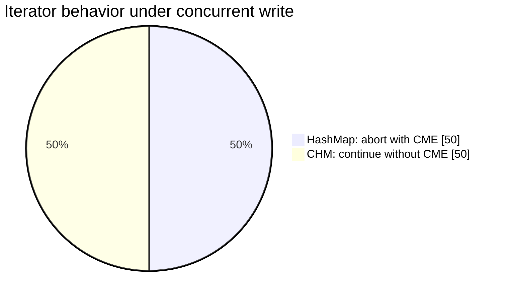
```mermaid
pie showData
    title Iterator behavior under concurrent write
    "HashMap: abort with CME" : 50
    "CHM: continue without CME" : 50
```

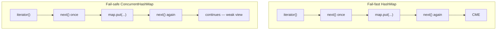
```mermaid
flowchart TD
  subgraph fast ["Fail-fast HashMap"]
    F1["iterator()"] --> F2["next() once"]
    F2 --> F3["map.put(...)"]
    F3 --> F4["next() again"]
    F4 --> F5["CME"]
  end

  subgraph safe ["Fail-safe ConcurrentHashMap"]
    S1["iterator()"] --> S2["next() once"]
    S2 --> S3["map.put(...)"]
    S3 --> S4["next() again"]
    S4 --> S5["continues — weak view"]
  end
```

---

## Null keys and values

| | `HashMap` | `ConcurrentHashMap` |
| --- | --------- | ------------------- |
| `null` key | **One** `null` key allowed | **`NullPointerException`** |
| `null` value | Allowed | **`NullPointerException`** |

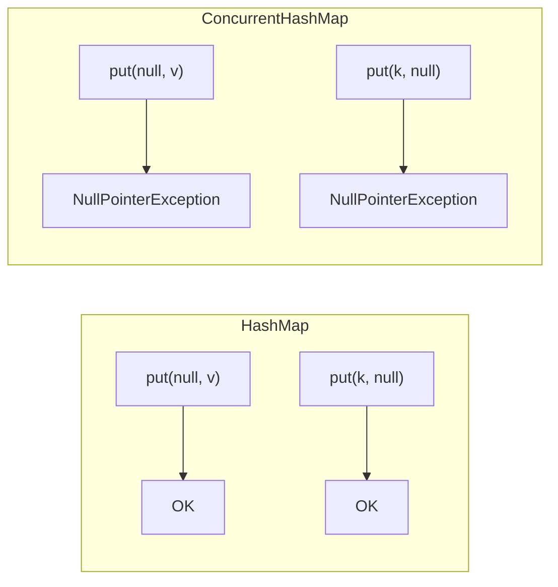
```mermaid
flowchart LR
  subgraph hm ["HashMap"]
    HK["put(null, v)"] --> OK1["OK"]
    HV["put(k, null)"] --> OK2["OK"]
  end

  subgraph chm ["ConcurrentHashMap"]
    CK["put(null, v)"] --> NPE1["NullPointerException"]
    CV["put(k, null)"] --> NPE2["NullPointerException"]
  end
```

`ConcurrentHashMap` forbids `null` so **absence** is unambiguous in concurrent code (`get` returning `null` always means “no mapping”, not “mapped to null”).

---

## Which map should you use?

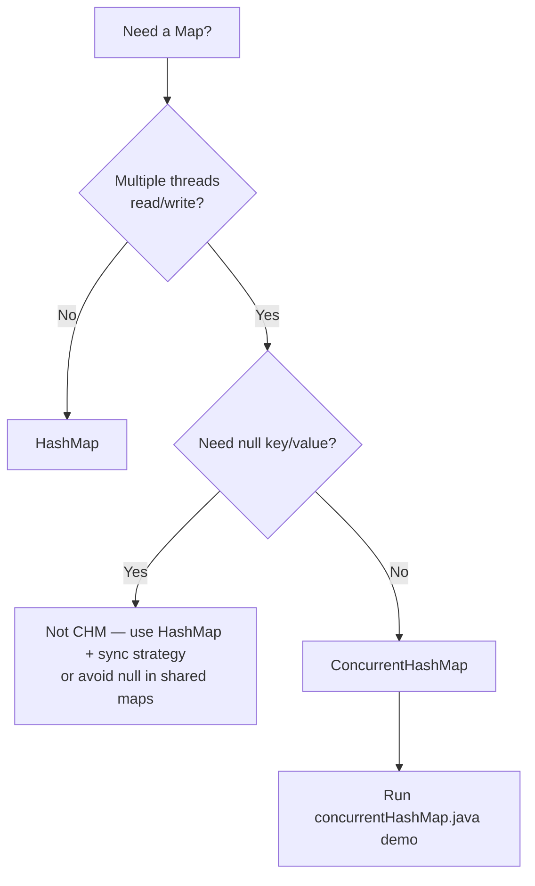
```mermaid
flowchart TD
  Start["Need a Map?"] --> TS{"Multiple threads<br/>read/write?"}
  TS -- No --> HM["HashMap"]
  TS -- Yes --> Null{"Need null key/value?"}
  Null -- Yes --> Sync["Not CHM — use HashMap + sync strategy<br/>or avoid null in shared maps"]
  Null -- No --> CHM["ConcurrentHashMap"]
  CHM --> Demo["Run concurrentHashMap.java demo"]
```

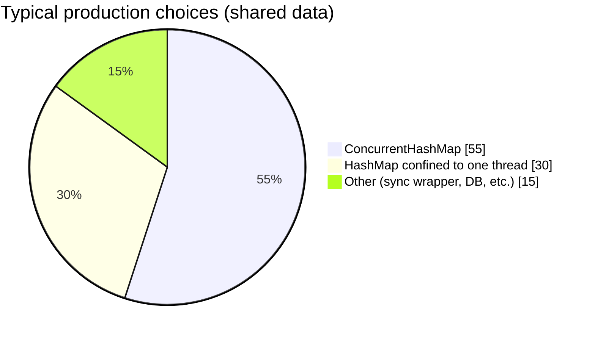
```mermaid
pie showData
    title Typical production choices (shared data)
    "ConcurrentHashMap" : 55
    "HashMap confined to one thread" : 30
    "Other (sync wrapper, DB, etc.)" : 15
```

---

## ConcurrentHashMap vs `synchronizedMap()` vs `Hashtable`

Three ways people make a **shared `Map` thread-safe**. Only **`ConcurrentHashMap`** uses **bucket-level** (portion-level) coordination; the other two lock the **whole map** for writes (and `Hashtable` locks reads too).

<p align="center">
  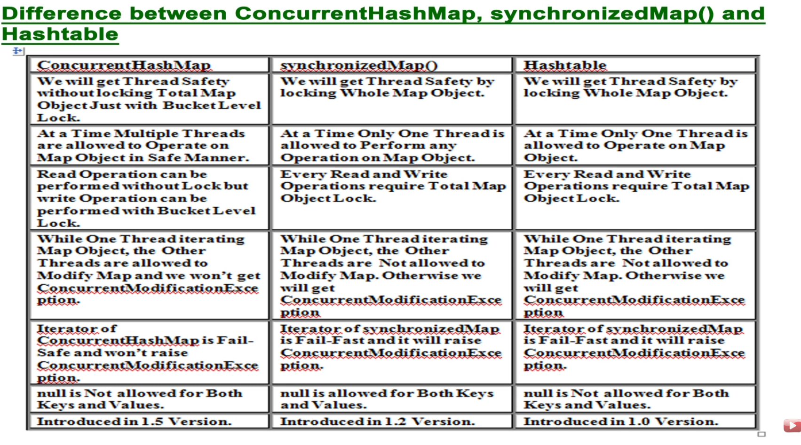
</p>

*Figure: classroom comparison (expanded below with diagrams).*

### Summary table (all seven slide rows)

| Topic | `ConcurrentHashMap` | `Collections.synchronizedMap(map)` | `Hashtable` |
| ----- | ------------------- | ---------------------------------- | ----------- |
| **Thread safety** | Built-in, concurrent | Wraps any `Map`; **every** method syncs on wrapper | Legacy class; **synchronized** methods |
| **Lock scope** | **Bucket / portion** — not the entire table for every update ([details](concurrentMap.md#bucket-level-lock-vs-whole-collection-lock)) | **Whole map object** monitor | **Whole table** monitor |
| **Threads at once** | Many threads can read; multiple writes on **different** bins often run together | **One** thread in synchronized API at a time | **One** thread at a time for reads and writes |
| **Reads** | Typically **without** locking the entire map | Each `get` is `synchronized` on the wrapper | Each `get` is `synchronized` on `this` |
| **Writes** | **Bucket-level** lock (or CAS on empty bin) | **Whole-map** lock | **Whole-map** lock |
| **Iterate + another thread modifies** | Allowed in a safe way — **no** `ConcurrentModificationException` | **Not** allowed without external sync → **CME** (fail-fast) | Same — **CME** (fail-fast) |
| **Iterator** | **Fail-safe** / weakly consistent | **Fail-fast** | **Fail-fast** |
| **`null` key / value** | **Not allowed** (`NullPointerException`) | **Allowed** (inherits wrapped map — usually `HashMap`) | **Not allowed** |
| **Since** | Java **1.5** (`java.util.concurrent`) | Java **1.2** (`Collections`) | Java **1.0** (legacy) |

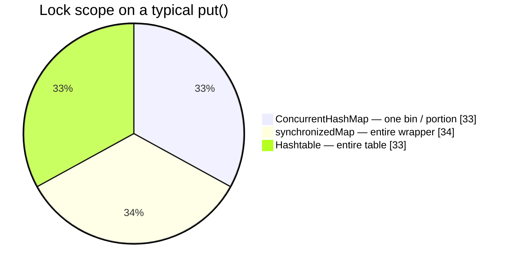
```mermaid
pie showData
    title Lock scope on a typical put()
    "ConcurrentHashMap — one bin / portion" : 33
    "synchronizedMap — entire wrapper" : 34
    "Hashtable — entire table" : 33
```

### Locking model (flow)

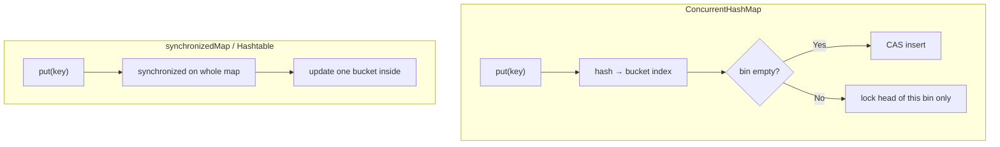
```mermaid
flowchart TB
  subgraph chm ["ConcurrentHashMap"]
    P1["put(key)"] --> H1["hash → bucket index"]
    H1 --> L1{"bin empty?"}
    L1 -- Yes --> CAS["CAS insert"]
    L1 -- No --> BL["lock head of this bin only"]
  end

  subgraph whole ["synchronizedMap / Hashtable"]
    P2["put(key)"] --> L2["synchronized on whole map"]
    L2 --> U2["update one bucket inside"]
  end
```

```text
ConcurrentHashMap          synchronizedMap() / Hashtable
─────────────────          ─────────────────────────────
  bin 0   bin 1   bin 2       ┌─────────────────────────┐
    │       │       │         │ ONE LOCK around all bins │
    ▲       │       ▲         │  0  1  2  3 …  n-1      │
  lock    (free)   lock       └─────────────────────────┘
  only            only              only one writer
  bin 0           bin 2             (or reader+writer for HT)
```

### Multi-thread access (sequence)

**`synchronizedMap` / `Hashtable`** — second thread waits on the **same** monitor:

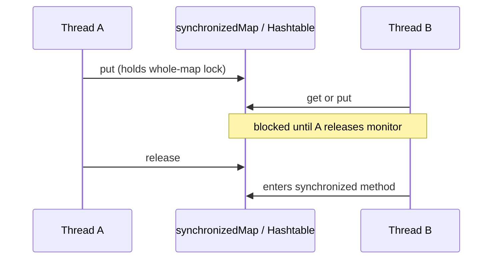
```mermaid
sequenceDiagram
  participant A as Thread A
  participant M as synchronizedMap / Hashtable
  participant B as Thread B

  A->>M: put (holds whole-map lock)
  B->>M: get or put
  Note over B,M: blocked until A releases monitor
  A->>M: release
  B->>M: enters synchronized method
```

**`ConcurrentHashMap`** — different bins, parallel writes:

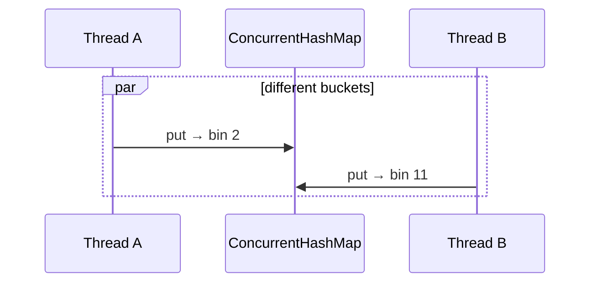
```mermaid
sequenceDiagram
  participant A as Thread A
  participant CHM as ConcurrentHashMap
  participant B as Thread B

  par different buckets
    A->>CHM: put → bin 2
    B->>CHM: put → bin 11
  end
```

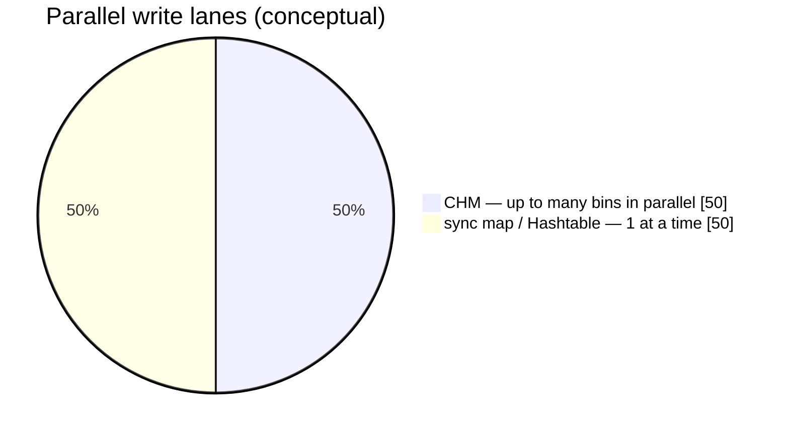
```mermaid
pie showData
    title Parallel write lanes (conceptual)
    "CHM — up to many bins in parallel" : 50
    "sync map / Hashtable — 1 at a time" : 50
```

### Iteration while another thread modifies

Same pattern as [fail-fast vs fail-safe](concurrentCollections.md#fail-fast-vs-fail-safe-iterators-with-examples):

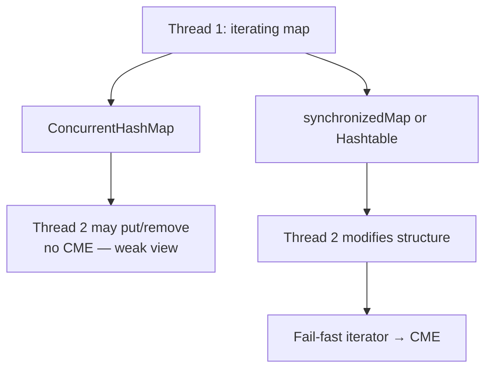
```mermaid
flowchart TD
  Iter["Thread 1: iterating map"]

  Iter --> CHMpath["ConcurrentHashMap"]
  CHMpath --> CHMok["Thread 2 may put/remove<br/>no CME — weak view"]

  Iter --> FFpath["synchronizedMap or Hashtable"]
  FFpath --> FFfail["Thread 2 modifies structure"]
  FFfail --> CME["Fail-fast iterator → CME"]
```

| While iterating | `ConcurrentHashMap` | `synchronizedMap` | `Hashtable` |
| --------------- | ------------------- | ------------------- | ----------- |
| Other thread `put` / `remove` | **OK** (no CME) | **CME** unless **you** sync on map during entire iteration | **CME** (fail-fast) |
| Recommended pattern | Use CHM iterator as documented | `synchronized (map) { for (...) }` for **both** iteration and writes | Same manual sync if sharing |

**Example — `synchronizedMap` (fail-fast):**

```java
Map<String, String> map = Collections.synchronizedMap(new HashMap<>());
map.put("a", "1");
var it = map.entrySet().iterator();
it.next();
map.put("b", "2");   // concurrent structural change
it.next();           // ConcurrentModificationException
```

**Example — `ConcurrentHashMap` (fail-safe / weakly consistent):**

```java
Map<String, String> map = new ConcurrentHashMap<>();
map.put("a", "1");
var it = map.entrySet().iterator();
it.next();
map.put("b", "2");   // allowed
it.next();           // no CME
```

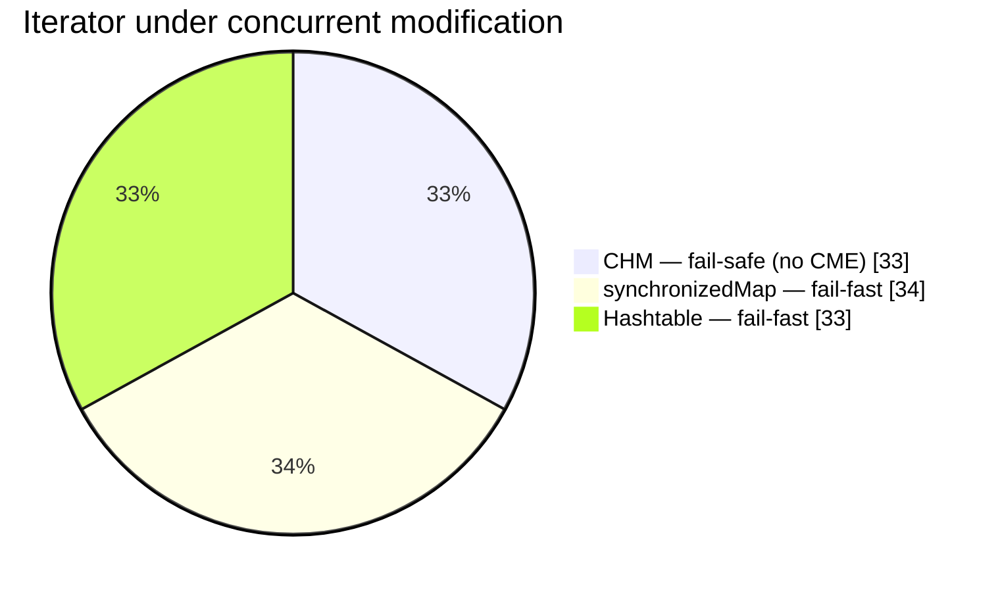
```mermaid
pie showData
    title Iterator under concurrent modification
    "CHM — fail-safe (no CME)" : 33
    "synchronizedMap — fail-fast" : 34
    "Hashtable — fail-fast" : 33
```

### `null` keys and values

| | `ConcurrentHashMap` | `synchronizedMap(new HashMap<>())` | `Hashtable` |
| --- | ------------------- | ----------------------------------- | ----------- |
| `null` key | **NPE** | **OK** (HashMap rules) | **NPE** |
| `null` value | **NPE** | **OK** | **NPE** |

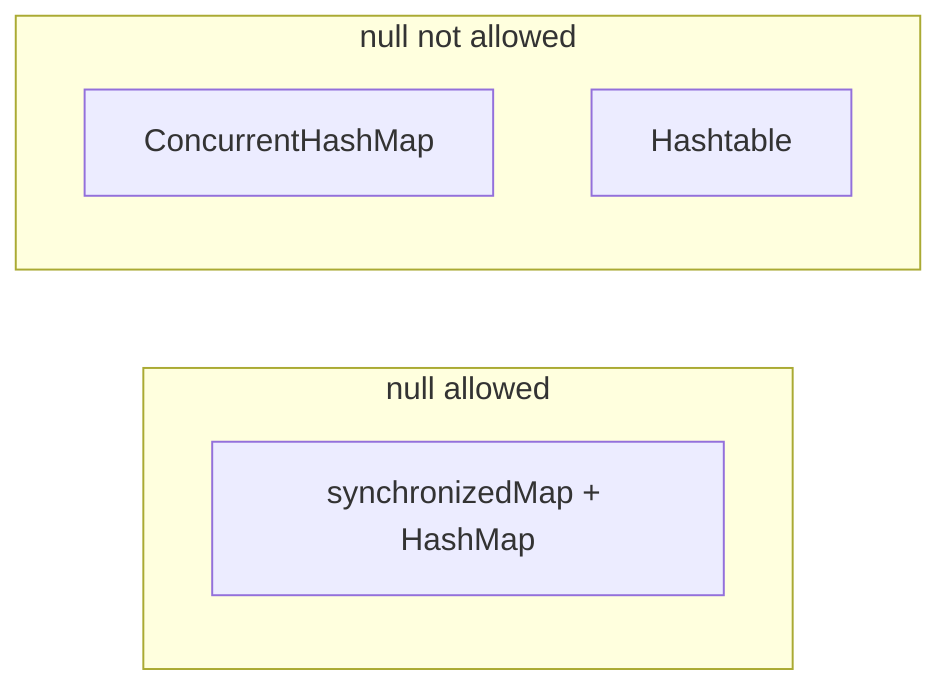
```mermaid
flowchart LR
  subgraph allow ["null allowed"]
    SM["synchronizedMap + HashMap"]
  end
  subgraph deny ["null not allowed"]
    CHM2["ConcurrentHashMap"]
    HT["Hashtable"]
  end
```

### Which thread-safe map? (extended)

```mermaid
flowchart TD
  Need["Shared Map in production?"] --> Legacy{"Legacy API / serialization?"}
  Legacy -- Hashtable --> HT["Avoid for new code<br/>use CHM instead"]
  Legacy -- No --> Wrap{"Already have HashMap?"}
  Wrap -- Yes --> Old["synchronizedMap — OK for low contention<br/>fail-fast iterator + whole-map lock"]
  Wrap -- No --> CHM2["ConcurrentHashMap<br/>default for concurrent caches"]
  CHM2 --> Null{"Need null key/value?"}
  Null -- Yes --> SM["synchronizedMap(HashMap)<br/>or redesign keys"]
  Null -- No --> CHM2
```

| Choose | When |
| ------ | ---- |
| **`ConcurrentHashMap`** | Default for **high concurrency**, no `null`, weakly consistent iteration OK |
| **`Collections.synchronizedMap`** | Simple wrapping of existing `HashMap`; **low** thread contention; you accept whole-map lock + fail-fast iterator rules |
| **`Hashtable`** | **Legacy only** — prefer CHM; same whole-map locking as sync wrapper, no `null`, older API |

Bucket internals and classroom CHM slide: [concurrentMap.md](concurrentMap.md). Hashtable bucket walkthrough: [hashTable.md](../collection/hashTable.md).

---

## Run the repo demo

```bash
cd demo
javac -d /tmp/chm \
  src/main/java/com/concurrentCollection/concurrentCollectionTypeInspector.java \
  src/main/java/com/concurrentCollection/concurrentMap/*.java
java -cp /tmp/chm com.concurrentCollection.concurrentMap.concurrentHashMap
```

---

## See also

- [concurrentMap.md](concurrentMap.md) — `ConcurrentMap` API, classroom CHM slide, **bucket internals**, constructors
- [concurrentCollections.md](concurrentCollections.md) — `threadDemo` / `ConcurrentModificationException`
- [map.md](../collection/map.md) — general `Map` hierarchy in the collection guides
