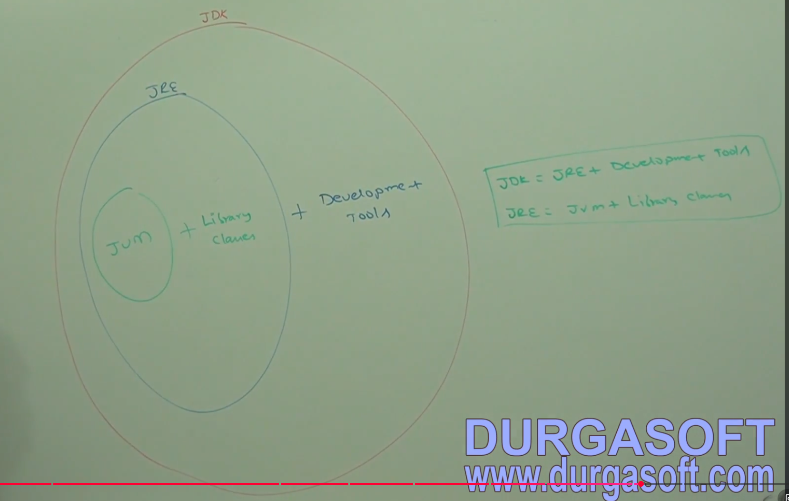
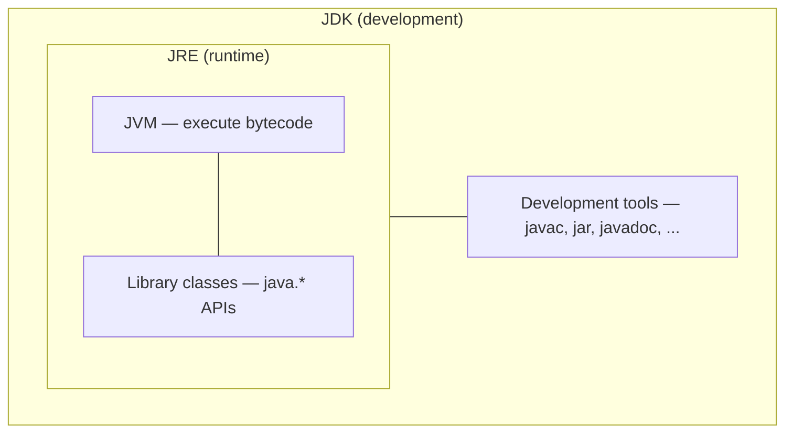
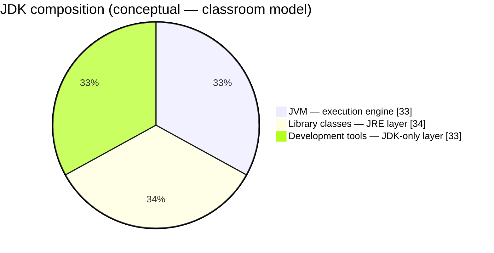
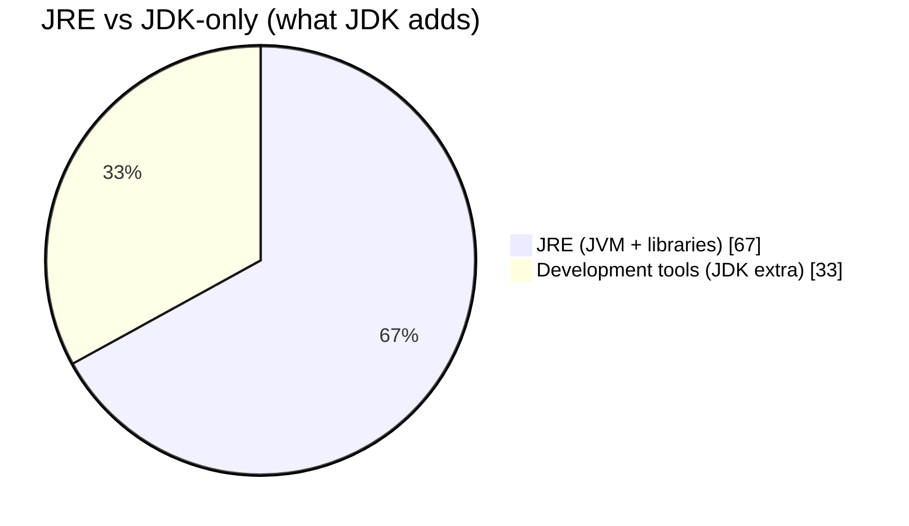
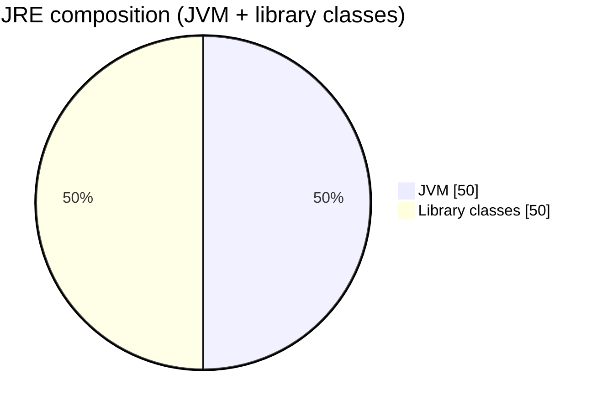
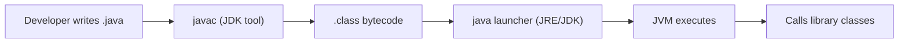
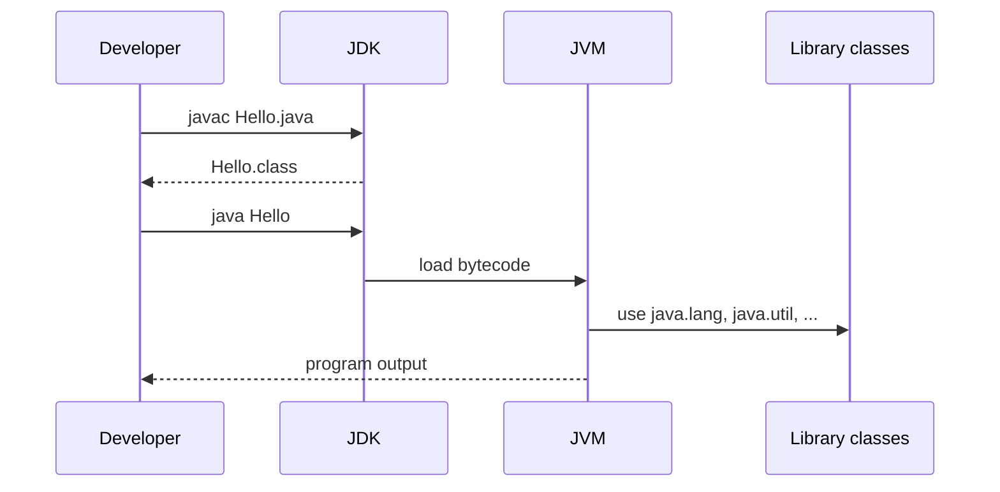
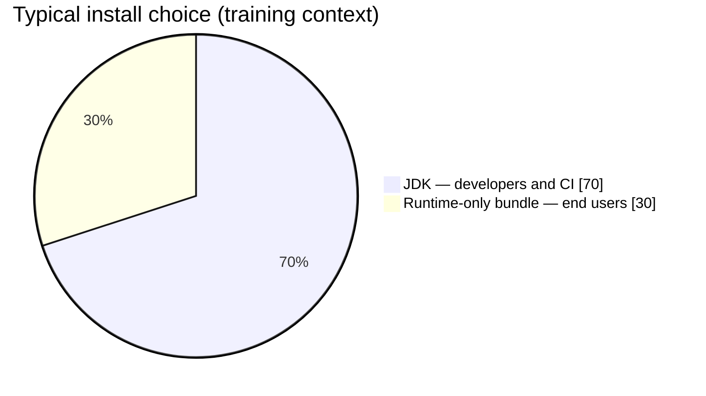

# Java development platform — JDK, JRE, and JVM

> Nested model from the classroom whiteboard: **JDK ⊃ JRE ⊃ JVM**, with library classes and development tools as the extra layers.

> **Preview tip:** Open in **Markdown Preview** (`Ctrl+Shift+V`) to render Mermaid pie charts and diagrams.

<!-- TOC -->
- [Java development platform — JDK, JRE, and JVM](#java-development-platform--jdk-jre-and-jvm)
  - [Guide map](#guide-map)
  - [Classroom diagram](#classroom-diagram)
  - [Core formulas](#core-formulas)
  - [What each layer does](#what-each-layer-does)
  - [Pie chart — JDK composition](#pie-chart--jdk-composition)
  - [Nested structure (flow)](#nested-structure-flow)
  - [Who needs which kit?](#who-needs-which-kit)
  - [Summary](#summary)
<!-- /TOC -->

## Guide map

| Jump to | Topic |
| ------- | ----- |
| [Classroom diagram](#classroom-diagram) | Whiteboard nested circles |
| [Core formulas](#core-formulas) | JDK = JRE + tools; JRE = JVM + libraries |
| [Pie chart — JDK composition](#pie-chart--jdk-composition) | Visual split of the three parts |
| [Who needs which kit?](#who-needs-which-kit) | Developer vs end user |

---

## Classroom diagram



| Circle (outside → in) | Label on board | Meaning |
| --------------------- | -------------- | ------- |
| **Outer (red)** | **JDK** | Full **development** kit |
| **Middle (blue)** | **JRE** = JVM + **library classes** | **Runtime** to execute Java programs |
| **Inner (green)** | **JVM** | **Virtual machine** — executes bytecode |

---

## Core formulas

From the green summary box on the slide:

```text
JDK = JRE + Development Tools
JRE = JVM + Library Classes
```

Therefore:

```text
JDK = JVM + Library Classes + Development Tools
```

| Symbol | Expands to |
| ------ | ---------- |
| **JVM** | Bytecode interpreter / JIT, memory management, threads, security sandbox |
| **Library classes** | `java.lang`, `java.util`, I/O, networking, etc. (`rt.jar` / modules on modern JDKs) |
| **Development tools** | `javac`, `jar`, `javadoc`, debugger, packaging, etc. |

---

## What each layer does

### JVM (innermost)

- Loads `.class` files (bytecode), verifies them, executes via interpreter and **JIT**.
- Manages **heap**, **stack**, **garbage collection**, and native calls.
- Same bytecode idea across OSes: *write once, run anywhere* (with a JVM for that platform).

### JRE (middle)

- **JVM** plus **standard library** classes your program uses at run time.
- Enough to **run** a compiled application (`java MyApp`), not to **compile** new source (`javac` is not in JRE-only distributions; modern **JDK** is the usual download).

### JDK (outermost)

- Everything in **JRE** plus **development tools** to write, compile, document, and package code.
- Typical classroom/workflow: install **JDK** → use `javac` then `java`.



---

## Pie chart — JDK composition

The whiteboard describes **JDK** as three conceptual slices. The chart below uses **equal thirds** for clarity in teaching (real install sizes differ; the **relationship** is what matters).



### Reading the pie chart

| Slice | Role | Included when you… |
| ----- | ---- | ------------------ |
| **JVM** | Runs bytecode | Run **any** Java program (inside JRE/JDK) |
| **Library classes** | APIs used at runtime | Run programs that call `java.util`, I/O, etc. |
| **Development tools** | Compile & package | **Develop** — need full **JDK** |



**JRE alone** (middle circle on the board):



### Point-by-point (pie + nesting)

1. **One JVM slice** — smallest inner circle; every Java run goes through it.
2. **Library slice** — turns “bytecode runner” into a **platform** (`String`, collections, streams, …).
3. **Tools slice** — only in **JDK**; without it you cannot compile `.java` → `.class` with standard tooling.
4. **Nesting, not three installs** — JDK **contains** JRE; JRE **contains** JVM (diagram is set inclusion, not three separate products on disk in all distributions).
5. **Modern note** — Oracle/OpenJDK often ship a single **JDK** download; “JRE only” is legacy for end-user bundles—the **ideas** on the whiteboard still hold for interviews and architecture.

---

## Nested structure (flow)





---

## Who needs which kit?

| Persona | Need | Typical install |
| ------- | ---- | ---------------- |
| **Java developer** | Compile + run + tools | **JDK** |
| **End user running a shipped app** | Run only | **JRE** concept / JRE bundled inside app (e.g. jlink image) |
| **CI build agent** | Compile & test | **JDK** |



---

## Summary

| Layer | One-line |
| ----- | -------- |
| **JVM** | Executes bytecode. |
| **JRE** | **JVM + library classes** — run Java programs. |
| **JDK** | **JRE + development tools** — build and run Java programs. |

**Formulas to remember:** **JDK = JRE + Development Tools** · **JRE = JVM + Library Classes**.
