# Table of Contents

- [javac](#javac)
- [java](#java)
- [classpath](#classpath)
- [Jar vs war vs ear](#jar-vs-war-vs-ear)
- [Web Application vs Enterprise Application](#web-application-vs-enterprise-application)
- [Web Server vs Application Server](#web-server-vs-application-server)
- [How to create executable Jar file :](#how-to-create-executable-jar-file)
  - [Example: `jarDemo.java` — Execution Summary](#example-jardemojava-—-execution-summary)
    - [What the program does](#what-the-program-does)
    - [Execution flow](#execution-flow)
    - [Console output (after the window is closed)](#console-output-after-the-window-is-closed)
    - [Output breakdown](#output-breakdown)
    - [Lifecycle stages (proportion of code dedicated to each)](#lifecycle-stages-proportion-of-code-dedicated-to-each)
    - [Key takeaway](#key-takeaway)
- [Key Methods Used in `jarDemo.java` — How They Work Internally](#key-methods-used-in-jardemojava-—-how-they-work-internally)
  - [1. `new Frame(String title)`](#1-new-framestring-title)
  - [2. `frame.addWindowListener(WindowAdapter)`](#2-frameaddwindowlistenerwindowadapter)
  - [3. `windowClosing(WindowEvent e)` — the overridden callback](#3-windowclosingwindowevent-e-—-the-overridden-callback)
  - [4. `frame.add(new Label(text, alignment))`](#4-frameaddnew-labeltext-alignment)
  - [5. `frame.setSize(width, height)` & `frame.setVisible(true)`](#5-framesetsizewidth-height-framesetvisibletrue)
  - [Putting it all together](#putting-it-all-together)
- [How many ways to run a Java program](#how-many-ways-to-run-a-java-program)
  - [Detailed Steps & Internal Flow for Each Method](#detailed-steps-internal-flow-for-each-method)
    - [1. Using the `java` command](#1-using-the-java-command)
    - [2. Using an IDE (IntelliJ IDEA, Eclipse, NetBeans)](#2-using-an-ide-intellij-idea-eclipse-netbeans)
    - [3. Using an executable JAR](#3-using-an-executable-jar)
    - [4. Using a build tool (Maven / Gradle)](#4-using-a-build-tool-maven-gradle)
    - [5. Using a container or cloud service (Docker / AWS / Azure / GCP)](#5-using-a-container-or-cloud-service-docker-aws-azure-gcp)
    - [6. Using a script or automation tool (shell/batch script, Jenkins)](#6-using-a-script-or-automation-tool-shellbatch-script-jenkins)
    - [7. Using a package manager (SDKMAN!, Homebrew)](#7-using-a-package-manager-sdkman-homebrew)
    - [8. Using a remote development environment (GitHub Codespaces, VS Code Remote)](#8-using-a-remote-development-environment-github-codespaces-vs-code-remote)
    - [9. Using a containerized development environment (Docker dev container)](#9-using-a-containerized-development-environment-docker-dev-container)
    - [10. By running the batch file (Windows `.bat`)](#10-by-running-the-batch-file-windows-bat)
- [classpath vs path](#classpath-vs-path)
- [difference between jdk ,jre and jvm](#difference-between-jdk-jre-and-jvm)
- [java vs javaw](#java-vs-javaw)

---

# javac 

we can use javac command to compile a single or group of java source files 

>javac [options] Test.java
>javac [options] A.java B.java C.java
>javac [options] *.java

options may be -version, -d, -source, -verbose , -cp|-classpath

# java 

We can use java command to run a single class file 

>java [options] Test A B C 

A, B, C are command line arguments 

options may include -version, -d, -source, -verbose , -cp|-classpath, -ea|-esa|-dsa|-da

NOTE : 

We can compile any number of source files at a time but we can run only one class file at a time 

# classpath 

classpath describes the location where required .class files are available java compiler and jvm will use classpath to locate required .class file

# Jar vs war vs ear

Jar (Java Archieve) :

It contains a group of .class files 

war (Web Archieve) : 

A war file represents one web application which contains servlets jsp's html pages, javascritp files etc. The main advantage of maintaining web applications in the form of var file is project deployment, project delivery and project transportation will become easy

ear (enterprise archieve) : 

An ear file represents one enterprise application which contains servlets jsp's ejb's jms components etc

NOTE : 

In general ear files represents a group of war files and jar files 

# Web Application vs Enterprise Application

A web application can be developed by only web realted technologies like servlets jsp, html .css , javascript etc

Ex: online library managment system, online shopping cart 

An enterprise application can be developed by any technology from java javaj2ee lie ervlets , jsp'd ejb's jms components etc

Ex: banking application, telecom based project 

j2ee/JEE compatible application is enterprise application 

# Web Server vs Application Server

1. Web Server provides environment to run web application
2. Web Server provides support for web related technologies like servlets, jsp, html, css, javascript etc.
   Ex: Apache Tomcat, Jetty
3. Application Server provides environment to run enterprise applications.
4. Application Server provides support for (any technologies) both web related technologies and enterprise technologies like EJB, JMS, etc.
   Ex: JBoss, GlassFish, webLogic, JBoss EAP
5. Every application server contains inbuilt webserver to provide support for web related technologies 
6. J2EE compatible server is application server

# How to create executable Jar file : 

## Example: `jarDemo.java` — Execution Summary

Source: [jarDemo.java](../../../demo/src/main/java/com/advanced/development/jarDemo.java)

This demo creates a simple AWT (`java.awt.*`) desktop window containing a centered `Label`, and demonstrates
graceful shutdown logic triggered by the window's close ("X") button via a `WindowAdapter`.

### What the program does

1. Creates an AWT `Frame` titled **"JAR Demo"**.
2. Registers a `WindowAdapter` so that clicking the close button (`windowClosing` event) is intercepted.
3. Adds a centered `Label` with the text **"I can Create Executable Jar File"**.
4. Sizes the frame to `400x300` pixels and makes it visible.
5. When the window is closed by the user:
   - A loop runs from `i = 1` to `9`, printing `"Closing window " + i` to the console for **each** iteration (this was fixed so the full loop completes instead of exiting early).
   - After the loop finishes, `System.exit(0)` terminates the JVM.

### Execution flow

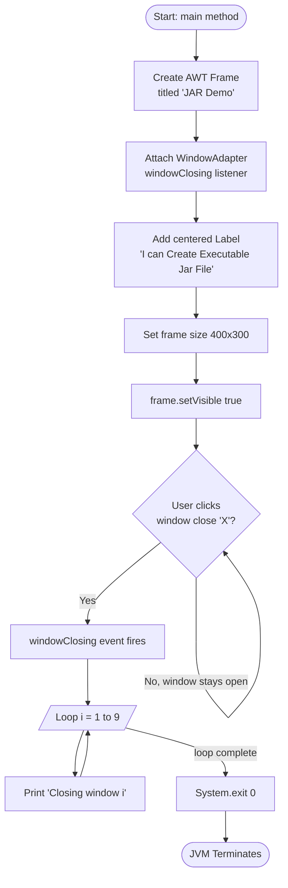

### Console output (after the window is closed)

```
Closing window 1
Closing window 2
Closing window 3
Closing window 4
Closing window 5
Closing window 6
Closing window 7
Closing window 8
Closing window 9
```

### Output breakdown

Of the program's total visible output, the GUI contributes one rendered window with one label, while the
console produces exactly 9 shutdown log lines once the window is closed:

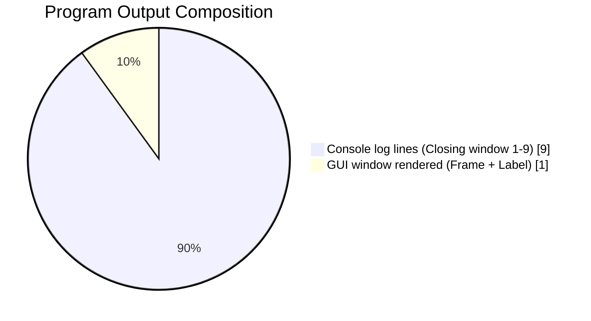

### Lifecycle stages (proportion of code dedicated to each)

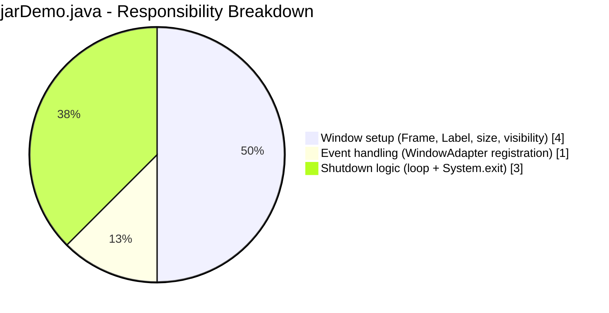

### Key takeaway

The frame remains open and interactive indefinitely (step `G` in the flowchart loops on itself) until the
user explicitly closes it. Only then does the shutdown sequence run to completion, printing all 9 log
lines before the JVM exits — this guarantees no closing message is skipped, which is the fix applied over
the original version that called `System.exit(0)` **inside** the loop (causing it to exit after printing
just `"Closing window 1"`).

# Key Methods Used in `jarDemo.java` — How They Work Internally

This section explains the core AWT/event-handling API calls used in
[jarDemo.java](../../../demo/src/main/java/com/advanced/development/jarDemo.java), each with a minimal
standalone example and a flowchart of what happens "under the hood" inside the JVM/AWT toolkit.

## 1. `new Frame(String title)`

Creates a **top-level native window** (peer-backed) managed by the OS windowing system. The constructor
doesn't show the window yet — it only allocates the lightweight Java `Frame` object; the actual native
window ("peer") is created lazily when the frame becomes displayable.

```java
Frame f = new Frame("My Window");
```

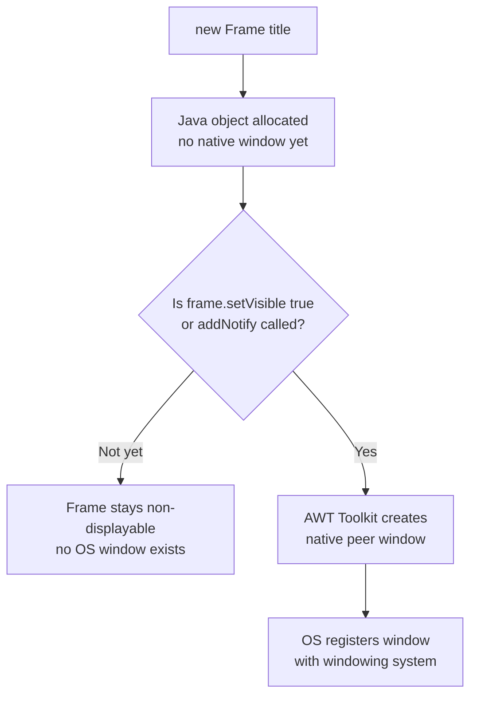

## 2. `frame.addWindowListener(WindowAdapter)`

Registers a **listener object** in the frame's internal listener list. `WindowAdapter` is a convenience
class that implements the `WindowListener` interface with empty method bodies — you only override the
callbacks you care about (here, just `windowClosing`).

```java
frame.addWindowListener(new WindowAdapter() {
    public void windowClosing(WindowEvent e) {
        System.out.println("User clicked close!");
    }
});
```

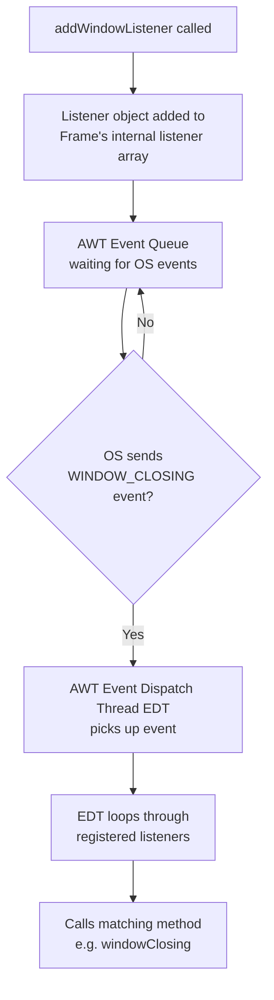

## 3. `windowClosing(WindowEvent e)` — the overridden callback

This method is **not called by your code directly** — it's called by the AWT Event Dispatch Thread (EDT)
whenever the OS reports that the user tried to close the window (clicking "X", Alt+F4, etc.). By default,
`Frame` does NOT destroy itself on close — that's why the demo must handle `windowClosing` manually and
call `System.exit(0)` to actually terminate the JVM.

```java
public void windowClosing(WindowEvent e) {
    for (int i = 1; i < 10; i++) {
        System.out.println("Closing window " + i);
    }
    System.exit(0);
}
```

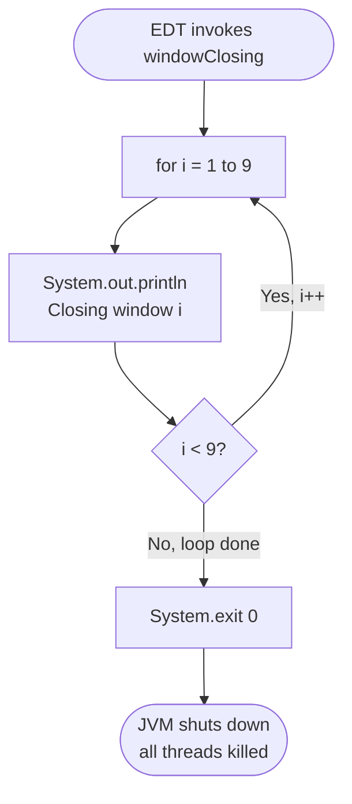

## 4. `frame.add(new Label(text, alignment))`

Adds a **child component** to the frame's container hierarchy. AWT containers use a `LayoutManager`
(Frame's default is `BorderLayout`) to decide where/how the component is positioned and sized when the
frame is laid out.

```java
frame.add(new Label("Hello", Label.CENTER));
```

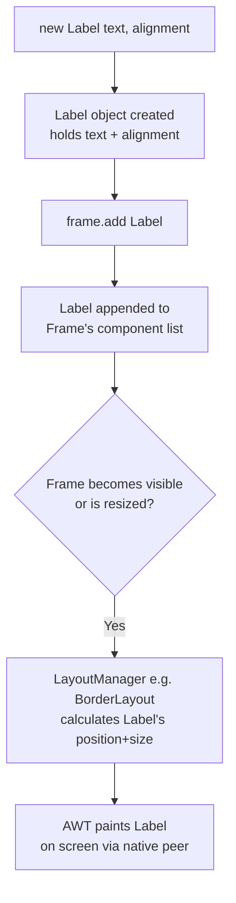

## 5. `frame.setSize(width, height)` & `frame.setVisible(true)`

`setSize` stores the requested dimensions on the Java-side component; `setVisible(true)` is the trigger
that makes AWT actually realize the native peer (if not already created) and tells the OS to render and
display the window.

```java
frame.setSize(400, 300);
frame.setVisible(true);
```

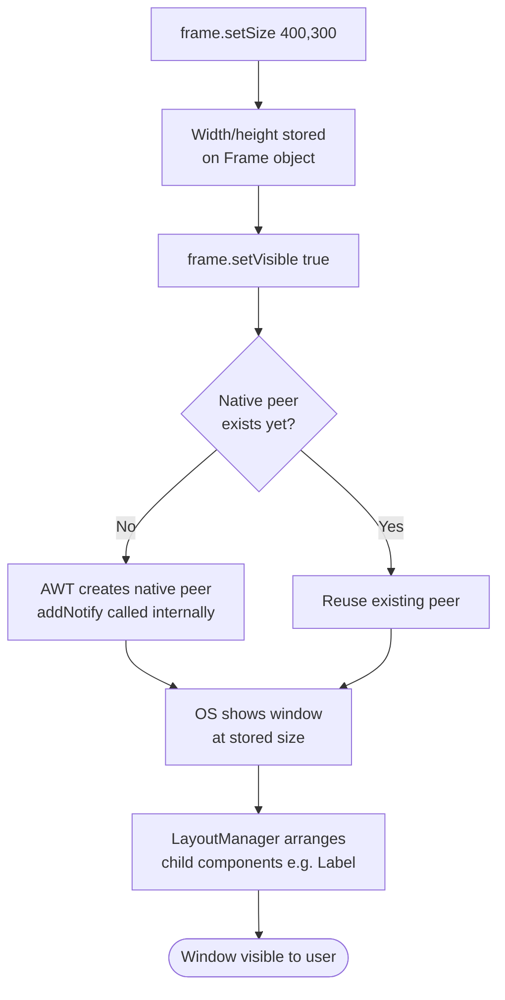

## Putting it all together

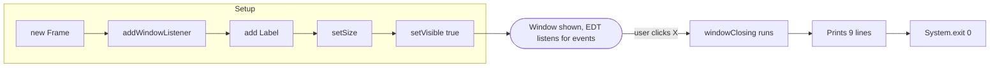

# How many ways to run a Java program

1. **Using the `java` command**: Compile the `.java` file using `javac` and run it with `java`.
2. **Using an IDE**: Most Java IDEs (like IntelliJ IDEA, Eclipse, NetBeans) allow you to run Java programs directly.
3. **Using an executable JAR**: Package your application into a JAR file with a `Main-Class` specified in the manifest and run it using `java -jar yourfile.jar`.   
4. **Using a build tool**: Use build tools like Maven or Gradle to compile and run your Java programs, which can also handle dependencies and packaging.
5. **Using a container or cloud service**: Deploy your Java application to a container (like Docker) or a cloud service (like AWS, Azure, or Google Cloud) that supports Java runtime, and run it there.
6. **Using a script or automation tool**: Create scripts (like shell scripts or batch files) or use automation tools (like Jenkins) to compile and run your Java programs automatically.
7. **Using a package manager**: Use Java package managers like SDKMAN! or Homebrew to install, manage, and run different versions of Java, which can simplify the process of running Java programs.
8. **Using a remote development environment**: Use remote development environments like GitHub Codespaces or Visual Studio Code Remote to compile and run your Java programs on a remote server.
9. **Using a containerized development environment**: Use containerized development environments like Docker to create isolated environments for compiling and running your Java programs consistently across different systems.
10. **By running the batch file**: Create a batch file (on Windows) that compiles and runs your Java program, and execute it to automate the process.

---

## Detailed Steps & Internal Flow for Each Method

### 1. Using the `java` command

**Steps:**
1. Write source code in `Test.java`.
2. Run `javac Test.java` → compiler parses, type-checks, and emits `Test.class` (JVM bytecode).
3. Run `java Test` → JVM launcher starts, loads `Test.class` via the ClassLoader, links/verifies bytecode, then invokes `main(String[])`.
4. JVM allocates heap/stack, JIT optionally compiles hot methods, program executes, JVM exits when `main` returns or `System.exit()` is called.

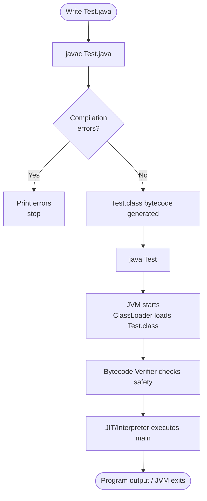

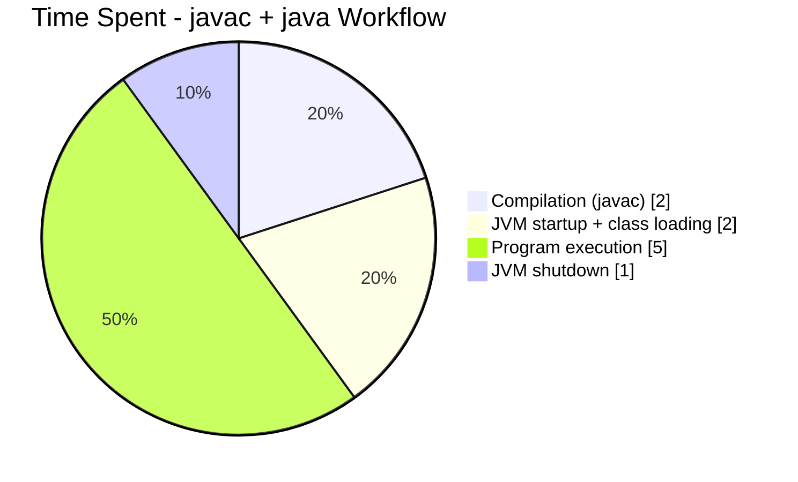

### 2. Using an IDE (IntelliJ IDEA, Eclipse, NetBeans)

**Steps:**
1. IDE indexes the project and detects `main` method via static analysis.
2. User clicks "Run" (or `Shift+F10` / `Ctrl+F11`).
3. IDE internally invokes `javac` (or its own incremental compiler) in the background to build changed files only.
4. IDE constructs the classpath automatically from project/module dependencies.
5. IDE spawns a `java` subprocess with the correct classpath and main class, redirecting stdout/stderr to the built-in console.

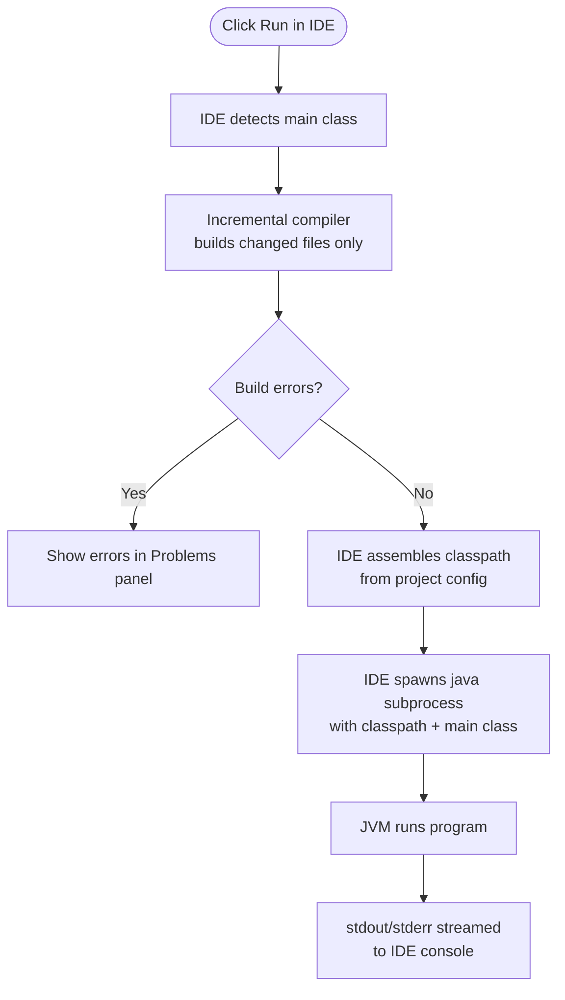

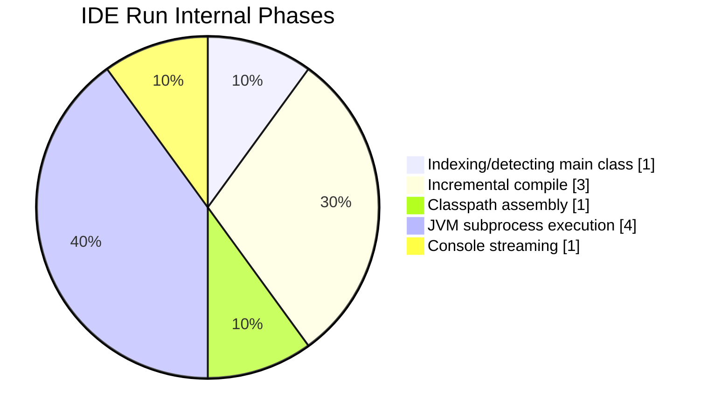

### 3. Using an executable JAR

**Steps:**
1. Compile all `.java` files to `.class` files.
2. Create a `manifest.txt` containing `Main-Class: com.example.Main`.
3. Package classes + manifest into a JAR: `jar cfm app.jar manifest.txt com/example/*.class`.
4. Run with `java -jar app.jar`.
5. JVM reads `META-INF/MANIFEST.MF` inside the JAR to discover the `Main-Class` entry, then loads and runs it — no need to specify the classpath manually.

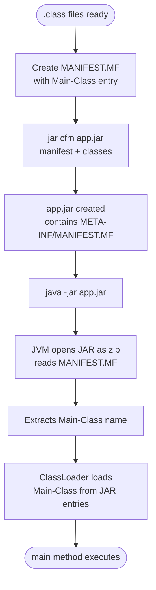

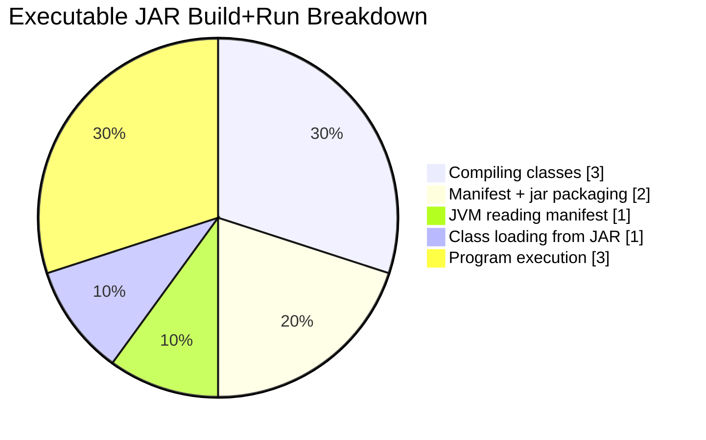

### 4. Using a build tool (Maven / Gradle)

**Steps:**
1. Define `pom.xml` (Maven) or `build.gradle` (Gradle) describing dependencies, plugins, and build phases.
2. Run `mvn compile` / `gradle build` → tool resolves dependencies from local `.m2`/Gradle cache or remote repositories (Maven Central).
3. Tool invokes `javac` internally with the resolved classpath to compile sources into `target/classes` (Maven) or `build/classes` (Gradle).
4. Run `mvn exec:java` / `gradle run` (or package + `java -jar`) → build tool launches the JVM with the fully resolved dependency classpath.

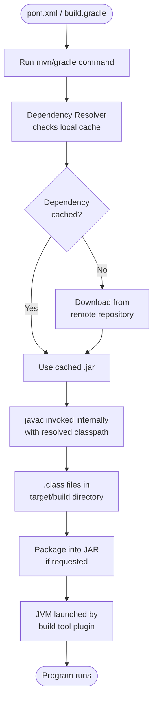

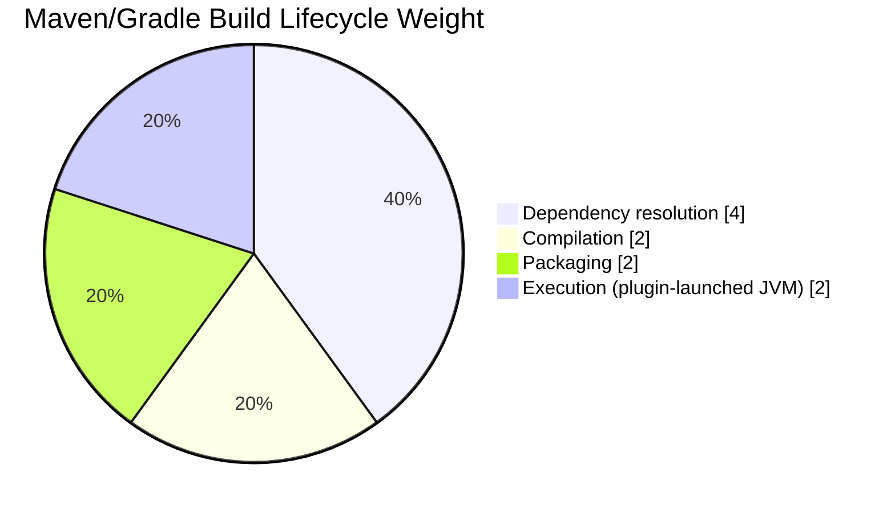

### 5. Using a container or cloud service (Docker / AWS / Azure / GCP)

**Steps:**
1. Write a `Dockerfile` specifying a base JDK/JRE image (e.g. `eclipse-temurin:17-jre`).
2. `docker build` copies your compiled `.class`/JAR into the image filesystem layer by layer.
3. `docker run` creates a container — a new isolated Linux namespace/cgroup — and starts the container's entrypoint (`java -jar app.jar`).
4. Inside the container, a full JVM starts exactly as it would on bare metal, but confined to the container's resource limits (CPU/memory).
5. For cloud services, the platform (e.g. AWS Elastic Beanstalk, Azure App Service) automates steps 1–4: it builds the image/artifact, provisions compute, and manages container lifecycle/scaling.

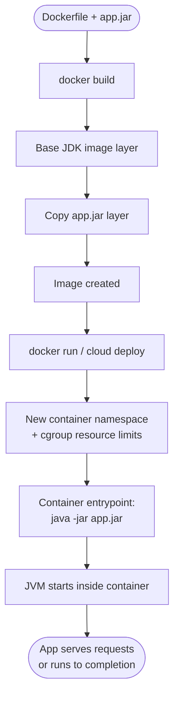

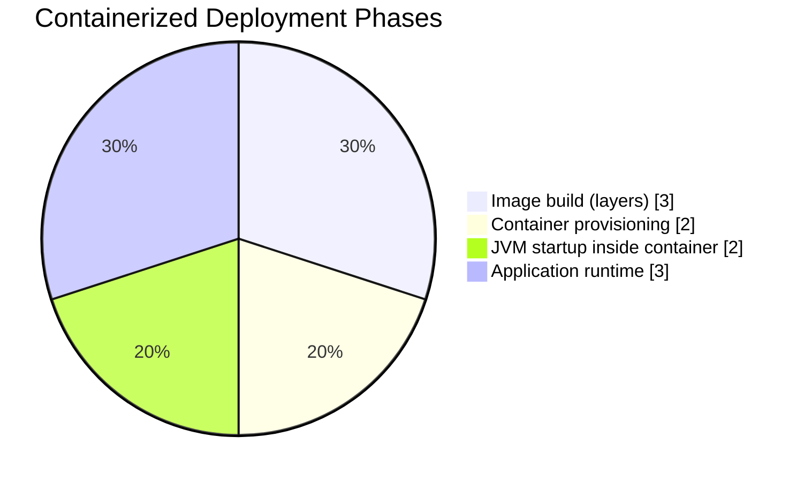

### 6. Using a script or automation tool (shell/batch script, Jenkins)

**Steps:**
1. Write a shell script (`run.sh`) or batch file (`run.bat`) containing `javac` + `java` commands in sequence.
2. Script runner (bash/cmd.exe) executes each line sequentially, checking exit codes.
3. For CI tools like Jenkins: a pipeline job checks out source from VCS, then invokes the same script/build-tool commands inside a Jenkins agent/worker.
4. Jenkins captures console output and exit status to mark the build as success/failure, optionally archiving artifacts.

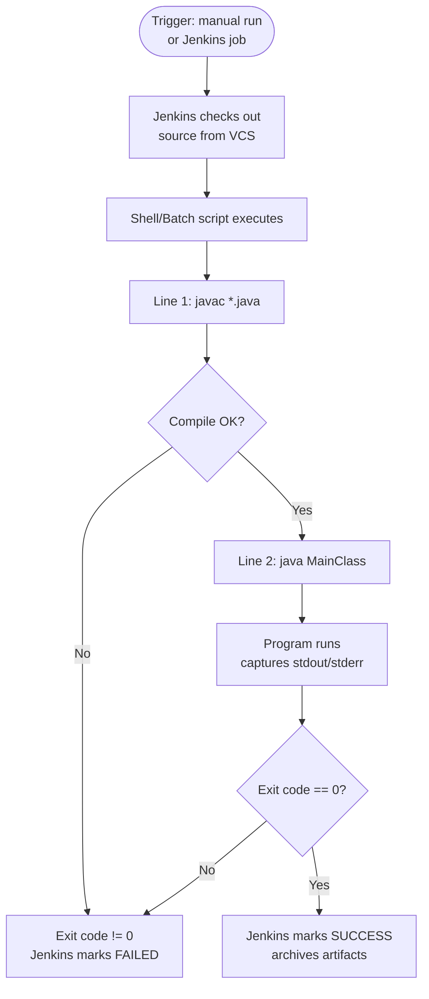

```mermaid
pie showData title Automation Script/Jenkins Pipeline Breakdown
    "VCS checkout" : 2
    "Compilation step" : 2
    "Execution step" : 4
    "Result reporting/archiving" : 2
```

### 7. Using a package manager (SDKMAN!, Homebrew)

**Steps:**
1. Install the package manager itself (e.g. `curl -s "https://get.sdkman.io" | bash`).
2. Use it to install a specific JDK: `sdk install java 17.0.9-tem` (SDKMAN!) or `brew install openjdk@17` (Homebrew).
3. Package manager downloads the prebuilt JDK binary, extracts it, and registers it in a managed directory (e.g. `~/.sdkman/candidates/java/`).
4. Package manager updates shell `PATH`/symlinks so `java`/`javac` point to the newly installed version.
5. You then compile/run normally — the package manager's only job was acquiring and switching the JDK version.

```mermaid
flowchart TD
    A([Install SDKMAN!/Homebrew]) --> B[sdk install java X\nor brew install openjdk@X]
    B --> C[Download prebuilt\nJDK binary archive]
    C --> D[Extract to managed\ncandidates directory]
    D --> E[Update PATH/symlinks\nto point at new JDK]
    E --> F[javac/java commands\nnow resolve to installed version]
    F --> G([Compile & run\nas in Method 1])
```

```mermaid
pie showData title Package-Manager JDK Setup Breakdown
    "Package manager bootstrap" : 1
    "JDK download" : 4
    "Extraction + registration" : 2
    "PATH/symlink switching" : 1
    "Subsequent compile+run" : 2
```

### 8. Using a remote development environment (GitHub Codespaces, VS Code Remote)

**Steps:**
1. Open repo in Codespaces / connect VS Code Remote-SSH to a remote machine.
2. A remote container/VM is provisioned (Codespaces uses a devcontainer image; Remote-SSH uses an existing server).
3. VS Code installs/starts a lightweight server component on the remote host; your local VS Code UI becomes a thin client.
4. Java extension + JDK are installed inside the remote environment (often pre-baked into the devcontainer image).
5. You run `javac`/`java` (or hit "Run") — but execution happens entirely on the remote machine; only UI events and console text are streamed back to your local editor.

```mermaid
flowchart TD
    A([Open Codespaces / Remote-SSH]) --> B[Remote container or VM\nprovisioned]
    B --> C[VS Code Server starts\non remote host]
    C --> D[Local VS Code connects\nas thin client over network]
    D --> E[JDK + Java extension\nloaded on remote host]
    E --> F[User clicks Run\nor types java command]
    F --> G[Compilation + JVM execution\nhappens on REMOTE machine]
    G --> H[Only stdout/UI events\nstreamed back to local editor]
```

```mermaid
pie showData title Remote Dev Environment Workflow
    "Remote provisioning" : 3
    "VS Code Server startup" : 1
    "JDK/extension setup" : 2
    "Remote compile+execute" : 3
    "Network streaming to local UI" : 1
```

### 9. Using a containerized development environment (Docker dev container)

**Steps:**
1. Define a `.devcontainer/devcontainer.json` + `Dockerfile` specifying a JDK base image and any tools/extensions needed.
2. IDE (e.g. VS Code) detects the devcontainer config and offers "Reopen in Container".
3. Docker builds (or pulls) the dev image and starts a container, mounting your source code as a volume.
4. The IDE's backend process attaches to the running container (similar to Remote-SSH, but the "remote" is a local container).
5. All compilation and execution (`javac`/`java`) happens inside that container's filesystem/process namespace, ensuring identical JDK version/tools across every developer's machine.

```mermaid
flowchart TD
    A([.devcontainer config]) --> B[Reopen in Container]
    B --> C[Docker builds/pulls\ndev image]
    C --> D[Container starts\nsource mounted as volume]
    D --> E[IDE backend attaches\nto container process]
    E --> F[javac/java executed\ninside container namespace]
    F --> G([Consistent build/run\nacross all machines])
```

```mermaid
pie showData title Dev Container Workflow Breakdown
    "Devcontainer image build/pull" : 3
    "Container startup + volume mount" : 2
    "IDE attach to container" : 1
    "Compile+execute inside container" : 4
```

### 10. By running the batch file (Windows `.bat`)

**Steps:**
1. Create `run.bat` containing commands like:
   ```bat
   @echo off
   javac Test.java
   java Test
   pause
   ```
2. Double-click the `.bat` file (or run from `cmd.exe`).
3. Windows launches `cmd.exe` to interpret the batch script line by line.
4. `cmd.exe` spawns a `javac` child process to compile; waits for it to exit.
5. If compilation succeeds (`errorlevel 0`), `cmd.exe` spawns a `java` child process to run the compiled class.
6. `pause` keeps the console window open so you can see the output before it closes.

```mermaid
flowchart TD
    A([Double-click run.bat]) --> B[Windows launches cmd.exe]
    B --> C[cmd.exe reads script\nline by line]
    C --> D[Spawn child process:\njavac Test.java]
    D --> E{errorlevel == 0?}
    E -- No --> F[Print error\nscript may continue/pause]
    E -- Yes --> G[Spawn child process:\njava Test]
    G --> H[Program output\nprinted to console]
    H --> I[pause command\nwaits for keypress]
    I --> J([Console window closes\non keypress])
```

```mermaid
pie showData title Batch File Execution Phases
    "cmd.exe script parsing" : 1
    "javac child process" : 2
    "java child process execution" : 5
    "pause / wait for user" : 2
```
# classpath vs path 

path realted to binary executable (e.g., `java`, `javac`)

classpath realted to .class file    (e.g., `.` for current directory, or a directory/jar containing compiled classes)

# difference between jdk ,jre and jvm 

JDK(Java Development Kit) - contains JRE + development tools like `javac`, `jar`, etc.

1. JDK provides environment to develop and run java applications including the compiler and other development tools.
2. JDK is necessary for Java development, while JRE alone is sufficient only for running Java applications.
 
JRE(Java Runtime Environment) - contains JVM + standard libraries to run Java programs.

1. JRE provides environment to run Java applications, including the JVM and standard libraries.
2. JRE is necessary for running Java applications, but not for development.
 
JVM(Java Virtual Machine) - executes Java bytecode, provides platform independence.
1. JVM is a responsible to run java program line by line , hence it is an interpreter.
2. JVM is the engine that executes Java bytecode, enabling Java's "write once, run anywhere" capability.
3. JVM is necessary for running Java applications, but it does not include development tools like the compiler.

# java vs javaw

java 

1. We can use java command to run a java class file where sop's will be executed and  corresponding output will be displayed in the console.
2. `java` launches the Java application with a console window, suitable for command-line interaction.
3. `java` is typically used when you need to see console output or interact with the application via the command line.

javaw (java without console output)

1. We can use javaw command to run a java class file where sop's will be execute but the corresponding output will not be displayed in the console. 
2. `javaw` launches the Java application without a console window, suitable for GUI applications.
3. `javaw` is typically used when you do not need to see console output and want to avoid an extra console window.

In general we can use javaw command to run GUI based applications

javaws (Java Web Start Utility)

1. We can use javaws to download a java application from the web and to start its execution.
2. We can use javawas command as follows 
   javaws jnlp-url it downloads the application from the specified URL and starts execution.
   
3. The main advantage of this approach is every end user will get updated version and enhancement will become   
   easy because of centralized control.
4.  `javaws` is used to launch Java applications directly from the web using JNLP (Java Network Launch Protocol) files.
5. `javaws` downloads the application from the specified URL and runs it in a secure environment.
6. `javaws` is typically used for deploying Java applications over the internet without requiring manual installation.
