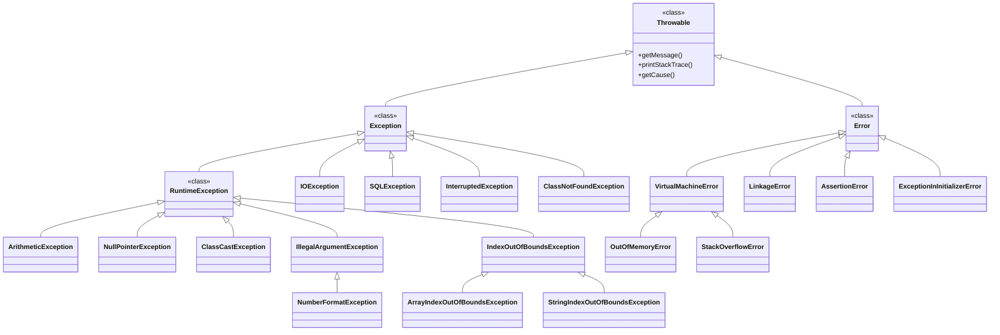
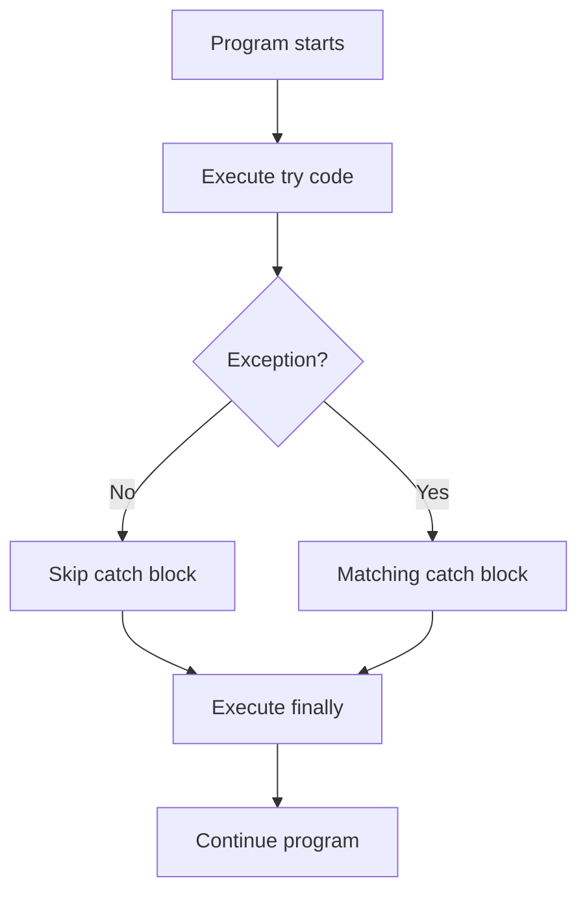
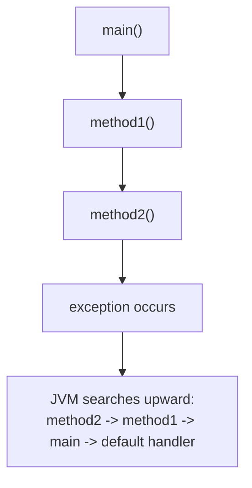
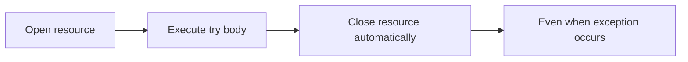

# Table of Contents

- [Java Exception Handling: Complete Hierarchy Guide](#java-exception-handling-complete-hierarchy-guide)
  - [Example Programs](#example-programs)
  - [The Complete Hierarchy](#the-complete-hierarchy)
  - [What Each Level Means](#what-each-level-means)
    - [`Throwable`](#throwable)
    - [`Exception`](#exception)
    - [`RuntimeException`](#runtimeexception)
    - [Checked Exceptions](#checked-exceptions)
    - [`Error`](#error)
  - [Exception Flow Picture](#exception-flow-picture)
  - [`try`, `catch`, and `finally`](#try-catch-and-finally)
  - [Catch Ordering](#catch-ordering)
  - [`throw` Versus `throws`](#throw-versus-throws)
    - [`throw`](#throw)
    - [`throws`](#throws)
  - [Call Stack Picture](#call-stack-picture)
  - [Custom Exceptions](#custom-exceptions)
  - [Try-with-Resources](#try-with-resources)
  - [Printing Exception Information](#printing-exception-information)
  - [Rethrowing an Exception](#rethrowing-an-exception)
  - [`finally` Behavior](#finally-behavior)
  - [Exception Versus Error](#exception-versus-error)
  - [Recommended Learning Order](#recommended-learning-order)
  - [Final Summary](#final-summary)

---

# Java Exception Handling: Complete Hierarchy Guide

<!-- TOC -->
- [Java Exception Handling: Complete Hierarchy Guide](#java-exception-handling-complete-hierarchy-guide)
    - [Example Programs](#example-programs)
    - [The Complete Hierarchy](#the-complete-hierarchy)
    - [What Each Level Means](#what-each-level-means)
    - [Exception Flow Picture](#exception-flow-picture)
    - [`try`, `catch`, and `finally`](#try-catch-and-finally)
    - [Catch Ordering](#catch-ordering)
    - [`throw` Versus `throws`](#throw-versus-throws)
    - [Call Stack Picture](#call-stack-picture)
    - [Custom Exceptions](#custom-exceptions)
    - [Try-with-Resources](#try-with-resources)
    - [Printing Exception Information](#printing-exception-information)
    - [Rethrowing an Exception](#rethrowing-an-exception)
    - [`finally` Behavior](#finally-behavior)
    - [Exception Versus Error](#exception-versus-error)
    - [Recommended Learning Order](#recommended-learning-order)
    - [Final Summary](#final-summary)
<!-- /TOC -->

This guide explains Java exception handling from the root of the hierarchy to practical handling syntax. It also provides the exact paths of the related example programs in this project.

> **Preview tip:** Use **Markdown Preview** (`Ctrl+Shift+V`) to view the hierarchy diagrams and navigate the guide quickly.

---

## Example Programs

The exception-handling programs are located here:

```text
demo/src/main/java/com/exceptionHandling/
```

| Topic                            | Program or folder                                                               |
| -------------------------------- | ------------------------------------------------------------------------------- |
| Abnormal flow                    | `demo/src/main/java/com/exceptionHandling/abnormalFlowNoExceptionHandling.java` |
| Exception types                  | `demo/src/main/java/com/exceptionHandling/exceptionTypes.java`                  |
| `try`, `catch`, `finally` basics | `demo/src/main/java/com/exceptionHandling/tryCatchBasics.java`                  |
| `try`/`catch` use cases          | `demo/src/main/java/com/exceptionHandling/tryCatchUseCases.java`                |
| `finally` block                  | `demo/src/main/java/com/exceptionHandling/finallyBlock.java`                    |
| `throw` keyword                  | `demo/src/main/java/com/exceptionHandling/throwKeyword.java`                    |
| `throws` keyword                 | `demo/src/main/java/com/exceptionHandling/throwsKeyword.java`                   |
| Try-with-resources               | `demo/src/main/java/com/exceptionHandling/trywithresources.java`                |
| Custom exception                 | `demo/src/main/java/com/exceptionHandling/defineOurOwenException.java`          |
| Rethrowing                       | `demo/src/main/java/com/exceptionHandling/rethrowingExceptions.java`            |
| Printing exception details       | `demo/src/main/java/com/exceptionHandling/waysOfPrintingException.java`         |
| Exception rules                  | `demo/src/main/java/com/exceptionHandling/rulesInExceptionHandling.java`        |
| Runtime examples                 | `demo/src/main/java/com/exceptionHandling/typeOfExceptions.java`                |
| Special cases                    | `demo/src/main/java/com/exceptionHandling/specialCases/`                        |

## The Complete Hierarchy

All throwable problems in Java begin at `java.lang.Throwable`.



## What Each Level Means

### `Throwable`

`Throwable` is the root type for everything that can be thrown and caught with Java's exception mechanism. It provides methods such as:

```java
getMessage()       // Returns the explanation message
printStackTrace()  // Prints the type, message, and call location
getCause()         // Returns the original cause, if one exists
```

Most application code catches `Exception`, not `Throwable`, because catching `Throwable` also catches serious `Error` objects.

### `Exception`

`Exception` represents conditions an application may reasonably handle, such as a missing file, invalid input, or an interrupted operation.

`Exception` has two important branches:

```text
Exception
    |
    +-- RuntimeException      unchecked
    |
    +-- Other exceptions      checked
```

### `RuntimeException`

Runtime exceptions are unchecked. The compiler does not force the programmer to catch or declare them.

Examples:

- `ArithmeticException`: invalid arithmetic such as division by zero
- `NullPointerException`: using a `null` reference
- `ClassCastException`: invalid type casting
- `IllegalArgumentException`: invalid method argument
- `NumberFormatException`: invalid text-to-number conversion
- `ArrayIndexOutOfBoundsException`: invalid array index

Unchecked does not mean harmless. It means the compiler does not require handling.

### Checked Exceptions

Checked exceptions are exceptions other than `RuntimeException` and its subclasses. The compiler requires them to be handled or declared.

Examples:

- `IOException`
- `InterruptedException`
- `ClassNotFoundException`
- `SQLException`

A checked exception must follow one of these paths:

```java
try {
    riskyOperation();
} catch (IOException e) {
    // Handle the problem here.
}
```

or:

```java
void readData() throws IOException {
    riskyOperation();
}
```

### `Error`

`Error` represents serious problems that applications normally should not try to recover from.

Examples include:

- `OutOfMemoryError`
- `StackOverflowError`
- `NoClassDefFoundError`
- `ExceptionInInitializerError`

An `Error` is a `Throwable`, but it is not an `Exception`:

```java
Throwable
    +-- Exception
    +-- Error
```

## Exception Flow Picture



## `try`, `catch`, and `finally`

```java
try {
    // Code that may throw an exception.
} catch (Exception e) {
    // Code that handles the exception.
} finally {
    // Cleanup code that normally runs either way.
}
```

Rules:

1. `try` must be followed by at least one `catch`, a `finally`, or resources.
2. A `catch` must follow a `try`.
3. A `finally` block is optional.
4. Catch more specific exceptions before general exceptions.
5. After a matching `catch` runs, Java does not return to the failed statement in `try`.
6. Code after the complete handling structure runs unless another exception occurs.

## Catch Ordering

Correct:

```java
try {
    riskyOperation();
} catch (ArithmeticException e) {
    // Specific exception first.
} catch (Exception e) {
    // General exception last.
}
```

Incorrect:

```java
try {
    riskyOperation();
} catch (Exception e) {
    // This catches almost everything below Exception.
} catch (ArithmeticException e) {
    // Unreachable: Exception already caught it.
}
```

## `throw` Versus `throws`

```text
throw  -> actually throws one exception object
throws -> declares that a method may pass responsibility to its caller
```

### `throw`

```java
throw new IllegalArgumentException("Age is invalid");
```

The programmer creates and throws an exception object immediately.

### `throws`

```java
void readFile() throws IOException {
    // The caller must handle or declare IOException.
}
```

`throws` is written in the method signature. It transfers handling responsibility to the caller.

## Call Stack Picture



If a matching `catch` is found, control moves there. If no handler is found, the JVM unwinds the stack and terminates the program.

## Custom Exceptions

A custom exception gives a meaningful name to a business-specific problem:

```java
class InvalidAgeException extends RuntimeException {
    InvalidAgeException(String message) {
        super(message);
    }
}
```

Use it like this:

```java
if (age < 18) {
    throw new InvalidAgeException("Age must be at least 18");
}
```

The project example is:

```text
demo/src/main/java/com/exceptionHandling/defineOurOwenException.java
```

## Try-with-Resources

Try-with-resources closes objects that implement `AutoCloseable`:

```java
try (BufferedReader reader = new BufferedReader(
        new FileReader("data.txt"))) {
    System.out.println(reader.readLine());
} catch (IOException e) {
    e.printStackTrace();
}
```

Execution picture:



This is safer and shorter than manually closing resources in `finally`.

The project example is:

```text
demo/src/main/java/com/exceptionHandling/trywithresources.java
```

## Printing Exception Information

```java
catch (Exception e) {
    System.out.println(e);              // Type and message
    System.out.println(e.getMessage()); // Message only
    e.printStackTrace();                // Full diagnostic details
}
```

A stack trace normally shows:

```text
Exception type -> message -> call path -> source file and line number
```

The project example is:

```text
demo/src/main/java/com/exceptionHandling/waysOfPrintingException.java
```

## Rethrowing an Exception

Rethrowing means catching an exception temporarily and passing it to another method or caller:

```java
try {
    riskyOperation();
} catch (Exception e) {
    // Add logging or context before passing the problem onward.
    throw e;
}
```

The project example is:

```text
demo/src/main/java/com/exceptionHandling/rethrowingExceptions.java
```

## `finally` Behavior

`finally` is normally used for cleanup:

```java
try {
    openResource();
} catch (Exception e) {
    handleException(e);
} finally {
    closeResource();
}
```

It normally executes whether the `try` succeeds or fails. It may not execute if the JVM stops abruptly, for example through `System.exit()` or a fatal system failure.

## Exception Versus Error

| Type                | Meaning                                   | Usually handle? |
| ------------------- | ----------------------------------------- | --------------- |
| Checked `Exception` | Recoverable condition checked by compiler | Yes             |
| `RuntimeException`  | Programming or input problem              | Sometimes       |
| `Error`             | Serious JVM or system problem             | Usually no      |

## Recommended Learning Order

1. `tryCatchBasics.java`
2. `tryCatchUseCases.java`
3. `finallyBlock.java`
4. `exceptionTypes.java`
5. `throwKeyword.java`
6. `throwsKeyword.java`
7. `trywithresources.java`
8. `waysOfPrintingException.java`
9. `defineOurOwenException.java`
10. `rethrowingExceptions.java`
11. `specialCases/`
12. `typeOfExceptions.java`

## Final Summary

```text
Throwable
   |
   +-- Exception -> problems an application may handle
   |      |
   |      +-- RuntimeException -> unchecked
   |      +-- Other Exception   -> checked
   |
   +-- Error -> serious JVM or system problems
```

Exception handling gives the program a controlled response to abnormal conditions. The most important habits are to catch specific exceptions, preserve useful diagnostic information, close resources safely, and avoid hiding errors with empty `catch` blocks.
