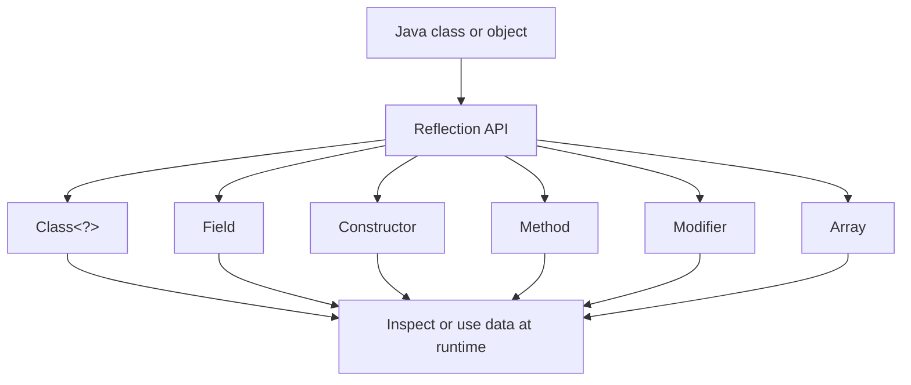

# Table of Contents

- [Java Reflection: Complete Basics Guide](#java-reflection-complete-basics-guide)
  - [Where the Example Programs Are](#where-the-example-programs-are)
  - [Final Topic Index](#final-topic-index)
    - [Exact Program Locations](#exact-program-locations)
    - [Arrays with Reflection: Theory](#arrays-with-reflection-theory)
  - [Reflection Picture](#reflection-picture)
  - [1. The Class Object](#1-the-class-object)
    - [Path](#path)
    - [Example](#example)
    - [Three common ways to obtain Class<?>](#three-common-ways-to-obtain-class)
  - [2. Inspecting Fields](#2-inspecting-fields)
    - [Path](#path-1)
    - [Example](#example-1)
    - [Important methods](#important-methods)
  - [3. Inspecting Constructors](#3-inspecting-constructors)
    - [Path](#path-2)
    - [Example](#example-2)
    - [Important methods](#important-methods-1)
  - [4. Inspecting and Invoking Methods](#4-inspecting-and-invoking-methods)
    - [Path](#path-3)
    - [Example](#example-3)
    - [Important methods](#important-methods-2)
  - [5. Understanding Modifiers](#5-understanding-modifiers)
    - [Path](#path-4)
    - [Example](#example-4)
    - [Common modifiers](#common-modifiers)
  - [6. Reflection and Arrays](#6-reflection-and-arrays)
    - [Path](#path-5)
    - [Example](#example-5)
    - [Important methods](#important-methods-3)
  - [7. Complete Reflection Flow](#7-complete-reflection-flow)
    - [Path](#path-6)
  - [`getDeclared...()` Versus `get...()`](#getdeclared-versus-get)
  - [What `setAccessible(true)` Means](#what-setaccessibletrue-means)
  - [Reflection Exceptions](#reflection-exceptions)
  - [Reflection Versus Normal Java Code](#reflection-versus-normal-java-code)
  - [Common Uses](#common-uses)
  - [Final Summary](#final-summary)

---

# Java Reflection: Complete Basics Guide

<!-- TOC -->
- [Java Reflection: Complete Basics Guide](#java-reflection-complete-basics-guide)
  - [Where the Example Programs Are](#where-the-example-programs-are)
  - [Final Topic Index](#final-topic-index)
    - [Exact Program Locations](#exact-program-locations)
    - [Arrays with Reflection: Theory](#arrays-with-reflection-theory)
  - [Reflection Picture](#reflection-picture)
  - [1. The Class Object](#1-the-class-object)
    - [Path](#path)
    - [Example](#example)
    - [Three common ways to obtain Class\<?\>](#three-common-ways-to-obtain-class)
  - [2. Inspecting Fields](#2-inspecting-fields)
    - [Path](#path-1)
    - [Example](#example-1)
    - [Important methods](#important-methods)
  - [3. Inspecting Constructors](#3-inspecting-constructors)
    - [Path](#path-2)
    - [Example](#example-2)
    - [Important methods](#important-methods-1)
  - [4. Inspecting and Invoking Methods](#4-inspecting-and-invoking-methods)
    - [Path](#path-3)
    - [Example](#example-3)
    - [Important methods](#important-methods-2)
  - [5. Understanding Modifiers](#5-understanding-modifiers)
    - [Path](#path-4)
    - [Example](#example-4)
    - [Common modifiers](#common-modifiers)
  - [6. Reflection and Arrays](#6-reflection-and-arrays)
    - [Path](#path-5)
    - [Example](#example-5)
    - [Important methods](#important-methods-3)
  - [7. Complete Reflection Flow](#7-complete-reflection-flow)
    - [Path](#path-6)
  - [`getDeclared...()` Versus `get...()`](#getdeclared-versus-get)
  - [What `setAccessible(true)` Means](#what-setaccessibletrue-means)
  - [Reflection Exceptions](#reflection-exceptions)
  - [Reflection Versus Normal Java Code](#reflection-versus-normal-java-code)
  - [Common Uses](#common-uses)
  - [Final Summary](#final-summary)
<!-- /TOC -->

Reflection allows a Java program to inspect and use classes, constructors, fields, methods, modifiers, and arrays while the program is running.

Normally, Java knows these things during compilation. With reflection, the program can discover them dynamically at runtime.

> **Preview tip:** Open this guide in **Markdown Preview** (`Ctrl+Shift+V`) for the full diagrams, tables, and clickable topic index.

---

## Where the Example Programs Are

All reflection examples are inside this package folder:

```text
demo/src/main/java/com/advanced/reflections/
```

| Topic             | Program path                                                                                |
| ----------------- | ------------------------------------------------------------------------------------------- |
| Class information | `demo/src/main/java/com/advanced/reflections/classBasics/ClassInspectionBasics.java`        |
| Constructors      | `demo/src/main/java/com/advanced/reflections/constructors/ConstructorReflectionBasics.java` |
| Fields            | `demo/src/main/java/com/advanced/reflections/fields/FieldReflectionBasics.java`             |
| Methods           | `demo/src/main/java/com/advanced/reflections/methods/MethodReflectionBasics.java`           |
| Modifiers         | `demo/src/main/java/com/advanced/reflections/modifiers/ModifierReflectionBasics.java`       |
| Arrays            | `demo/src/main/java/com/advanced/reflections/arrays/ArrayReflectionBasics.java`             |
| Complete example  | `demo/src/main/java/com/advanced/reflections/complete/CompleteReflectionExample.java`       |

The package declaration must match the folder structure. For example:

```java
package com.javalangPackage.reflections.modifiers;
```

## Final Topic Index

Use this table as a quick reference when returning to the examples later.

| Topic theory             | Folder name    | Program name                       | What the program demonstrates                                                                   |
| ------------------------ | -------------- | ---------------------------------- | ----------------------------------------------------------------------------------------------- |
| Class metadata           | `classBasics`  | `ClassInspectionBasics.java`       | Obtains `Class<?>` using an object, `.class`, and `Class.forName()`; lists declared fields.     |
| Constructor reflection   | `constructors` | `ConstructorReflectionBasics.java` | Finds constructors, accesses a private constructor, and creates an object with `newInstance()`. |
| Field reflection         | `fields`       | `FieldReflectionBasics.java`       | Finds, reads, and changes instance fields; also reads a static field.                           |
| Method reflection        | `methods`      | `MethodReflectionBasics.java`      | Finds methods, accesses a private method, and calls methods with `invoke()`.                    |
| Modifier reflection      | `modifiers`    | `ModifierReflectionBasics.java`    | Identifies `private`, `static`, `final`, and `transient` field modifiers.                       |
| Array reflection         | `arrays`       | `ArrayReflectionBasics.java`       | Reads array length and elements, changes values, and creates arrays dynamically.                |
| Complete reflection flow | `complete`     | `CompleteReflectionExample.java`   | Combines class, constructor, field, method, and modifier reflection.                            |

### Exact Program Locations

```text
demo/src/main/java/com/advanced/reflections/classBasics/ClassInspectionBasics.java
demo/src/main/java/com/advanced/reflections/constructors/ConstructorReflectionBasics.java
demo/src/main/java/com/advanced/reflections/fields/FieldReflectionBasics.java
demo/src/main/java/com/advanced/reflections/methods/MethodReflectionBasics.java
demo/src/main/java/com/advanced/reflections/modifiers/ModifierReflectionBasics.java
demo/src/main/java/com/advanced/reflections/arrays/ArrayReflectionBasics.java
demo/src/main/java/com/advanced/reflections/complete/CompleteReflectionExample.java
```

### Arrays with Reflection: Theory

Normal array code usually knows the type and size while compiling:

```java
int[] numbers = {10, 20, 30};
numbers[1] = 99;
```

Reflection is useful when the array type is available only at runtime. The array can be stored as `Object`, and the `java.lang.reflect.Array` class can still inspect and modify it:

```text
Unknown array object
       |
       +--> Array.getLength(array)       -> finds the size
       +--> Array.get(array, index)      -> reads one element
       +--> Array.set(array, index, x)   -> changes one element
       +--> Array.newInstance(type, n)   -> creates an array dynamically
```

The complete runnable example is:

```text
Folder:  demo/src/main/java/com/advanced/reflections/arrays/
Program: ArrayReflectionBasics.java
```

It demonstrates three important ideas:

1. `Array.getLength()` works without knowing whether the array is `int[]`, `String[]`, or another array type.
2. `Array.get()` and `Array.set()` access elements using a runtime index and value.
3. `Array.newInstance(String.class, 2)` creates a `String[]` when the component type is supplied at runtime.

## Reflection Picture



## 1. The Class Object

Every class loaded by the JVM has a corresponding `Class<?>` object. It contains metadata about that class.

### Path

```text
demo/src/main/java/com/advanced/reflections/classBasics/ClassInspectionBasics.java
```

### Example

```java
// Create a normal object.
Student student = new Student();

// Ask the object for its runtime Class object.
Class<?> fromObject = student.getClass();

// Get the Class object directly from the class literal.
Class<?> fromClassLiteral = Student.class;

// Load a class using its fully qualified name at runtime.
Class<?> fromName = Class.forName("package.ClassName");
```

### Three common ways to obtain Class<?>

```java
object.getClass();       // From an existing object
ClassName.class;         // From a class literal
Class.forName("...");    // From a class name stored as text
```

`Class.forName()` can throw `ClassNotFoundException` if the name is incorrect or the class cannot be found.

## 2. Inspecting Fields

A field is a variable declared inside a class.

### Path

```text
demo/src/main/java/com/advanced/reflections/fields/FieldReflectionBasics.java
```

### Example

```java
// Find a field by its name at runtime.
Field ownerField = Account.class.getDeclaredField("owner");

// Allow access to a private field.
ownerField.setAccessible(true);

// Read the field from one particular object.
Object value = ownerField.get(account);

// Change the field value through reflection.
ownerField.set(account, "Meera");
```

### Important methods

```java
getDeclaredField("name") // Finds a field declared in this class, including private fields
getField("name")         // Finds a public field, including inherited public fields
field.get(object)         // Reads an instance field
field.set(object, value)  // Changes an instance field
```

For a static field, there is no particular object, so use `null`:

```java
field.get(null);
```

## 3. Inspecting Constructors

A constructor creates and initializes an object.

### Path

```text
demo/src/main/java/com/advanced/reflections/constructors/ConstructorReflectionBasics.java
```

### Example

```java
// Find a constructor by its parameter types.
Constructor<Product> constructor = Product.class.getDeclaredConstructor(
        String.class, int.class);

// Allow access when the constructor is private.
constructor.setAccessible(true);

// Create an object dynamically.
Product product = constructor.newInstance("Pen", 25);
```

### Important methods

```java
getDeclaredConstructors()       // Finds all constructors declared in the class
getDeclaredConstructor(...)      // Finds one constructor by parameter types
constructor.newInstance(...)     // Invokes the constructor
```

The parameter types are important. These are different constructors:

```java
Product();
Product(String name, int price);
```

## 4. Inspecting and Invoking Methods

A method is an action defined inside a class.

### Path

```text
demo/src/main/java/com/advanced/reflections/methods/MethodReflectionBasics.java
```

### Example

```java
// Find a method using its name and parameter types.
Method addMethod = Calculator.class.getDeclaredMethod(
        "add", int.class, int.class);

// Invoke it on a Calculator object.
Object result = addMethod.invoke(calculator, 7, 3);
```

For a private method:

```java
// Find the private method.
Method messageMethod = Calculator.class.getDeclaredMethod(
        "message", String.class);

// Permit reflective access.
messageMethod.setAccessible(true);

// Invoke the method and receive its return value.
Object message = messageMethod.invoke(calculator, "Asha");
```

### Important methods

```java
getDeclaredMethods()             // Finds methods declared in this class
getDeclaredMethod(name, types)   // Finds one method by name and parameter types
method.invoke(object, arguments) // Calls the method dynamically
```

If the method is static, use `null` as the target object:

```java
method.invoke(null, arguments);
```

## 5. Understanding Modifiers

Modifiers describe how a class member behaves.

### Path

```text
demo/src/main/java/com/advanced/reflections/modifiers/ModifierReflectionBasics.java
```

### Example

```java
// Get the numeric modifier flags for a field.
int flags = field.getModifiers();

// Convert the flags into readable words.
String text = Modifier.toString(flags);

// Check individual modifiers.
boolean privateField = Modifier.isPrivate(flags);
boolean staticField = Modifier.isStatic(flags);
boolean finalField = Modifier.isFinal(flags);
boolean transientField = Modifier.isTransient(flags);
```

### Common modifiers

| Modifier       | Meaning                                              |
| -------------- | ---------------------------------------------------- |
| `public`       | Accessible from anywhere allowed by the class design |
| `private`      | Accessible directly only inside its declaring class  |
| `protected`    | Accessible through inheritance and package rules     |
| `static`       | Belongs to the class rather than one object          |
| `final`        | Cannot be reassigned after initialization            |
| `transient`    | Excluded from normal Java serialization              |
| `abstract`     | Requires implementation by a child class             |
| `synchronized` | Controls synchronized method access                  |

The `Modifier` class converts reflection's internal bit flags into understandable information.

## 6. Reflection and Arrays

The `Array` class works with arrays when the component type is known only at runtime.

### Path

```text
demo/src/main/java/com/advanced/reflections/arrays/ArrayReflectionBasics.java
```

### Example

```java
// Keep the array as Object to demonstrate dynamic access.
Object numbers = new int[] {10, 20, 30};

// Read the length of any array type.
int length = Array.getLength(numbers);

// Read an element by its index.
Object value = Array.get(numbers, 0);

// Change an element dynamically.
Array.set(numbers, 1, 99);

// Create an array when its type is known at runtime.
Object words = Array.newInstance(String.class, 2);
```

### Important methods

```java
Array.getLength(array)          // Returns the array length
Array.get(array, index)         // Reads an element
Array.set(array, index, value)  // Changes an element
Array.newInstance(type, size)  // Creates a new array dynamically
```

## 7. Complete Reflection Flow

### Path

```text
demo/src/main/java/com/advanced/reflections/complete/CompleteReflectionExample.java
```

The complete example follows this sequence:

```text
1. Employee.class
       |
       v
2. Find the private constructor
       |
       v
3. setAccessible(true)
       |
       v
4. constructor.newInstance("Neha")
       |
       v
5. Find the private name field
       |
       v
6. field.get(employee)
       |
       v
7. Find and invoke introduce()
       |
       v
8. Print the result
```

## `getDeclared...()` Versus `get...()`

```java
getDeclaredFields();
```

Returns fields declared directly in the selected class. It includes private fields, but it does not automatically include fields inherited from parent classes.

```java
getFields();
```

Returns public fields, including inherited public fields.

The same distinction applies to methods and constructors:

```java
getDeclaredMethods();
getMethods();
getDeclaredConstructors();
getDeclaredConstructor(...);
```

## What `setAccessible(true)` Means

```java
field.setAccessible(true);
```

This tells reflection to allow access to a non-public member. It does not change the field value and does not remove the field's `private`, `final`, or other modifier.

```text
setAccessible(true) -> permits reflective access
get(object)        -> reads the value
set(object, value) -> attempts to change the value
invoke(object, ...) -> calls a method
```

Use this carefully because it can bypass normal encapsulation.

## Reflection Exceptions

Reflection is dynamic, so many errors are discovered at runtime:

```java
ClassNotFoundException       // Class name cannot be loaded
NoSuchFieldException         // Field name is incorrect
NoSuchMethodException        // Method name or parameters are incorrect
NoSuchMethodException        // Constructor cannot be found
IllegalAccessException       // Access is not permitted
InstantiationException       // Object cannot be created
InvocationTargetException    // Invoked method threw an exception
```

Using `throws Exception` is convenient for learning examples. Production code should normally catch and handle specific exceptions.

## Reflection Versus Normal Java Code

| Normal Java                          | Reflection                            |
| ------------------------------------ | ------------------------------------- |
| Names are checked during compilation | Names may be supplied at runtime      |
| Fast and type-safe                   | Flexible but easier to misuse         |
| Private access is restricted         | Non-public access can be requested    |
| Usually easier to understand         | Useful for frameworks and tools       |
| Errors are often compile-time errors | Many errors become runtime exceptions |

## Common Uses

Reflection is commonly used by:

- Dependency injection frameworks
- Testing tools
- Object-relational mappers
- Serialization libraries
- Plugin systems
- IDEs and debugging tools
- Annotation processors and framework scanners

## Final Summary

```text
Class<?>       -> represents runtime class information
Field          -> inspects or accesses variables
Constructor    -> creates objects dynamically
Method         -> invokes behavior dynamically
Modifier       -> explains access and behavior flags
Array          -> works with unknown array types
setAccessible  -> requests access to non-public members
```

Reflection is powerful because it lets a program discover its own structure while running. It should be used thoughtfully because it reduces compile-time safety and can bypass normal class encapsulation.
